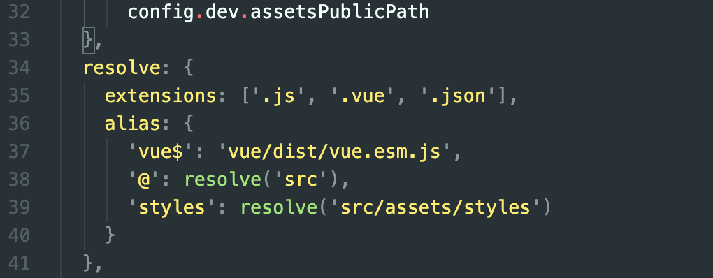
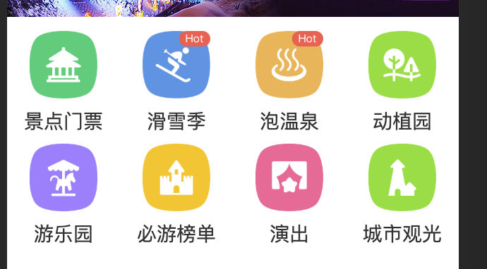
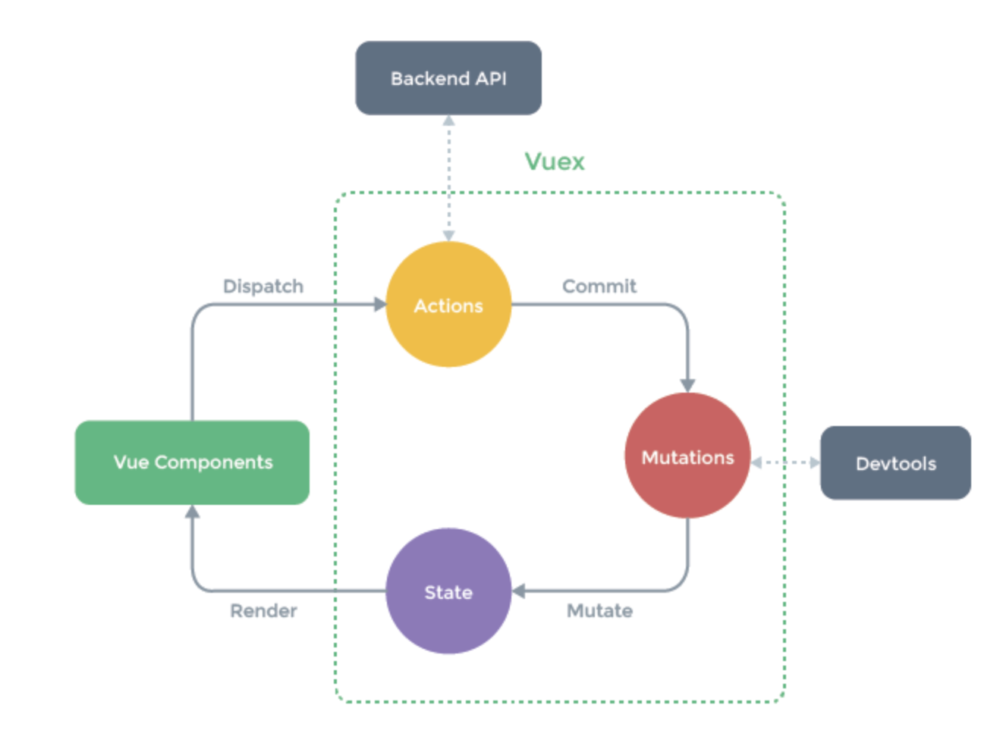

## 1.多页应用 vs 单页应用

**多页应用**

每一次的页面的跳转，后端都要返回一个新的HTML文件。

优点：首屏会非常快，SEO效果好，每次只发送了一次HTTP请求。

缺点：页面切换慢，每次跳转页面都要发送HTTP请求，所以网络不好的情况下，会有明显的卡顿情况。

**单页应用**

如果做到不请求HTML，页面也会变呢？JS会感知到url的变化，JS动态的把当前页面的内容清除掉，再把下一个页面的内容挂载到页面上。页面跳转是通过JS渲染实现。

优点：页面切换快

缺点：首屏时间稍慢，SEO差，首屏除了要请求一个HTML，还要发送一次JS请求。

<!---more-->

适配移动端，禁止用户通过手势缩放页面

~~~HTML
<meta name="viewport"
    content="width=device-width,initial-scale=1.0,minimum-scale=1.0,maximum-scale=1.0,user-scalable=no">
~~~

reset.css是为了消除不同的浏览器在默认样式上不同表现，使得项目在所有浏览器上的表现一致。

移动端1px边框

原因：
我们做移动端页面时一般都会设置meta标签viewport的content=width=device-width，
这里就是把html视窗大小设置等于设备的大小，大多数手机的屏幕设备宽度都差不多，
以iphoneX为例，屏幕宽度375px。

而UI给设计图的时候基本上都是给的二倍图甚至三倍图，假设设计图是750px的二倍图，在750px上设计了1px的边框，要拿到375px宽度的手机来显示，就相当于缩小了一倍，所以1px的边框要以0.5px来呈现才符合预期效果，然而css里最低只支持1px大小，不足1px就以1px显示，所以你看到的就显得边框较粗，实际上只是设计图整体缩小了，而边框粗细没有跟着缩小导致的。（ps：ios较新版已经支持0.5px了，这里暂且忽略）

简而言之就是：多倍的设计图设计了1px的边框，在手机上缩小呈现时，由于css最低只支持显示1px大小，导致边框太粗的效果。

移动端300ms点击事件延迟的问题

**由于移动端会有双击缩放的这个操作，因此浏览器在click之后要等待300ms，看用户有没有下一次点击，也就是这次操作是不是双击。**

~~~JS
npm install fastclick --save

import fastClick from 'fastclick'

fastClick.attach(document.body)
~~~

路由就是根据网址的不同，返回不同的内容给用户

~~~HTML
<!-- 显示的是当前路由地址所对应的内容 -->
<router-view />
~~~

stylus

~~~JS
npm install stylus --save
npm install stylus-loader --save
~~~

scoped：只对当前的组件有效

移动端布局一般采用rem的布局

rem是一个相对单位，1rem等于html元素上字体设置的大小。我们只要设置html上font-size的大小，就可以改变rem所代表的大小。

1rem=html font-size=50px

在二倍图上的86px，实际上是我们要写成43px

iconfont的引入，全局main.js下需要引入

~~~HTML
//标签放在span中，内容用十六进制的字符串
&#xe624; 
~~~

css全局变量，比如背景色，在项目中多处用到，如果我需要改变的话，不需要一个个的去修改

在assets文件夹下创建varibles.styl的文件

~~~JS
$bgColor = #00bcd4
~~~

然后在你需要用到的地方引入，后面直接写变量就行了

~~~JS
@import '../../../assets/varibles.styl'
~~~

@import

`@import` 用于从其他样式表导入样式规则，告诉 CSS 引擎引入一个外部样式表。

如果在css里面也想简化路径的话，需要在@符号前加~

~~~JS
@import '~@/assets/varibles.styl'
~~~

或者说我们可以在webpack.base.conf.js里面自定义配置路径别名。

~~~JS
@import '~styles/varibles.styl'
~~~

**简单来说，BFC就是一个独立不干扰外界也不受外界干扰的盒子**

~~~CSS

~~~

使用>>>可以让wrapper下的指定类的样式，样式穿透，不受scoped的限制

对于图标的轮播图，需要对数据进行分页处理

~~~HTML
<swiper :options="swiperOption">
	<swiper-slide v-for="(page, index) of pages" :key="index">
        

          

            
          

          
{{ item.desc }}

        

	</swiper-slide>
</swiper>
~~~

~~~JS
computed: {
    pages() {
      const pages = [];
      this.iconList.forEach((item, index) => {
        const page = Math.floor(index / 8);
        if (pages[page]) pages[page].push(item);
        else pages[page] = [item];
      });
      return pages;
    }
  }
~~~

利用computed计算数据以及缓存特性，可以对数据进行分页展示

对于文字过于多想要`...`显示的话

~~~CSS
overflow: hidden
white-space: nowrap
text-overflow: ellipsis
~~~

~~~CSS
class = "border-bottom"
~~~

1像素的边框

vuex中getters的作用类似于组件中的computed，当我们需要根据state里面的数据算出新的数据，我们可以借助getters来避免数据的冗余

刷新页面以后swiper的默认显示是在最后一张图，而不是第一张图，主要是swiper一开始是空数组，后面ajax才请求到了数据。

解决方案：可以在swiper上添加v-if，如果数组的长度为空，那么不渲染swiper组件，可以用computed计算属性。避免在模版中写逻辑。

~~~JS
<swiper :options="swiperOption" v-if="showSwiper">

computed: {
    showSwiper() {
      return this.list.length;
    }
}
~~~

alphabet组件和list组件属于同级，但是需要联动，那么可以通过父组件city传递，alphabet组件emit，city组件接受到emit过来的事件，然后在city组件向list组件传递值，list组件watch传递过来的变化。从而实现非父子之间的传值

手指在alphabet上拖动，如何让列表也随之变化。

可以根据(手指距离顶部的距离-第一个字母距离顶部的距离)/俩个字母之间距离，便可以知道此时是在第几个字母，然后触发事件。但是可以看出此时的事件触发频率太高了，可以通过防抖实现性能优化，每次执行都是在最后一次触发事件的16ms后触发，如果16ms内再次出发了事件，那么重新计时。

使用keep-alive优化网页性能

~~~HTML
<keep-alive>
      <router-view />
</keep-alive>
~~~

路由的内容被加载过一次之后，我就把路由中的内容放到内存之中，下次再进这个路由，不需要重新执行钩子函数，只需要从内存中重新拿出来就好了。

但是会存在问题，比如说我从首页进入选择城市页面，选择了另一个城市，此时返回首页，由于有keep-alive的存在，不会根据新的城市从而首页改变，还是从缓存中拿，那么可以借助activated钩子函数实现，activated钩子是在页面重新被显示的时候执行。