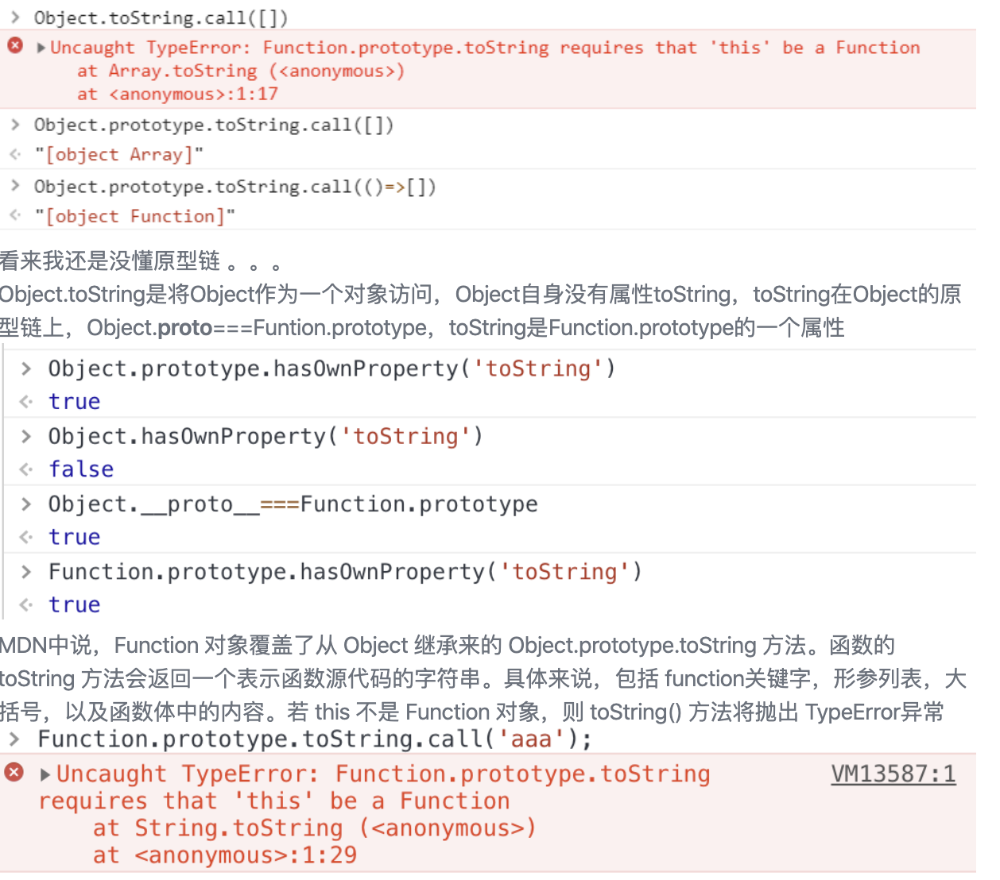
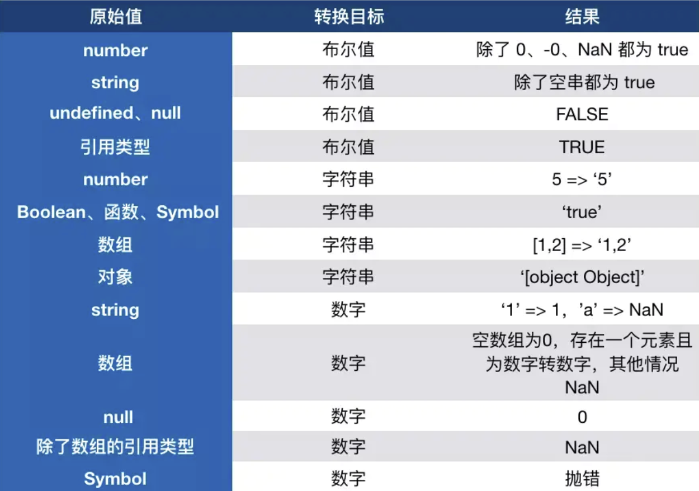
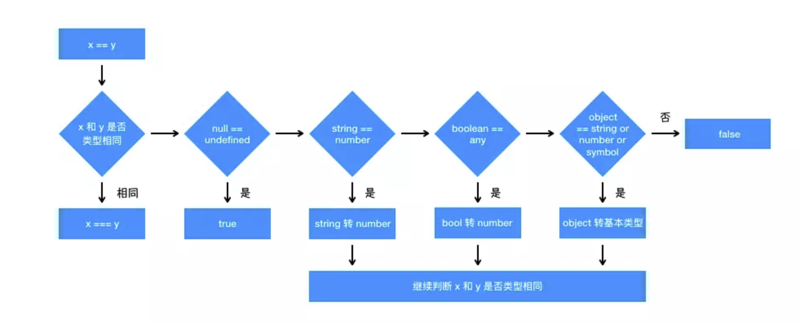
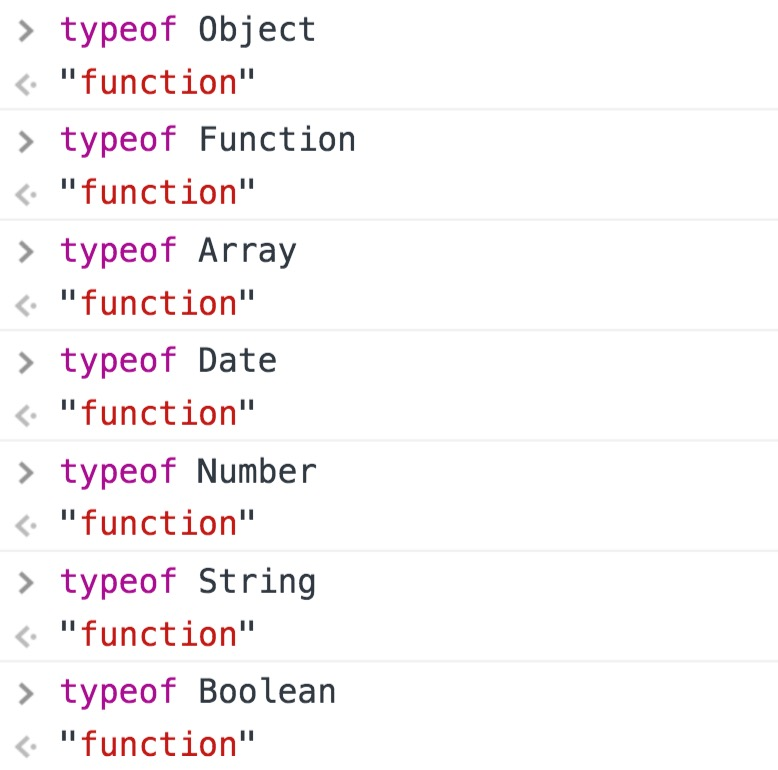
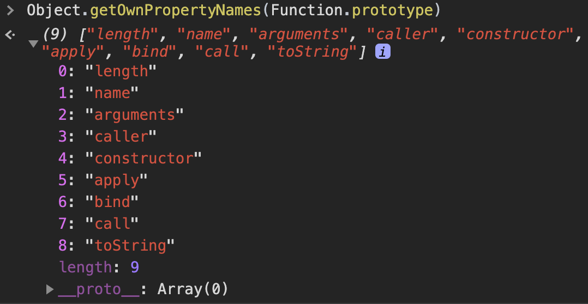
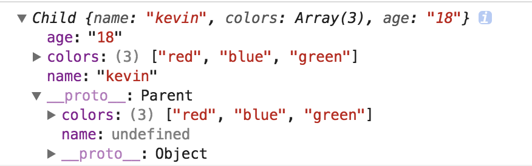

# 1.变量类型和类型转换

## JS 变量类型

JS中有 6 种原始值，分别是：

1. boolean
2. number
3. string
4. undefined
5. symbol
6. null

引用类型：

1. 对象
2. 数组
3. 函数

<!---more-->

## JS中使用typeof能得到哪些类型？

其中一个奇怪的 null，虽然是基本变量，但是因为设计的时候`null`是全0，而对象是`000`开头，所以有这个误判。

1. boolean
2. number
3. string
4. undefined
5. symbol
6. **object**
7. **function**
8. [bigint](https://developer.mozilla.org/en-US/docs/Web/JavaScript/Reference/Global_Objects/BigInt)

## instanceof 能正确判断对象的原理是什么？

基于原型链的查找

```JS
const Person = function() {}
const p1 = new Person()
p1 instanceof Person // true

var str = 'hello world'
str instanceof String // false

var str1 = new String('hello world')
str1 instanceof String // true
```

对于原始类型来说，你想直接通过 `instanceof` 来判断类型是不行的，当然我们还是有办法让 `instanceof` 判断原始类型的

```JS
class PrimitiveString {
  static [Symbol.hasInstance](x) {
    return typeof x === 'string'
  }
}
console.log('hello world' instanceof PrimitiveString) // true
```

你可能不知道 `Symbol.hasInstance` 是什么东西，其实就是一个能让我们自定义 `instanceof` 行为的东西，以上代码等同于 `typeof 'hello world' === 'string'`，所以结果自然是 `true` 了。这其实也侧面反映了一个问题， `instanceof` 也不是百分之百可信的。

### typeof

> 能检测出object、undefined、string、number、boolean、function,但对于object下的细分不能够识别

### Object.prototype.toString

> When the toString method is called, the following steps are taken:

> 1. If the **this** value is **undefined**, return "**[object Undefined]**".
> 2. If the **this** value is **null**, return "**[object Null]**".
> 3. Let *O* be the result of calling ToObject passing the **this** value as the argument.
> 4. Let *class* be the value of the [[Class]] internal property of *O*.
> 5. Return the String value that is the result of concatenating the three Strings "**[object** ", *class*, and "**]**".

```JS
// 以下是11种：
var number = 1;          // [object Number]
var string = '123';      // [object String]
var boolean = true;      // [object Boolean]
var und = undefined;     // [object Undefined]
var nul = null;          // [object Null]
var obj = {a: 1}         // [object Object]
var array = [1, 2, 3];   // [object Array]
var date = new Date();   // [object Date]
var error = new Error(); // [object Error]
var reg = /a/g;          // [object RegExp]
var func = function a(){}; // [object Function]

function checkType() {
    for (var i = 0; i < arguments.length; i++) {
        console.log(Object.prototype.toString.call(arguments[i]))
    }
}

checkType(number, string, boolean, und, nul, obj, array, date, error, reg, func)
```

除了以上 11 种之外，还有：

```JS
console.log(Object.prototype.toString.call(Math)); // [object Math]
console.log(Object.prototype.toString.call(JSON)); // [object JSON]
```

除了以上 13 种之外，还有：

```JS
function a() {
    console.log(Object.prototype.toString.call(arguments)); // [object Arguments]
}
a();
```

所以我们可以识别至少 14 种类型，当然我们也可以算出来，[[class]] 属性至少有 12 个。



## 实现一个类型判断函数

1. 判断null
2. 判断基本类型
3. 使用Object.prototype.toString.call(target)来判断**引用类型**

```JS
function getType(target) {
    //先处理最特殊的null
    if(target === null) {
        return 'null'
    }
    //判断是不是基本类型
    const typeOfT = typeof target
    if(typeOfT !== 'object') {
        return typeOfT
    }
    //肯定是引用类型
    const template = {
        "[object Object]": "object",
        "[object Array]": "array",
        //一些包装类型
        "[object String]": "object - string",
        "[object Number]": "object - number",
        "[object Boolean]": "object - boolean"
    }
    const typeStr = Object.prototype.toString.call(target)
    return template[typeStr];
}
```



## 转Boolean

以下都为假值，其他所有值都转为 true，包括所有对象（空对象，空数组也转为真）。

- false
- undfined
- null
- ''
- NaN
- 0
- -0

## 对象转基本类型

对象转原始类型，会调用内置的[ToPrimitive]函数，对于该函数而言，其逻辑如下：

1. 如果Symbol.toPrimitive()方法，优先调用再返回
2. 调用valueOf()，如果转换为原始类型，则返回
3. 调用toString()，如果转换为原始类型，则返回
4. 如果都没有返回原始类型，会报错

```JS
var a = {
  valueOf() {
    return 0;
  },
  toString() {
    return '1';
  }
}

1 + a           // 1
'1'.concat(a)   //"11"
```

也可以重写 `Symbol.toPrimitive` ，该方法在转基本类型时调用**优先级最高**。 [Symbol.toPrimitive](https://developer.mozilla.org/zh-CN/docs/Web/JavaScript/Reference/Global_Objects/Symbol/toPrimitive) 指将被调用的指定函数值的属性转换为相对应的原始值。

```JS
const object1 = {
  [Symbol.toPrimitive](hint) {
    if (hint == 'number') {
      return 42;
    }
    return null;
  }
};

console.log(+object1);
// expected output: 42
```

~~~JS
let a = {
  valueOf() {
    return 0
  },
  toString() {
    return '1'
  },
  [Symbol.toPrimitive]() {
    return 2
  }
}
1 + a // => 3
~~~

## 类型转换

- 运算中其中一方为字符串，那么就会把另一方也转换为字符串
- 如果一方不是字符串或者数字，那么会将它转换为数字或者字符串

```JS
1 + '1' // '11'
true + true // 2
4 + [1,2,3] // "41,2,3"
```

还需要注意这个表达式`'a' + + 'b'`

```js
'a' + + 'b' // -> "aNaN"
```

因为 + 'b' 等于 NaN，所以结果为 "aNaN"，你可能也会在一些代码中看到过 + '1' 的形式来快速获取 number 类型。

那么对于除了加法的运算符来说，只要其中一方是数字，那么另一方就会被转为数字

```JS
4 * '3' // 12
4 * [] // 0
4 * [1, 2] // NaN
```

## 比较运算符

1. 如果是对象，就通过 `toPrimitive` 转换对象
2. 如果是字符串，就通过 `unicode` 字符索引来比较

```JS
let a = {
  valueOf() {
    return 0
  },
  toString() {
    return '1'
  }
}
a > -1 // true
```

在以上代码中，因为 `a` 是对象，所以会通过 `valueOf` 转换为原始类型再比较值。

## `100 +` 问题

```JS
'100' + 100   // "100100"

100 + '100'   // "100100"

100 + true    // 101

100 + false   // 100

100 + undefined //NaN

100 + null    // 100
```

## "a common string"为什么会有length属性

通过字面量的方式创建：var a = 'string';，这时它就是基本类型值；通过构造函数的方式创建：var a = new String('string');这时它是对象类型。

基本类型是没有属性和方法的，但仍然可以使用对象才有的属性方法。这时因为在对基本类型使用属性方法的时候，后台会隐式的创建这个基本类型的对象，之后再销毁这个对象

## console.log(!!(new Boolean(false))输出什么 [易混淆]

true   布尔的包装对象 Boolean 的对象实例，对象只有在 null 与 undefined 时，才会认定为布尔的 false 值，布尔包装对象本身是个对象，对象->布尔 都是 true，所以 new Boolean(false)其实是布尔的 true，看下面这段代码:

```JS
if(new Boolean(false)){
    alert('true!!');
}
```

只有使用了 valueOf 后才是真正的转换布尔值，与上面包装对象与原始资料转换说明的相同:

```JS
!!(new Boolean(false))  //true
(new Boolean(false)).valueOf() //false
```

## == vs ===

### == 操作符

1. 首先会判断两者类型是否相同。相同的话就是比大小了
2. 类型不相同的话，那么就会进行类型转换
3. 会先判断是否在对比 null 和 undefined，是的话就会返回 true
4. 判断两者类型是否为 string 和 number，是的话就会将字符串转换为 number
5. 判断其中一方是否为 boolean，是的话就会把 boolean 转为 number 再进行判断
6. 判断其中一方是否为 object 且另一方为 string、number 或者 symbol，是的话就会把 object 转为原始类型再进行判断
7. 两边都是对象的话，那么只要不是同一对象的不同引用，都为false

只要出现NaN，就一定是false，因为就连NaN自己都不等于NaN 对于NaN，判断的方法是使用全局函数 `isNaN()`




### === 操作符

不转类型，直接判断类型和值是否相同。 但是 NaN === NaN 还是false

### {} 等于true还是false

```JS
var a = {};

a == true // -> ?
a == false // -> ?
```

答案是两个都为false 因为a.toString() -> '[object Object]' -> NaN

但是一般情况下对象的toString方法都被重写了，所以在判断类型的时候都会调用Object.prototype.toString.call()

### 1 与 Number(1)有什么区别

```JS
var a = Number(1) // 1
var b = new Number(1)  // Number {[[PrimitiveValue]]: 1}
typeof (a) // number
typeof (b) // object
a == b // true
```

- var a = 1 是一个常量，而 Number(1)是一个函数
- new Number(1)返回的是一个对象
- a==b 为 true 是因为所以在求值过程中，总是会强制转为原始数据类型而非对象，例如下面的代码:

```JS
typeof 123 // "number"
typeof new Number(123) // "object"
123 instanceof Number // false
(new Number(123)) instanceof Number // true
123 === new Number(123) // false
```

### []==![]

1. 根据运算符优先级 ，！ 的优先级是大于 == 的，所以先会执行 ![]，！可将变量转换成boolean类型，null、undefined、NaN以及空字符串('')取反都为true，其余都为false。所以 ! [] 运算后的结果就是 false，也就是 [] == ! [] 相当于 [] == false
2. 根据上面提到的规则（如果有一个操作数是布尔值，则在比较相等性之前先将其转换为数值——false转换为0，而true转换为1），则需要把 false 转成 0，也就是 [] == ! [] 相当于 [] == false 相当于 [] == 0
3. 根据上面提到的规则（如果一个操作数是对象，另一个操作数不是，则调用对象的valueOf()方法，用得到的基本类型值按照前面的规则进行比较，如果对象没有valueOf()方法，则调用 toString()）而对于空数组，[].toString() ->  '' (返回的是空字符串)也就是  [] == 0 相当于 '' == 0
4. 根据上面提到的规则（如果一个操作数是字符串，另一个操作数是数值，在比较相等性之前先将字符串转换为数值）Number('') -> 返回的是 0，相当于 0 == 0 自然就返回 true了

总结一下：

[] == ! []   ->   [] == false  ->  [] == 0  ->   '' == 0   ->  0 == 0   ->  true 

那么对于 {} == !{} 也是同理的

关键在于  {}.toString() ->   '[object Object]' -> NaN(返回的是NaN)

根据上面的规则（如果有一个操作数是NaN，则相等操作符返回 false）

总结一下：

{} == ! {}   ->   {} == false  ->  {} == 0  ->   NaN == 0    ->  false


[]==[] //false

### 输出以下代码运行结果

```
1 + "1"

2 * "2"

[1, 2] + [2, 1]

"a" + + "b"
```

- 1 + "1"
    - 加性操作符：如果只有一个操作数是字符串，则将另一个操作数转换为字符串，然后再将两个字符串拼接起来
    - 所以值为：“11”
- 2 * "2"
    - 乘性操作符：如果有一个操作数不是数值，则在后台调用 Number()将其转换为数值
- [1, 2] + [2, 1]
    - Javascript中所有对象基本都是先调用valueOf方法，如果不是数值，再调用toString方法。
    - 所以两个数组对象的toString方法相加，值为："1,22,1"
- "a" + + "b"
    - 后边的“+”将作为一元操作符，如果操作数是字符串，将调用Number方法将该操作数转为数值，如果操作数无法转为数值，则为NaN。
    - 所以值为："aNaN"


## 如何判断一个数据是不是Array

- ```
    Array.isArray(obj)
    ```

    - ECMAScript5中的函数，当使用ie8的时候就会出现问题。

- ```
    obj instanceof Array
    ```

    - 当用来检测在不同的window或iframe里构造的数组时会失败。这是因为每一个iframe都有它自己的执行环境，彼此之间并不共享原型链，所以此时的判断一个对象是否为数组就会失败。此时我们有一个更好的方式去判断一个对象是否为数组。

- ```
    Object.prototype.toString.call(obj) == '[object Array]'
    ```

    - 这个方法比较靠谱

- ```
    obj.constructor === Array
    ```

    - constructor属性返回对创建此对象的函数的引用

## Object.prototype.toString

如果是原始类型，他会将原始类型包装为引用类型，然后调用对应方法

```JS
function dd(){}
var toString = Object.prototype.toString;
toString.call(dd);          //[object Function]
toString.call(new Object);  //[object Object]
toString.call(new Array);   //[object Array]
toString.call(new Date);    //[object Date]
toString.call(new String);  //[object String]
toString.call(Math);        //[object Math]
toString.call(undefined);   //[object Undefined]
toString.call(null);        //[object Null]
toString.call(123)          //[object Number]
toString.call('abc')        //[object String]
```

## obj.toString() 和Object.prototype.toString.call(obj)

同样是检测对象obj调用toString方法，obj.toString()的结果和Object.prototype.toString.call(obj)的结果不一样，这是为什么？

这是因为toString为Object的原型方法，而Array ，function等类型作为Object的实例，都重写了toString方法。不同的对象类型调用toString方法时，根据原型链的知识，调用的是对应的重写之后的toString方法（function类型返回内容为函数体的字符串，Array类型返回元素组成的字符串.....），而不会去调用Object上原型toString方法（返回对象的具体类型），所以采用obj.toString()不能得到其对象类型，只能将obj转换为字符串类型；因此，在想要得到对象的具体类型时，应该调用Object上原型toString方法。

~~~js
let a = {},
  b = {
    n: 1
  },
  c = {
    m: 2
  };
a[b] = 'z';
a[c] = 'j';
console.log(a[b]);
//j
~~~

转换成属性名，调用toString()，所以b.toString()=>'[object Object]'，c.toString()=>'[object Object]'，会覆盖前一个。

~~~JS
alert({})
//'[object Object]'
alert({
  toString() {
    return '3';
  },
  valueOf() {
    return 1;
  }
})
// '3'
~~~

alert()会将里面的强转为字符串。

~~~JS
var a = 0,
  b = 0;

function A(a) {
  A = function (b) {
    console.log(a + b++);
  }
  console.log(a++);
}

A(1);
A(2);
//1 4
~~~

闭包


## 对象引用问题 - 1

```JS
var a = {n: 1};
var b = a;
a.x = a = {n: 2};

console.log(a.x) 	// --> undefined
console.log(b.x)  // --> {n: 2}
```

1. **优先级**。`.`的优先级高于`=`，所以先执行a.x，堆内存中的{n: 1}就会变成{n: 1, x: undefined}，改变之后相应的b.x也变化了，因为指向的是同一个对象。
2. **赋值操作是从右到左**，所以先执行a = {n: 2}，a的引用就被改变了，然后这个返回值又赋值给了a.x，需要注意的是这时候a.x是第一步中的{n: 1, x: undefined}那个对象，其实就是b.x，相当于b.x = {n: 2}

## 对象引用问题 - 2

```JS
function changeObjProperty(o) {
  o.siteUrl = "http://www.baidu.com"
  o = new Object()
  o.siteUrl = "http://www.google.com"
} 
let webSite = new Object();
changeObjProperty(webSite);
console.log(webSite.siteUrl);
```

答案： "[http://www.baidu.com](http://www.baidu.com/)" 原因： o = new Object() 这句代码切断了原本对 o 的引用

## ['1', '2', '3'].map(parseInt) 答案是多少？

答案 [1, NaN, NaN]

map会给函数传递3个参数： (elem, index, array)，当相与：

```JS
['1', '2', '3'].map((item, index) => {
	return parseInt(item, index)
})
```

parseInt接收两个参数(string, radix)，其中radix代表进制。省略 radix 或 radix = 0，则数字将以十进制解析

因此，map 遍历 ["1", "2", "3"]，相应 parseInt 接收参数如下

```JS
parseInt('1', 0);  // 1
parseInt('2', 1);  // NaN
parseInt('3', 2);  // NaN
```

## 考 Symbol

```JS
// example 1
var a={}, b='123', c=123;  
a[b]='b';
a[c]='c';  
console.log(a[b]);

---------------------
// example 2
var a={}, b=Symbol('123'), c=Symbol('123');  
a[b]='b';
a[c]='c';  
console.log(a[b]);

---------------------
// example 3
var a={}, b={key:'123'}, c={key:'456'};  
a[b]='b';
a[c]='c';  
console.log(a[b]);
// example 1
var a={}, b='123', c=123;
a[b]='b';

// c 的键名会被转换成字符串'123'，这里会把 b 覆盖掉。
a[c]='c';  

// 输出 c
console.log(a[b]);
// example 2
var a={}, b=Symbol('123'), c=Symbol('123');  

// b 是 Symbol 类型，不需要转换。
a[b]='b';

// c 是 Symbol 类型，不需要转换。任何一个 Symbol 类型的值都是不相等的，所以不会覆盖掉 b。
a[c]='c';

// 输出 b
console.log(a[b]);
// example 3
var a={}, b={key:'123'}, c={key:'456'};  

// b 不是字符串也不是 Symbol 类型，需要转换成字符串。
// 对象类型会调用 toString 方法转换成字符串 [object Object]。
a[b]='b';

// c 不是字符串也不是 Symbol 类型，需要转换成字符串。
// 对象类型会调用 toString 方法转换成字符串 [object Object]。这里会把 b 覆盖掉。
a[c]='c';  

// 输出 c
console.log(a[b]);
```


这个ToPrimitive可能不太好懂，我给你解释一下吧：

```JS
ToPrimitive(obj,preferredType)

JS引擎内部转换为原始值ToPrimitive(obj,preferredType)函数接受两个参数，第一个obj为被转换的对象，第二个
preferredType为希望转换成的类型（默认为空，接受的值为Number或String）

在执行ToPrimitive(obj,preferredType)时如果第二个参数为空并且obj为Date的事例时，此时preferredType会
被设置为String，其他情况下preferredType都会被设置为Number如果preferredType为Number，ToPrimitive执
行过程如
下：
1. 如果obj为原始值，直接返回；
2. 否则调用 obj.valueOf()，如果执行结果是原始值，返回之；
3. 否则调用 obj.toString()，如果执行结果是原始值，返回之；
4. 否则抛异常。

如果preferredType为String，将上面的第2步和第3步调换，即：
1. 如果obj为原始值，直接返回；
2. 否则调用 obj.toString()，如果执行结果是原始值，返回之；
3. 否则调用 obj.valueOf()，如果执行结果是原始值，返回之；
4. 否则抛异常。
```

首先我们要明白 **obj.valueOf()** 和 **obj.toString()** 还有原始值分别是什么意思,这是弄懂上面描述的前提之一:

**toString用来返回对象的字符串表示。**

```JS
var obj = {};
console.log(obj.toString());//[object Object]

var arr2 = [];
console.log(arr2.toString());//""空字符串
  
var date = new Date();
console.log(date.toString());//Sun Feb 28 2016 13:40:36 GMT+0800 (中国标准时间)
```

**valueOf方法返回对象的原始值，可能是字符串、数值或bool值等，看具体的对象。**

```JS
var obj = {
  name: "obj"
};
console.log(obj.valueOf());//Object {name: "obj"}

var arr1 = [1];
console.log(arr1.valueOf());//[1]


var date = new Date();
console.log(date.valueOf());//1456638436303
如代码所示，三个不同的对象实例调用valueOf返回不同的数据
```

**原始值指的是['Null','Undefined','String','Boolean','Number','Symbol']6种基本数据类型之一**

最后分解一下其中的过程：
+new Date():

> 1. 运算符new的优先级高于一元运算符+，所以过程可以分解为：
>     var time=new Date()；
>        +time

> 2.根据上面提到的规则相当于：ToNumber(time)

> 3.time是个日期对象，根据ToNumber的转换规则，所以相当于：ToNumber(ToPrimitive(time))

> 4.根据ToPrimitive的转换规则：ToNumber(time.valueOf())，time.valueOf()就是 **原始值** 得到的是个时间戳，假设time.valueOf()=1503479124652

> 5.所以ToNumber(1503479124652)返回值是1503479124652这个数字。

## 0.1+0.2为什么不等于0.3？

0.1和0.2在转换成二进制后会无限循环，由于标准位数的限制后面多余的位数会被截掉，此时就已经出现了精度的损失，相加后因浮点数小数位的限制而截断的二进制数字在转换为十进制就会变成0.30000000000000004。

#  2.对象

## 属性类型

### 数据属性

+ Configurable：能否通过delete删除属性从而重新定义属性
+ Enumerable：表示能否通过for-in循环返回属性
+ Writable：表示能否修改属性的值
+ Value：属性的数据值，默认为undefined

在调用Object.defineProperty()时，如果不指定，configurable、enumerable和writable特性的默认值都是false。

> IE8是第一个实现Object.defineProperty()方法的浏览器版本，但是问题多，如只能创建访问器属性，所以最好不要在IE8中使用这个方法。

### 访问器属性

+ Configurable
+ Enumerable
+ Get
+ Set

~~~JS
var book={};

Object.defineProperties(book,{
    _year: {
        value: 2020
    },
    edition: {
        value: 1
    },
    year: {
        get: function() {
            return thie._year;
        },
        set: function(newValue) {
            if(newValue > 2020) {
                this._year = newValue;
                this.edition += newValue - 2020;
            }
        }
    }
})
~~~

上述例子中_year、edition是数据属性，year是访问器属性。

可以通过`Object.getOwnPropertyDescriptor(object,属性名)`读取属性的特性

`Object.hasOwnProperty()`可以检测一个属性是存在于实例中还是原型中。

`in`操作符会在通过对象能够访问给定属性时返回true，无论该属性存在于实例中还是原型中。

`for-in`返回的是所有能够通过对象访问的、可枚举的属性

`Object.keys()`返回对象上所有可枚举的实例属性。

`Object.getOwnPropertyNames()`返回对象上所有的实例属性，无论可枚举不可枚举。

# 3.创建对象

## 1. 工厂模式

```JS
function createPerson(name) {
    var o = new Object();
    o.name = name;
    o.getName = function () {
        console.log(this.name);
    };

    return o;
}

var person1 = createPerson('kevin');
```

缺点：对象无法识别，因为所有的实例都指向一个原型

## 2. 构造函数模式

```JS
function Person(name) {
    this.name = name;
    this.getName = function () {
        console.log(this.name);
    };
}

var person1 = new Person('kevin');
```

优点：实例可以识别为一个特定的类型

缺点：每次创建实例时，每个方法都要被创建一次

## 2.1 构造函数模式优化

```JS
function Person(name) {
    this.name = name;
    this.getName = getName;
}

function getName() {
    console.log(this.name);
}

var person1 = new Person('kevin');
```

优点：解决了每个方法都要被重新创建的问题

缺点：这叫啥封装……

## 3. 原型模式

```JS
function Person(name) {

}

Person.prototype.name = 'keivn';
Person.prototype.getName = function () {
    console.log(this.name);
};

var person1 = new Person();
```

优点：方法不会重新创建

缺点：1. 所有的属性和方法都共享 2. 不能初始化参数

## 3.1 原型模式优化

```JS
function Person(name) {

}

Person.prototype = {
    name: 'kevin',
    getName: function () {
        console.log(this.name);
    }
};

var person1 = new Person();
```

优点：封装性好了一点

缺点：重写了原型，丢失了constructor属性

## 3.2 原型模式优化

```JS
function Person(name) {

}

Person.prototype = {
    constructor: Person,
    name: 'kevin',
    getName: function () {
        console.log(this.name);
    }
};

var person1 = new Person();
```

优点：实例可以通过constructor属性找到所属构造函数

缺点：原型模式该有的缺点还是有

## 4. 组合模式

构造函数模式与原型模式双剑合璧。

```JS
function Person(name) {
    this.name = name;
}

Person.prototype = {
    constructor: Person,
    getName: function () {
        console.log(this.name);
    }
};

var person1 = new Person();
```

优点：该共享的共享，该私有的私有，使用最广泛的方式

缺点：有的人就是希望全部都写在一起，即更好的封装性

## 4.1 动态原型模式

```JS
function Person(name) {
    this.name = name;
    if (typeof this.getName != "function") {
        Person.prototype.getName = function () {
            console.log(this.name);
        }
    }
}

var person1 = new Person();
```

注意：使用动态原型模式时，不能用对象字面量重写原型

解释下为什么：

```JS
function Person(name) {
    this.name = name;
    if (typeof this.getName != "function") {
        Person.prototype = {
            constructor: Person,
            getName: function () {
                console.log(this.name);
            }
        }
    }
}

var person1 = new Person('kevin');
var person2 = new Person('daisy');

// 报错 并没有该方法
person1.getName();

// 注释掉上面的代码，这句是可以执行的。
person2.getName();
```

为了解释这个问题，假设开始执行`var person1 = new Person('kevin')`。

> 当执行 var person1 = new Person('kevin') 的时候，person1.的原型并不是指向 Person.prototype，而是指向 Person.prototype 指向的原型对象，我们假设这个原型对象名字为 O, 然后再修改 Person.prototype 的值为一个字面量，只是将一个新的值赋值给 Person.prototype, 并没有修改 O 对象，也不会切断已经建立的 person1 和 O 的原型关系，访问 person.getName 方法，依然会从 O 上查找

如果对 new 和 apply 的底层执行过程不是很熟悉，可以阅读底部相关链接中的文章。

我们回顾下 new 的实现步骤：

1. 首先新建一个对象
2. 然后将对象的原型指向 Person.prototype指向的对象
3. 然后 Person.apply(obj)
4. 返回这个对象

注意这个时候，回顾下 apply 的实现步骤，会执行 obj.Person 方法，这个时候就会执行 if 语句里的内容，注意构造函数的 prototype 属性指向了实例的原型，使用字面量方式直接覆盖 Person.prototype，并不会更改实例的原型的值，person1 依然是指向了以前的原型，而不是 Person.prototype。而之前的原型是没有 getName 方法的，所以就报错了！

如果你就是想用字面量方式写代码，可以尝试下这种：

```JS
function Person(name) {
    this.name = name;
    if (typeof this.getName != "function") {
        Person.prototype = {
            constructor: Person,
            getName: function () {
                console.log(this.name);
            }
        }

        return new Person(name);
    }
}

var person1 = new Person('kevin');
var person2 = new Person('daisy');

person1.getName(); // kevin
person2.getName();  // daisy
```

### 5.1 寄生构造函数模式

```JS
function Person(name) {

    var o = new Object();
    o.name = name;
    o.getName = function () {
        console.log(this.name);
    };

    return o;

}

var person1 = new Person('kevin');
console.log(person1 instanceof Person) // false
console.log(person1 instanceof Object)  // true
```

寄生构造函数模式，我个人认为应该这样读：

寄生-构造函数-模式，也就是说寄生在构造函数的一种方法。

也就是说打着构造函数的幌子挂羊头卖狗肉，你看创建的实例使用 instanceof 都无法指向构造函数！

这样方法可以在特殊情况下使用。比如我们想创建一个具有额外方法的特殊数组，但是又不想直接修改Array构造函数，我们可以这样写：

```JS
function SpecialArray() {
    var values = new Array();

    for (var i = 0, len = arguments.length; i < len; i++) {
        values.push(arguments[i]);
    }

    values.toPipedString = function () {
        return this.join("|");
    };
    return values;
}

var colors = new SpecialArray('red', 'blue', 'green');
var colors2 = SpecialArray('red2', 'blue2', 'green2');


console.log(colors);
console.log(colors.toPipedString()); // red|blue|green

console.log(colors2);
console.log(colors2.toPipedString()); // red2|blue2|green2
```

你会发现，其实所谓的寄生构造函数模式就是比工厂模式在创建对象的时候，多使用了一个new，实际上两者的结果是一样的。

但是作者可能是希望能像使用普通 Array 一样使用 SpecialArray，虽然把 SpecialArray 当成函数也一样能用，但是这并不是作者的本意，也变得不优雅。

在可以使用其他模式的情况下，不要使用这种模式。

但是值得一提的是，上面例子中的循环：

```JS
for (var i = 0, len = arguments.length; i < len; i++) {
    values.push(arguments[i]);
}
```

可以替换成：

```
values.push.apply(values, arguments);
```

## 5.2 稳妥构造函数模式

```JS
function person(name){
    var o = new Object();
    o.sayName = function(){
        console.log(name);
    };
    return o;
}

var person1 = person('kevin');

person1.sayName(); // kevin

person1.name = "daisy";

person1.sayName(); // kevin

console.log(person1.name); // daisy
```

所谓稳妥对象，指的是没有公共属性，而且其方法也不引用 this 的对象。

与寄生构造函数模式有两点不同：

1. 新创建的实例方法不引用 this
2. 不使用 new 操作符调用构造函数

稳妥对象最适合在一些安全的环境中。

稳妥构造函数模式也跟工厂模式一样，无法识别对象所属类型。


类的声明

```JS
// 普通写法
function Animal() {
  this.name = 'name'
}

// ES6
class Animal2 {
  constructor () {
    this.name = 'name';
  }
}
```


# 4.原型链与继承

ES6之前中并没有引入类（class）的概念，JavaScript并非通过类而是直接通过构造函数来创建实例。构造函数和普通函数其实形式上一样，唯一区别是构造函数命名通常首字母是大写，并且调用的时候是new。

### 一、普通对象和函数对象

```JS
凡是通过 new Function() 创建的对象都是函数对象，其他的都是普通对象
```

所有函数对象的__proto__都指向Function.prototype，它是一个空函数（Empty function）

函数对象包括：

> 内置的函数对象：Array Date Number String等等
>
> 自定义函数对象：如function Person() {}; 此时Person就是函数对象

这些构造器都是函数对象：



~~~JS
Number.__proto__ === Function.prototype  // true
Number.constructor == Function //true

Boolean.__proto__ === Function.prototype // true
Boolean.constructor == Function //true

String.__proto__ === Function.prototype  // true
String.constructor == Function //true

// 所有的构造器都来自于Function.prototype，甚至包括根构造器Object及Function自身
Object.__proto__ === Function.prototype  // true
Object.constructor == Function // true

// 所有的构造器都来自于Function.prototype，甚至包括根构造器Object及Function自身
Function.__proto__ === Function.prototype // true
Function.constructor == Function //true

Array.__proto__ === Function.prototype   // true
Array.constructor == Function //true

RegExp.__proto__ === Function.prototype  // true
RegExp.constructor == Function //true

Error.__proto__ === Function.prototype   // true
Error.constructor == Function //true

Date.__proto__ === Function.prototype    // true
Date.constructor == Function //true
~~~

`Function.prototype`也是唯一一个`typeof XXX.prototype`为 `function`的`prototype`。其它的构造器的`prototype`都是一个对象



### 二、构造函数

```JS
console.log(person1.constructor == Person); //true
实例的构造函数属性（constructor）指向构造函数
```

### 三、原型对象

在 ECMAScript 核心所定义的全部属性中，最耐人寻味的就要数 `prototype` 属性了。对于 ECMAScript 中的引用类型而言，`prototype` 是保存着它们所有实例方法的真正所在。换句话所说，诸如 `toString()`和 `valuseOf()` 等方法实际上都保存在 `prototype` 名下，只不过是通过各自对象的实例访问罢了。

```JS
Object.getPrototypeOf(person) === Person.prototype
//es5的方法,可以获得对象的原型
```

```JS
每个对象都有 __proto__ 属性，但只有函数对象才有 prototype 属性
其中函数对象也有__proto__，因为函数对象是Function的实例对象
```

==**prototype是函数才会有的属性**==

```JS
Person.prototype = {
   name:  'Zaxlct',
   age: 28,
   job: 'Software Engineer',
   sayName: function() {
     alert(this.name);
   }
}
//Person.prototype就是原型对象,还有一个默认属性:constructor
//这个属性（是一个指针）指向 prototype 属性所在的函数（Person）
```

==Person.prototype.constructor == Person==

### 四、构造器

所有的构造器都来自于 `Function.prototype`，甚至包括根构造器`Object`及`Function`自身。所有构造器都继承了Function.prototype·的属性及方法。如length、call、apply、bind

```JS
//创建对象的构造器不仅仅有 Object，也可以是 Array，Date，Function等。
//所以我们也可以构造函数来创建 Array、 Date、Function
var b = new Array();
b.constructor === Array;
b.__proto__ === Array.prototype;

var c = new Date(); 
c.constructor === Date;
c.__proto__ === Date.prototype;

var d = new Function();
d.constructor === Function;
d.__proto__ === Function.prototype;
```

### 五、原型链

1. `person1.__proto__` 是什么？

    Person.prototype

2. `Person.__proto__` 是什么？

    Function.prototype

3. `Person.prototype.__proto__` 是什么？

    ```JS
    Person.prototype是一个普通对象，我们无需关注它有哪些属性，只要记住它是一个普通对象。
    因为一个普通对象的构造函数 === Object
    所以Person.prototype.__proto__ === Object.prototype
    ```

4. `Object.__proto__` 是什么？

    Function.prototype

    **Object.__proto__** 可以理解为是一个指针，指向了构造函数的原型对象，由于Objec是一个构造函数，函数继承自Function.prototype,所以此处 Objec.__proto__ === Function.prototype;

    **Object.prototype** 是作为构造函数的Object的原型对象，比较有意思的是，由于Function.prototype也是一个对象，所以它也继承自Object,所以Function.prototype.__proto__ === Object.prototype;

    所以，你要问他们有什么关系 Object.__proto__.__proto__ === Object.prototype

5. `Object.prototype__proto__` 是什么？

    null

6. `Function__proto__===Function.prototype`//true


### 六、原型的原型


蓝色的线就是**`原型链`**,原型链是通过__proto__来串起来的

==原型对象是通过Object构造函数生成的==

==**null**==有俩个用处:

- 作为函数的参数，表示该函数的参数不是对象
- 作为对象原型链的终点==Object.getPrototypeOf(Object.prototype) //null==

### 七、补充

#### constructor

```JS
function Person() {

}
var person = new Person();
console.log(person.constructor === Person); // true
//这里其实person中并没有constructor属性,当不能读取到constructor 属性时，会从 person 的原型也就是 Person.prototype 中读取，正好原型中有该属性
person.constructor === Person.prototype.constructor
```

#### __proto__

其次是 __proto__ ，绝大部分浏览器都支持这个非标准的方法访问原型，然而它并不存在于 Person.prototype 中，实际上，它是来自于 Object.prototype ，与其说是一个属性，不如说是一个 getter/setter，当使用 obj.__proto__ 时，可以理解成返回了 Object.getPrototypeOf(obj)。

#### 真的是继承吗?

一般我们所说"每一个对象都会从原型'继承'属性",然而继承意味着复制操作,但是Javascript默认不会复制对象的属性,相反,Javascript只是在俩个对象之间创建一个关联,这样,一个对象就可以通过委托访问另一个对象的属性和函数,所以与其叫继承，委托的说法反而更准确些。

### 八、梳理流程

JS对象的圈子里有这么个游戏规则:

> 如果试图引用对象(实例instance)的某个属性,会首先在对象内部寻找该属性,直至找不到,然后才在该对象的原型(instance.prototype)里去找这个属性.

如果让原型对象指向另一个类型的实例…..有趣的事情便发生了.

即: constructor1.prototype = instance2

鉴于上述游戏规则生效,如果试图引用constructor1构造的实例instance1的某个属性p1:

1).首先会在instance1内部属性中找一遍;

2).接着会在instance1.__proto__(constructor1.prototype)中找一遍,而constructor1.prototype 实际上是instance2, 也就是说在instance2中寻找该属性p1;

3).如果instance2中还是没有,此时程序不会灰心,它会继续在instance2.__proto__(constructor2.prototype)中寻找…直至Object的原型对象

> 搜索轨迹: instance1–> instance2 –> constructor2.prototype…–>Object.prototype

这种搜索的轨迹,形似一条长链, 又因prototype在这个游戏规则中充当链接的作用,于是我们把这种实例与原型的链条称作 **原型链** . 下面有个例子：

```JS
function Father(){
    this.property = true;
}
Father.prototype.getFatherValue = function(){
    return this.property;
}
function Son(){
    this.sonProperty = false;
}
//继承 Father
Son.prototype = new Father();//Son.prototype被重写,导致Son.prototype.constructor也一同被重写
Son.prototype.getSonVaule = function(){
    return this.sonProperty;
}
var instance = new Son();
alert(instance.getFatherValue());//true
```

instance实例通过原型链找到了Father原型中的getFatherValue方法.

注意: 此时instance.constructor指向的是Father,这是因为Son.prototype中的constructor被重写的缘故.


判断原型与实例的这种继承关系:

> 第一种是使用 **instanceof** 操作符, 只要用这个操作符来测试实例(instance)与原型链中出现过的构造函数,结果就会返回true.
>
> 判断实例对象的__proto__属性与构造函数的prototype是不是用一个引用。如果不是，他会沿着对象的__proto__向上查找的，直到顶端Object。

```JS
alert(instance instanceof Object);//true
alert(instance instanceof Father);//true
alert(instance instanceof Son);//true
```

> 第二种是使用 **isPrototypeOf()** 方法, 同样只要是原型链中出现过的原型,isPrototypeOf() 方法就会返回true, 如下所示.

```JS
alert(Object.prototype.isPrototypeOf(instance));//true
alert(Father.prototype.isPrototypeOf(instance));//true
alert(Son.prototype.isPrototypeOf(instance));//true
```

#### 1.原型链继承

> 原理：把子类的prototype（原型对象）直接设置为父类的实例
>
> 缺点：因为子类只进行一次原型更改，所以子类的所有实例保存的是同一个父类的值。 当子类对象上进行值修改时，如果是修改的原始类型的值，那么会在实例上新建这样一个值； 但如果是引用类型的话，他就会去修改子类上唯一一个父类实例里面的这个引用类型，这会影响所有子类实例

~~~JS
function Parent () {
    this.name = 'kevin';
}

Parent.prototype.getName = function () {
    console.log(this.name);
}

function Child () {

}

Child.prototype = new Parent();

var child1 = new Child();

console.log(child1.getName()) // kevin
~~~

**缺点**：

1. 当原型链中包含引用类型值的原型时,该引用类型值会被所有实例共享;

    ~~~JS
    function Parent () {
        this.names = ['kevin', 'daisy'];
    }
    
    function Child () {
    
    }
    
    Child.prototype = new Parent();
    
    var child1 = new Child();
    
    child1.names.push('yayu');
    
    console.log(child1.names); // ["kevin", "daisy", "yayu"]
    
    var child2 = new Child();
    
    console.log(child2.names); // ["kevin", "daisy", "yayu"]
    ~~~

2. 在创建子类型(例如创建Son的实例)时,不能向超类型(例如Father)的构造函数中传递参数。实际上没有办法在不影响所有对象实例的情况下，给超类型的构造函数传递参数。

#### 2. 借用构造函数

> 基本思想:在子类构造函数中 使用`Parent.call(this)`的方法继承父类属性。
>
> 原理： 将子类的this使用父类的构造函数跑一遍
>
> 缺点： Parent原型链上的属性和方法并不会被子类继承

```JS
function Father(){
    this.colors = ["red","blue","green"];
}
function Son(){
    Father.call(this);//继承了Father,且向父类型传递参数
}
var instance1 = new Son();
instance1.colors.push("black");
console.log(instance1.colors);//"red,blue,green,black"

var instance2 = new Son();
console.log(instance2.colors);//"red,blue,green" 可见引用类型值是独立的
```

很明显,借用构造函数一举解决了原型链的两大问题:

其一, 保证了原型链中引用类型值的独立,不再被所有实例共享;

其二, 子类型创建时也能够向父类型传递参数.

随之而来的是, 如果仅仅借用构造函数,那么将无法避免构造函数模式存在的问题–方法都在构造函数中定义, 因此函数复用也就不可用了.而且超类型(如Father)中定义的方法,对子类型而言也是不可见的。考虑此,借用构造函数的技术也很少单独使用.

缺点:

- 方法都在构造函数中定义，每次创建实例都会创建一遍方法
- 只能继承父类实例的属性和方法，不能继承原型上的属性和方法

#### 3. 组合继承

> 基本思路: 使用原型链实现对原型属性和方法的继承,通过借用构造函数来实现对实例属性的继承.
>
> 组合构造函数中使用call继承和原型链继承。
>
> 原理： 子类构造函数中使用`Parent.call(this);`的方式可以继承写在父类构造函数中this上绑定的各属性和方法； 使用`Child.prototype = new Parent()`的方式可以继承挂在在父类原型上的各属性和方法
>
> 缺点： 父类构造函数在子类构造函数中执行了一次，在子类绑定原型时又执行了一次

这样,既通过在原型上定义方法实现了函数复用,又能保证每个实例都有它自己的属性. 如下所示.

```JS
function Father(name){
    this.name = name;
    this.colors = ["red","blue","green"];
}
Father.prototype.sayName = function(){
    alert(this.name);
};
function Son(name,age){
    Father.call(this,name);//继承实例属性，第一次调用Father()
    this.age = age;
}
Son.prototype = new Father();//继承父类方法,第二次调用Father()
Son.prototype.contructor = Son;
Son.prototype.sayAge = function(){
    alert(this.age);
}
var instance1 = new Son("louis",5);
instance1.colors.push("black");
console.log(instance1.colors);//"red,blue,green,black"
instance1.sayName();//louis
instance1.sayAge();//5

var instance1 = new Son("zhai",10);
console.log(instance1.colors);//"red,blue,green"
instance1.sayName();//zhai
instance1.sayAge();//10
```

组合继承避免了原型链和借用构造函数的缺陷,融合了它们的优点,成为 JavaScript 中最常用的继承模式. 而且, instanceof 和 isPrototypeOf( )也能用于识别基于组合继承创建的对象.

同时我们还注意到组合继承其实==调用了两次父类构造函数==, 造成了不必要的消耗, 那么怎样才能避免这种不必要的消耗呢, 这个我们将在后面讲到.

##### 3.1 组合继承优化1：

因为这时父类构造函数的方法已经被执行过了，只需要关心原型链上的属性和方法了

```JS
Son.prototype = Father.prototype;
```

缺点：

- 因为原型上有一个属性为`constructor`，此时直接使用父类的prototype的话那么会导致 实例的constructor为Father，即不能区分这个实例对象是Son的实例还是父类的实例对象。
- 子类不可直接在prototype上添加属性和方法，因为会影响父类的原型

`注意：这个时候instanceof是可以判断出实例为Son的实例的，因为instanceof的原理是沿着对象的__proto__判断是否有一个原型是等于该构造函数的原型的。这里把Son的原型直接设置为了父类的原型，那么: 实例.__proto__ === Son.prototype === Father.prototype`

##### 3.2组合继承方式 优化2 - 添加中间对象【最通用版本】：

```JS
function Parent() {
  this.name = 'parent'
  this.arr = [1,2,3]
}

function Child() {
  Parent.call(this);
  this.type = 'child'
}

Child.prototype = Object.create(Parent.prototype); //提供__proto__
Child.prototype.constrctor = Child;
```

Object.create()方法创建一个新对象，使用现有的对象来提供新创建的对象的__proto__

#### 封装一个原生的继承方法

```JS
/**
 * 继承
 * @param Parent
 * @param Child
 */
function extendsClass(Parent, Child) {
  function F() {}
  F.prototype = Parent.prototype
  Child.prototype = new F()
  Child.prototype.constrctor = Child
  return Child
}
```

#### 4. 原型式继承

该方法最初由道格拉斯·克罗克福德于2006年在一篇题为 《Prototypal Inheritance in JavaScript》(JavaScript中的原型式继承) 的文章中提出. 他的想法是借助原型可以基于已有的对象创建新对象， 同时还不必因此创建自定义类型. 大意如下：

> 原理：就是 ES5 Object.create 的模拟实现，将传入的对象作为创建的对象的原型。
>
> 缺点：包含引用类型的属性值始终都会共享相应的值，这点跟原型链继承一样。

```JS
function object(o){
    function F(){}
    F.prototype = o;
    return new F();
}
```

从本质上讲, object() 对传入其中的对象执行了一次浅复制. 下面我们来看看为什么是浅复制.

```JS
var person = {
    friends : ["Van","Louis","Nick"]
};
var anotherPerson = object(person);
anotherPerson.friends.push("Rob");
var yetAnotherPerson = object(person);
yetAnotherPerson.friends.push("Style");
alert(person.friends);//"Van,Louis,Nick,Rob,Style"
```

在这个例子中,可以作为另一个对象基础的是person对象,于是我们把它传入到object()函数中,然后该函数就会返回一个新对象. 这个新对象将person作为原型,因此它的原型中就包含引用类型值属性. 这意味着

person.friends不仅属于person所有,而且也会被anotherPerson以及yetAnotherPerson共享.

在 ECMAScript5 中,通过新增 **Object.create()** 方法规范化了上面的原型式继承.

**Object.create()** 接收两个参数:

- 一个用作新对象原型的对象
- (可选的)一个为新对象定义额外属性的对象

**Object.create()** 只有一个参数时功能与上述object方法相同, 它的第二个参数与Object.defineProperties()方法的第二个参数格式相同: 每个属性都是通过自己的描述符定义的.以这种方式指定的任何属性都会覆盖原型对象上的同名属性.例如:

```JS
var person = {
    name : "Van"
};
var anotherPerson = Object.create(person, {
    name : {
        value : "Louis"
    }
});
alert(anotherPerson.name);//"Louis"
```

目前支持 **Object.create()** 的浏览器有 IE9+, Firefox 4+, Safari 5+, Opera 12+ 和 Chrome.

**提醒:** 原型式继承中, 包含引用类型值的属性始终都会共享相应的值, 就像使用原型模式一样.

#### 5. 寄生式继承

创建一个仅用于封装继承过程的函数，该函数在内部以某种形式来做增强对象，最后返回对象。

```JS
function createObj (o) {
    var clone = Object.create(o);
    clone.sayName = function () {
        console.log('hi');
    }
    return clone;
}
```

缺点：跟借用构造函数模式一样，每次创建对象都会创建一遍方法。

#### 6. 寄生组合式继承

为了方便大家阅读，在这里重复一下组合继承的代码：

```JS
function Parent (name) {
    this.name = name;
    this.colors = ['red', 'blue', 'green'];
}

Parent.prototype.getName = function () {
    console.log(this.name)
}

function Child (name, age) {
    Parent.call(this, name);
    this.age = age;
}

Child.prototype = new Parent();

var child1 = new Child('kevin', '18');

console.log(child1)
```

组合继承最大的缺点是会调用两次父构造函数。

一次是设置子类型实例的原型的时候：

```js
Child.prototype = new Parent();
```

一次在创建子类型实例的时候：

```JS
var child1 = new Child('kevin', '18');
```

回想下 new 的模拟实现，其实在这句中，我们会执行：

```JS
Parent.call(this, name);
```

在这里，我们又会调用了一次 Parent 构造函数。

所以，在这个例子中，如果我们打印 child1 对象，我们会发现 Child.prototype 和 child1 都有一个属性为`colors`，属性值为`['red', 'blue', 'green']`。

那么我们该如何精益求精，避免这一次重复调用呢？

如果我们不使用 Child.prototype = new Parent() ，而是==间接的让 Child.prototype 访问到 Parent.prototype== 呢？

看看如何实现：

```JS
function Parent (name) {
    this.name = name;
    this.colors = ['red', 'blue', 'green'];
}

Parent.prototype.getName = function () {
    console.log(this.name)
}

function Child (name, age) {
    Parent.call(this, name);
    this.age = age;
}

// 关键的三步
// var F = function () {};

// F.prototype = Parent.prototype;

// Child.prototype = new F();

var temp = Object.create(Parent.prototype)
temp.constructor = Child
Child.prototype = temp


var child1 = new Child('kevin', '18');

console.log(child1);
```

最后我们封装一下这个继承方法：

```JS
function object(o) {
    function F() {}
    F.prototype = o;
    return new F();
}

function prototype(child, parent) {
    var prototype = object(parent.prototype);
    prototype.constructor = child;
    child.prototype = prototype;
}

// 当我们使用的时候：
prototype(Child, Parent);
```

为什么不让 Child.prototype 直接访问到 Parent.prototype ？一定要通过寄生的方式呢。。。

> 你这样的话，增加 Child.prototype.testProp = 1; 同时会影响 Parent.prototype 的
> 如果不模拟，直接上 es5 的话应该是下面这样吧
> Child.prototype = Object.create(Parent.prototype);

关键在于直接访问的时候，会产生多余的属性值：

```JS
function Parent (name) {
    this.name = name;
    this.colors = ['red', 'blue', 'green'];
}

Parent.prototype.getName = function () {
    console.log(this.name)
}

function Child (name, age) {
    Parent.call(this, name);
    this.age = age;
}

Child.prototype = new Parent();

var child1 = new Child('kevin', '18');

console.log(child1)
```

结果为：



你会发现有两个 ['red', 'blue', 'green'] 数组，实际上，Parent 中的那个是没有必要的

为了避免这种情况，才采用了间接调用

引用《JavaScript高级程序设计》中对寄生组合式继承的夸赞就是：

这种方式的高效率体现它只调用了一次 Parent 构造函数，并且因此避免了在 Parent.prototype 上面创建不必要的、多余的属性。与此同时，原型链还能保持不变；因此，还能够正常使用 instanceof 和 isPrototypeOf。开发人员普遍认为寄生组合式继承是引用类型最理想的继承范式。

### ES5/ES6 的继承除了写法以外还有什么区别？

- class 声明会提升，但不会初始化赋值。Foo 进入暂时性死区，类似于 let、const 声明变量。
- class 声明内部会启用严格模式。
- class 的所有方法（包括静态方法和实例方法）都是不可枚举的。
- class 的所有方法（包括静态方法和实例方法）都没有原型对象 prototype，所以也没有[[construct]]，不能使用 new 来调用。
- 必须使用 new 调用 class。
- class 内部无法重写类名。

### js中new和object.create区别


### 下面的代码会输出什么？

```JS
function A(name) {
  this.name = name || 'Tom'
  this.msg = "use 'this.' set in function"
}

function B() {};
B.prototype = A;

var b = new B();

console.log(b.name);
console.log(b.msg);
```

答案是：

```JS
A
undefined
```

### 分析

`b.name`返回 `A`，是因为`b`上面没有`name`属性，他就会沿着原型链向上查找，然而 `b.__proto__` 为`函数A`，每一个函数都有一个属性为name，其值是函数的名字。

```JS
function abc() { /* 这是一个名为'abc'的函数 */ }
abc.name // -> 'abc'
```

`b.msg` 为什么是`undefined`哪？ 因为`b.__proto__` 是 `函数A`，那怎么修改才能拿到`msg`哪？

```JS
B.prototype = new A();
```

修改后的输出：

```
Tom
VM731:12 use 'this.' set in function
```


# 5.this

## this的指向有哪几种情况

> this代表函数调用相关联的对象，通常也称之为执行上下文

1. 作为函数直接调用，非严格模式下，this指向window，严格模式下，this指向undefined
2. 作为某对象的方法调用，this通常指向调用的对象
3. 使用apply、call、bind 可以绑定this的指向
4. 在构造函数中，this指向新创建的对象
5. 箭头函数没有单独的this值，this在箭头函数创建时确定，它与声明所在的上下文相同

## 如果对一个函数进行多次 bind，那么上下文会是什么呢？

```JS
let a = {}
let fn = function () { console.log(this) }
fn.bind().bind(a)() // => ?
```

不管我们给函数 bind 几次，fn 中的 this 永远由第一次 bind 决定，所以结果永远是 window。

```JS
// fn.bind().bind(a) 等于
let fn2 = function fn1() {
  return function() {
    return fn.apply()
  }.apply(a)
}
fn2()
```

## 多个this规则出现时，this最终指向哪里？

首先，new 的方式优先级最高，接下来是 bind 这些函数，然后是 obj.foo() 这种调用方式，最后是 foo 这种调用方式，同时，箭头函数的 this 一旦被绑定，就不会再被任何方式所改变。 


## 面试题

```JS
function Foo() {
    getName = function() {
        console.log(1);
    };
    return this;
}
Foo.getName = function() {
    console.log(2);
};
Foo.prototype.getName = function() {
    console.log(3);
};
var getName = function() {
    console.log(4);
};

function getName() {
    console.log(5);
}

//请写出以下输出结果：
Foo.getName();      //-> 2    Foo对象上的getName() ，这里不会是3，因为只有Foo的实例对象才会是3，Foo上面是没有3的
getName();          //-> 4    window上的getName，console.log(5)的那个函数提升后，在console.log(4)的那里被重新赋值
Foo().getName();    //-> 1    在Foo函数中，getName是全局的getName，覆盖后输出 1
new Foo.getName();  //-> 2    Foo后面不带括号而直接 '.'，那么点的优先级会比new的高，所以把 Foo.getName 作为构造函数
new Foo().getName();//-> 3    此时是Foo的实例，原型上会有输出3这个方法
```


箭头函数里面的this是继承它作用域父级的this， 即声明箭头函数处的this

```JS
let a = {
  b: function() { 
    console.log(this) 
  },
  c: () => {
    console.log(this)
  }
}

a.b()   // a
a.c()   // window

let d = a.b
d()     // window
```

```JS
var name1 = 1;

function test() {
    let name1 = 'kin';
    let a = {
        name1: 'jack',
        fn: () => {
            var name1 = 'black'
            console.log(this.name1)
        }
    }
    return a;
}

test().fn() // ?
```

答案： 输出1

因为fn处绑定的是箭头函数，箭头函数并不创建this，它只会从自己的作用域链的上一层继承this。这里它的上一层是test()，非严格模式下test中this值为window。

- 如果在绑定fn的时候使用了function，那么答案会是 'jack'
- 如果第一行的 var 改为了 let，那么答案会是 undefind， 因为let不会挂到window上


# 6.作用域和作用域链

## 一、作用域

作用域是指程序源代码中定义变量的区域。

作用域规定了如何查找变量，也就是确定当前执行代码对变量的访问权限。

JavaScript 采用词法作用域(lexical scoping)，也就是静态作用域。

## 二、静态作用域与动态作用域

因为 JavaScript 采用的是词法作用域，函数的作用域在函数定义的时候就决定了。

而与词法作用域相对的是动态作用域，函数的作用域是在函数调用的时候才决定的。

```JS 
var value = 1;

function foo() {
    console.log(value);
}

function bar() {
    var value = 2;
    foo();
}

bar();

// 结果是 ???
//1
```

接下来看俩段代码:

```JS
var scope = "global scope";
function checkscope(){
    var scope = "local scope";
    function f(){
        return scope;
    }
    return f();
}
checkscope();
```

```JS
var scope = "global scope";
function checkscope(){
    var scope = "local scope";
    function f(){
        return scope;
    }
    return f;
}
checkscope()();
```

结果都是`local scope`

JavaScript 函数的执行用到了作用域链，这个作用域链是在函数定义的时候创建的。嵌套的函数 f() 定义在这个作用域链里，其中的变量 scope 一定是局部变量，不管何时何地执行函数 f()，这种绑定在执行 f() 时依然有效。

> Like most modern programming languages, JavaScript uses `lexical scoping`. This means that `functions are executed using the variable scope that was in effect when they were defined`, not the variable scope that is in effect when they are invoked. In order to implement lexical scoping, the internal state of a JavaScript function object must in- clude not only the code of the function but also a reference to the current scope chain. (Before reading the rest of this section, you may want to review the material on variable scope and the scope chain in §3.10 and §3.10.3.) This combination of a function object and a scope (a set of variable bindings) in which the function’s variables are resolved is called a closure in the computer science literature. (This is an old term that refers to the fact that the function’s variables have bindings in the scope chain and that therefore the function is “closed over” its variables.)

> Technically, all JavaScript functions are closures: they are objects, and they have a scope chain associated with them. Most functions are invoked using the same scope chain that was in effect when the function was defined, and it doesn’t really matter that there is a closure involved. Closures become interesting when they are invoked under a different scope chain than the one that was in effect when they were defined. This happens most commonly when a nested function object is returned from the function within which it was defined. There are a number of powerful programming techniques that involve this kind of nested function closures, and their use has become relatively common in JavaScript programming. Closures may seem confusing when you first en- counter them, but it is important that you understand them well enough to use them comfortably.

> JavaScript, The Definite Guide

核心就是: `函数的作用域在函数定义的时候就决定了`

翻译成中文的话也许是这样：

和大多数的现代化编程语言一样，`JavaScript`是采用词法作用域的，这就意味着函数的执行依赖于函数定义的时候所产生（而不是函数调用的时候产生的）的变量作用域。为了去实现这种词法作域，`JavaScript`函数对象的内部状态不仅包含函数逻辑的代码，除此之外还包含当前作用域链的引用。函数对象可以通过这个作用域链相互关联起来，如此，函数体内部的变量都可以保存在函数的作用域内，这在计算机的文献中被称之为闭包。

从技术的角度去将，所有的`JavaScript`函数都是闭包：他们都是对象，他们都有一个关联到他们的作用域链。绝大多数函数在调用的时候使用的作用域链和他们在定义的时候的作用域链是相同的，但是这并不影响闭包。当调用函数的时候闭包所指向的作用域链和定义函数时的作用域链不是同一个作用域链的时候，闭包become interesting。这种interesting的事情往往发生在这样的情况下： 当一个函数嵌套了另外的一个函数，外部的函数将内部嵌套的这个函数作为对象返回。一大批强大的编程技术都利用了这类嵌套的函数闭包，当然，`javascript`也是这样。可能你第一次碰见闭包觉得比较难以理解，但是去明白闭包然后去非常自如的使用它是非常重要的。

通俗点说，在程序语言范畴内的闭包是指函数把其的变量作用域也包含在这个函数的作用域内，形成一个所谓的“闭包”，这样的话外部的函数就无法去访问内部变量。所以按照第二段所说的，严格意义上所有的函数都是闭包。

需要注意的是：我们常常所说的闭包指的是让外部函数访问到内部的变量，也就是说，按照一般的做法，是使内部函数返回一个函数，然后操作其中的变量。这样做的话一是可以读取函数内部的变量，二是可以让这些变量的值始终保存在内存中。

`JavaScript`利用闭包的这个特性，就意味着当前的作用域总是能够访问外部作用域中的变量。

```JS
var a = 10;
var o = {
     a:11,
     b:{
         fn:function(){
              console.log(a);
         }
     }
}
o.b.fn();
```

> 结果是 10 ，因为变量 a 并不能读取到对象 o 的属性 a ，如果 console.log(o.a)，就会打印 11，函数 fn 的作用域链为 [AO, Global.VO]，而 Global.VO 中包括了变量 a 和变量 o。


## 三、执行上下文栈

JavaScript 的可执行代码(executable code)的类型有哪些了？

> 全局代码、函数代码、eval代码

当执行到一个函数的时候，就会进行准备工作，这里的“准备工作”，让我们用个更专业一点的说法，就叫做"执行上下文(execution context)"。

Javascript开始解释执行代码时,最先遇到的就是全局代码,用 globalContext 表示它，并且只有当整个应用程序结束的时候，ECStack 才会被清空，所以程序结束之前， ECStack 最底部永远有个 globalContext：

```JS
ECStack = [
    globalContext
];
```

此时遇到如下代码:

```JS
function fun3() {
    console.log('fun3')
}

function fun2() {
    fun3();
}

function fun1() {
    fun2();
}

fun1();
```

当执行一个函数的时候，就会创建一个执行上下文，并且压入执行上下文栈，当函数执行完毕的时候，就会将函数的执行上下文从栈中弹出。

```JS
// 伪代码

// fun1()
ECStack.push(<fun1> functionContext);

// fun1中竟然调用了fun2，还要创建fun2的执行上下文
ECStack.push(<fun2> functionContext);

// 擦，fun2还调用了fun3！
ECStack.push(<fun3> functionContext);

// fun3执行完毕
ECStack.pop();

// fun2执行完毕
ECStack.pop();

// fun1执行完毕
ECStack.pop();

// javascript接着执行下面的代码，但是ECStack底层永远有个globalContext
```

对于每个执行上下文都有三个重要属性:

- 变量对象(Variable object，VO)
- 作用域链(Scope chain)
- this

**一个执行上下文的生命周期可以分为两个阶段。**

1. 创建阶段

> 在这个阶段中，执行上下文会分别创建变量对象，建立作用域链，以及确定this的指向。

2. 代码执行阶段

> 创建完成之后，就会开始执行代码，这个时候，会完成变量赋值，函数引用，以及执行其他代码。

### 1.变量对象

变量对象的创建是在EC(执行上下文)的创建阶段

变量对象是与执行上下文相关的数据作用域，存储了在上下文中定义的变量和函数声明。

#### 执行过程

执行上下文的代码会分成两个阶段进行处理：分析和执行，我们也可以叫做：

1. 进入执行上下文
2. 代码执行

##### 进入执行上下文

当进入执行上下文时，这时候还没有执行代码，

变量对象会包括：

1. 函数的所有形参 (如果是函数上下文)
    - 由名称和对应值组成的一个变量对象的属性被创建
    - 没有实参，属性值设为 undefined
2. 函数声明
    - 由名称和对应值（函数对象(function-object)）组成一个变量对象的属性被创建
    - 如果变量对象已经存在相同名称的属性，则完全替换这个属性
3. 变量声明
    - 由名称和对应值（undefined）组成一个变量对象的属性被创建；
    - 如果变量名称跟已经声明的形式参数或函数相同，则变量声明不会干扰已经存在的这类属性

举个例子：

```JS
function foo(a) {
  var b = 2;
  function c() {}
  var d = function() {};

  b = 3;

}

foo(1);
```

在进入执行上下文后，这时候的 AO 是：

```JS
AO = {
    arguments: {
        0: 1,
        length: 1
    },
    a: 1,
    b: undefined,
    c: reference to function c(){},
    d: undefined
}
```

##### 代码执行

在代码执行阶段，会顺序执行代码，根据代码，修改变量对象的值

还是上面的例子，当代码执行完后，这时候的 AO 是：

```JS
AO = {
    arguments: {
        0: 1,
        length: 1
    },
    a: 1,
    b: 3,
    c: reference to function c(){},
    d: reference to FunctionExpression "d"
}
```

到这里变量对象的创建过程就介绍完了，让我们简洁的总结我们上述所说：

1. 全局上下文的变量对象初始化是全局对象
2. 函数上下文的变量对象初始化只包括 Arguments 对象
3. 在进入执行上下文时会给变量对象添加形参、函数声明、变量声明等初始的属性值
4. 在代码执行阶段，会再次修改变量对象的属性值


在函数上下文中，我们用活动对象(activation object, AO)来表示变量对象。

**AO = VO + function parameters + arguments**

未进入执行阶段之前，变量对象(VO)中的属性都不能访问！但是进入执行阶段之后，变量对象(VO)转变为了活动对象(AO)，里面的属性都能被访问了，然后开始进行执行阶段的操作。

它们其实都是同一个对象，只是处于执行上下文的不同生命周期。

#### 思考题

1.第一题

```JS
function foo() {
    console.log(a);
    a = 1;
}

foo(); // ???

function bar() {
    a = 1;
    console.log(a);
}
bar(); // ???
```

第一段会报错：`Uncaught ReferenceError: a is not defined`。

第二段会打印：`1`。

这是因为函数中的 "a" 并没有通过 var 关键字声明，所有不会被存放在 AO 中。

第一段执行 console 的时候， AO 的值是：

```JS
AO = {
    arguments: {
        length: 0
    }
}
```

没有 a 的值，然后就会到全局去找，全局也没有，所以会报错。

当第二段执行 console 的时候，全局对象已经被赋予了 a 属性，这时候就可以从全局找到 a 的值，所以会打印 1。

2.第二题

```JS
console.log(foo);

function foo(){
    console.log("foo");
}

var foo = 1;
```

会打印函数，而不是 undefined 。

这是因为在进入执行上下文时，首先会处理函数声明，其次会处理变量声明，如果如果变量名称跟已经声明的形式参数或函数相同，则变量声明不会干扰已经存在的这类属性。

3.第三题

```JS
var foo = 1;

console.log(foo);

function foo(){
    console.log("foo");
}
```

打印的1

执行上下文的生命周期可以分为两个阶段(也就是这段代码从开始到结束经历的过程)。

- **创建阶段**
    在这个阶段中，执行上下文会分别创建变量对象，建立作用域链，以及确定this的指向
- **代码执行阶段**
    创建完成之后，就会开始执行代码，这个时候，会完成变量赋值，函数引用，以及执行其他代码。

**这里我们先重点了解执行上下文中变量对象的创建。**

变量对象的创建，依次经历了以下几个过程。

1. 建立arguments对象。检查当前上下文中的参数，建立该对象下的属性与属性值(全局环境下没有这步)。
2. 检查当前上下文的函数声明，也就是使用function关键字声明的函数。在变量对象中以函数名建立一个属性，属性值为指向该函数所在内存地址的引用。**如果函数名的属性已经存在，那么该属性将会被新的引用所覆盖。**
3. 检查当前上下文中的变量声明，每找到一个变量声明，就在变量对象中以变量名建立一个属性，属性值为undefined。**如果该变量名的属性已经存在，为了防止同名的函数被修改为undefined，则会直接跳过，原属性值不会被修改。**(上面的例子就属于这种情况，foo函数名与变量foo同名)

**在上面的规则中我们看出，function声明会比var声明优先级更高一点。**

我们直接从全局执行上下文开始理解。全局作用域中运行时，全局执行上下文开始创建。为了便于理解，我们用如下的形式来表示。

```JS
创建过程
global:EC = {
    // 变量对象
    VO: {},
    scopeChain: {},
    this: {}
}

// 因为暂时不详细解释作用域链和this，所以把变量对象专门提出来说明

// VO 为 Variable Object的缩写，即变量对象
VO = {
    foo: <foo reference>  // 表示foo的地址引用
   // foo: undefined
(如果该变量名的属性已经存在，为了防止同名的函数被修改为undefined，则会直接跳过，原属性值不会被修改。这个过程已被忽略)
}
```

未进入执行阶段之前，变量对象中的属性都不能访问！但是进入执行阶段之后，变量对象转变为了活动对象，里面的属性都能被访问了，然后开始进行执行阶段的操作。

```JS
// 执行阶段
VO ->  AO   // Active Object
AO = {
    foo: 1(此时函数已被重新赋值)
}
```

因此，上面的代码，执行顺序就变成了这样：

```JS
function foo(){
console.log("foo");
};
 foo = 1;
console.log(foo);
```

所以最后打印的是1.

### 2.作用域链

当查找变量的时候，会先从当前上下文的变量对象中查找，如果没有找到，就会从父级(词法层面上的父级)执行上下文的变量对象中查找，一直找到全局上下文的变量对象，也就是全局对象。这样由多个执行上下文的变量对象构成的链表就叫做作用域链。

#### 函数创建

函数的作用域在函数定义的时候就决定了。

这是因为函数有一个内部属性 [[scope]]，当函数创建的时候，就会保存所有父变量对象到其中，你可以理解 [[scope]] 就是所有父变量对象的层级链，但是注意：[[scope]] 并不代表完整的作用域链！

举个例子：

```JS
function foo() {
    function bar() {
        ...
    }
}
```

函数创建时，各自的[[scope]]为：

```JS
foo.[[scope]] = [
  globalContext.VO
];

bar.[[scope]] = [
    fooContext.AO,
    globalContext.VO
];
```

#### 函数激活

当函数激活时，进入函数上下文，创建 VO/AO 后，就会将活动对象添加到作用链的前端。

这时候执行上下文的作用域链，我们命名为 Scope：

```JS
Scope = [AO].concat([[Scope]]);
```

至此，作用域链创建完毕。

```JS
var scope = "global scope";
function checkscope(){
    var scope2 = 'local scope';
    return scope2;
}
checkscope();
```

#### 例子

执行过程如下：

1.checkscope 函数被创建，保存作用域链到 内部属性[[scope]]

```
checkscope.[[scope]] = [
    globalContext.VO
];
```

2.执行 checkscope 函数，创建 checkscope 函数执行上下文，checkscope 函数执行上下文被压入执行上下文栈

```
ECStack = [
    checkscopeContext,
    globalContext
];
```

3.checkscope 函数并不立刻执行，开始做准备工作，第一步：复制函数[[scope]]属性创建作用域链

```
checkscopeContext = {
    Scope: checkscope.[[scope]],
}
```

4.第二步：用 arguments 创建活动对象，随后初始化活动对象，加入形参、函数声明、变量声明

```
checkscopeContext = {
    AO: {
        arguments: {
            length: 0
        },
        scope2: undefined
    }，
    Scope: checkscope.[[scope]],
}
```

5.第三步：将活动对象压入 checkscope 作用域链顶端

```
checkscopeContext = {
    AO: {
        arguments: {
            length: 0
        },
        scope2: undefined
    },
    Scope: [AO, [[Scope]]]
}
```

6.准备工作做完，开始执行函数，随着函数的执行，修改 AO 的属性值

```
checkscopeContext = {
    AO: {
        arguments: {
            length: 0
        },
        scope2: 'local scope'
    },
    Scope: [AO, [[Scope]]]
}
```

7.查找到 scope2 的值，返回后函数执行完毕，函数上下文从执行上下文栈中弹出

```
ECStack = [
    globalContext
];
```


checkscope函数创建的时候，保存的是根据词法所生成的作用域链，checkscope执行的时候，会复制这个作用域链，作为自己作用域链的初始化，然后根据环境生成变量对象，然后将这个变量对象，添加到这个复制的作用域链，这才完整的构建了自己的作用域链。至于为什么会有两个作用域链，是因为在函数创建的时候并不能确定最终的作用域的样子，为什么会采用复制的方式而不是直接修改呢？应该是因为函数会被调用很多次吧。

在源代码中当你定义（书写）一个函数的时候（并未调用），js引擎也能根据你函数书写的位置，函数嵌套的位置，给你生成一个[[scope]]，作为该函数的属性存在（这个属性属于函数的）。即使函数不调用，所以说==基于词法作用域（静态作用域）==。

然后进入函数执行阶段，生成执行上下文，执行上下文你可以宏观的看成一个对象，（包含vo,scope,this），此时，执行上下文里的scope和之前属于函数的那个[[scope]]不是同一个，执行上下文里的scope，是在之前函数的[[scope]]的基础上，又新增一个当前的AO对象构成的。

函数定义时候的[[scope]]和函数执行时候的scope，前者作为函数的属性，后者作为函数执行上下文的属性。


### 3.this

#### Types

首先是第 8 章 Types：

> Types are further subclassified into ECMAScript language types and specification types.

> An ECMAScript language type corresponds to values that are directly manipulated by an ECMAScript programmer using the ECMAScript language. The ECMAScript language types are Undefined, Null, Boolean, String, Number, and Object.

> A specification type corresponds to meta-values that are used within algorithms to describe the semantics of ECMAScript language constructs and ECMAScript language types. The specification types are Reference, List, Completion, Property Descriptor, Property Identifier, Lexical Environment, and Environment Record.

我们简单的翻译一下：

ECMAScript 的类型分为语言类型和规范类型。

ECMAScript 语言类型是开发者直接使用 ECMAScript 可以操作的。其实就是我们常说的Undefined, Null, Boolean, String, Number, 和 Object。

而规范类型相当于 meta-values，是用来用算法描述 ECMAScript 语言结构和 ECMAScript 语言类型的。规范类型包括：Reference, List, Completion, Property Descriptor, Property Identifier, Lexical Environment, 和 Environment Record。

没懂？没关系，我们只要知道在 ECMAScript 规范中还有一种只存在于规范中的类型，它们的作用是用来描述语言底层行为逻辑。

今天我们要讲的重点是便是其中的 Reference 类型。它与 this 的指向有着密切的关联。

#### Reference

那什么又是 Reference ？

让我们看 8.7 章 The Reference Specification Type：

> The Reference type is used to explain the behaviour of such operators as delete, typeof, and the assignment operators.

所以 Reference 类型就是用来解释诸如 delete、typeof 以及赋值等操作行为的。

抄袭尤雨溪大大的话，就是：

> 这里的 Reference 是一个 Specification Type，也就是 “只存在于规范里的抽象类型”。它们是为了更好地描述语言的底层行为逻辑才存在的，但并不存在于实际的 js 代码中。

再看接下来的这段具体介绍 Reference 的内容：

> A Reference is a resolved name binding.

> A Reference consists of three components, the base value, the referenced name and the Boolean valued strict reference flag.

> The base value is either undefined, an Object, a Boolean, a String, a Number, or an environment record (10.2.1).

> A base value of undefined indicates that the reference could not be resolved to a binding. The referenced name is a String.

这段讲述了 Reference 的构成，由三个组成部分，分别是：

- ==base value==
- ==referenced name==
- ==strict reference==

可是这些到底是什么呢？

我们简单的理解的话：

base value 就是属性所在的对象或者就是 EnvironmentRecord，它的值只可能是 undefined, an Object, a Boolean, a String, a Number, or an environment record 其中的一种。

referenced name 就是属性的名称。

举个例子：

```
var foo = 1;

// 对应的Reference是：
var fooReference = {
    base: EnvironmentRecord,
    name: 'foo',
    strict: false
};
```

再举个例子：

```
var foo = {
    bar: function () {
        return this;
    }
};
 
foo.bar(); // foo

// bar对应的Reference是：
var BarReference = {
    base: foo,
    propertyName: 'bar',
    strict: false
};
```

而且规范中还提供了获取 Reference 组成部分的方法，比如 GetBase 和 IsPropertyReference。

这两个方法很简单，简单看一看：

1.GetBase

> GetBase(V). Returns the base value component of the reference V.

返回 reference 的 base value。

2.IsPropertyReference

> IsPropertyReference(V). Returns true if either the base value is an object or HasPrimitiveBase(V) is true; otherwise returns false.

简单的理解：如果 base value 是一个对象，就返回true。

#### GetValue

除此之外，紧接着在 8.7.1 章规范中就讲了一个用于从 Reference 类型获取对应值的方法： GetValue。

简单模拟 GetValue 的使用：

```
var foo = 1;

var fooReference = {
    base: EnvironmentRecord,
    name: 'foo',
    strict: false
};

GetValue(fooReference) // 1;
```

GetValue 返回对象属性真正的值，但是要注意：

**调用 GetValue，返回的将是具体的值，而不再是一个 Reference**

这个很重要，这个很重要，这个很重要。

#### 如何确定this的值

关于 Reference 讲了那么多，为什么要讲 Reference 呢？到底 Reference 跟本文的主题 this 有哪些关联呢？如果你能耐心看完之前的内容，以下开始进入高能阶段：

看规范 11.2.3 Function Calls：

这里讲了当函数调用的时候，如何确定 this 的取值。

只看第一步、第六步、第七步：

> 1.Let *ref* be the result of evaluating MemberExpression.

> 6.If Type(*ref*) is Reference, then

> ```
> a.If IsPropertyReference(ref) is true, then
> ```

> ```
>    i.Let thisValue be GetBase(ref).
> ```

> ```
> b.Else, the base of ref is an Environment Record
> ```

> ```
>    i.Let thisValue be the result of calling the ImplicitThisValue concrete method of GetBase(ref).
> ```
>
> 7.Else, Type(*ref*) is not Reference.

> ```
> a. Let thisValue be undefined.
> ```

让我们描述一下：

1.计算 MemberExpression 的结果赋值给 ref

2.判断 ref 是不是一个 Reference 类型

```
2.1 如果 ref 是 Reference，并且 IsPropertyReference(ref) 是 true, 那么 this 的值为 GetBase(ref)

2.2 如果 ref 是 Reference，并且 base value 值是 Environment Record, 那么this的值为 ImplicitThisValue(ref)

2.3 如果 ref 不是 Reference，那么 this 的值为 undefined
```

#### 具体分析

让我们一步一步看：

1. 计算 MemberExpression 的结果赋值给 ref

什么是 MemberExpression？看规范 11.2 Left-Hand-Side Expressions：

MemberExpression :

- PrimaryExpression // 原始表达式 可以参见《JavaScript权威指南第四章》
- FunctionExpression // 函数定义表达式
- MemberExpression [ Expression ] // 属性访问表达式
- MemberExpression . IdentifierName // 属性访问表达式
- new MemberExpression Arguments // 对象创建表达式

举个例子：

```JS
function foo() {
    console.log(this)
}

foo(); // MemberExpression 是 foo

function foo() {
    return function() {
        console.log(this)
    }
}

foo()(); // MemberExpression 是 foo()

var foo = {
    bar: function () {
        return this;
    }
}

foo.bar(); // MemberExpression 是 foo.bar
```

所以简单理解 MemberExpression 其实就是()左边的部分。

2.判断 ref 是不是一个 Reference 类型。

关键就在于看规范是如何处理各种 MemberExpression，返回的结果是不是一个Reference类型。

举最后一个例子：

```JS
var value = 1;

var foo = {
  value: 2,
  bar: function () {
    return this.value;
  }
}

//示例1
console.log(foo.bar());
//示例2
console.log((foo.bar)());
//示例3
console.log((foo.bar = foo.bar)());
//示例4
console.log((false || foo.bar)());
//示例5
console.log((foo.bar, foo.bar)());
```

##### foo.bar()

在示例 1 中，MemberExpression 计算的结果是 foo.bar，那么 foo.bar 是不是一个 Reference 呢？

查看规范 11.2.1 Property Accessors，这里展示了一个计算的过程，什么都不管了，就看最后一步：

> Return a value of type Reference whose base value is baseValue and whose referenced name is propertyNameString, and whose strict mode flag is strict.

我们得知该表达式返回了一个 Reference 类型！

根据之前的内容，我们知道该值为：

```
var Reference = {
  base: foo,
  name: 'bar',
  strict: false
};
```

接下来按照 2.1 的判断流程走：

> 2.1 如果 ref 是 Reference，并且 IsPropertyReference(ref) 是 true, 那么 this 的值为 GetBase(ref)

该值是 Reference 类型，那么 IsPropertyReference(ref) 的结果是多少呢？

前面我们已经铺垫了 IsPropertyReference 方法，如果 base value 是一个对象，结果返回 true。

base value 为 foo，是一个对象，所以 IsPropertyReference(ref) 结果为 true。

这个时候我们就可以确定 this 的值了：

```
this = GetBase(ref)，
```

GetBase 也已经铺垫了，获得 base value 值，这个例子中就是foo，所以 this 的值就是 foo ，示例1的结果就是 2！

唉呀妈呀，为了证明 this 指向foo，真是累死我了！但是知道了原理，剩下的就更快了。

##### (foo.bar = foo.bar)()

看示例3，有赋值操作符，查看规范 11.13.1 Simple Assignment ( = ):

计算的第三步：

> 3.Let rval be GetValue(rref).

因为使用了 GetValue，所以返回的值不是 Reference 类型，

按照之前讲的判断逻辑：

> 2.3 如果 ref 不是Reference，那么 this 的值为 undefined

this 为 undefined，非严格模式下，this 的值为 undefined 的时候，其值会被隐式转换为全局对象。

##### (false || foo.bar)()

看示例4，逻辑与算法，查看规范 11.11 Binary Logical Operators：

计算第二步：

> 2.Let lval be GetValue(lref).

因为使用了 GetValue，所以返回的不是 Reference 类型，this 为 undefined

##### 揭晓结果

所以最后一个例子的结果是：

```JS
var value = 1;

var foo = {
  value: 2,
  bar: function () {
    return this.value;
  }
}

//示例1
console.log(foo.bar()); // 2
//示例2
console.log((foo.bar)()); // 2
//示例3
console.log((foo.bar = foo.bar)()); // 1
//示例4
console.log((false || foo.bar)()); // 1
//示例5
console.log((foo.bar, foo.bar)()); // 1
```

注意：以上是在非严格模式下的结果，严格模式下因为 this 返回 undefined，所以示例 3 会报错。

##### 补充

最最后，忘记了一个最最普通的情况：

```JS
function foo() {
    console.log(this)
}

foo(); 
```

MemberExpression 是 foo，解析标识符，查看规范 10.3.1 Identifier Resolution，会返回一个 Reference 类型的值：

```JS
var fooReference = {
    base: EnvironmentRecord,
    name: 'foo',
    strict: false
};
```

接下来进行判断：

> 2.1 如果 ref 是 Reference，并且 IsPropertyReference(ref) 是 true, 那么 this 的值为 GetBase(ref)

因为 base value 是 EnvironmentRecord，并不是一个 Object 类型，还记得前面讲过的 base value 的取值可能吗？ 只可能是 undefined, an Object, a Boolean, a String, a Number, 和 an environment record 中的一种。

IsPropertyReference(ref) 的结果为 false，进入下个判断：

> 2.2 如果 ref 是 Reference，并且 base value 值是 Environment Record, 那么this的值为 ImplicitThisValue(ref)

base value 正是 Environment Record，所以会调用 ImplicitThisValue(ref)

查看规范 10.2.1.1.6，ImplicitThisValue 方法的介绍：该函数始终返回 undefined。

所以最后 this 的值就是 undefined。

#### 例题

```JS
function Foo(){
	getName = function(){
		console.log(1);					
        };
	return this
}
			
function getName(){
	console.log(5);
}

Foo().getName();
```

Foo()函数返回的this指window对吧，然后Foo().getName()，不就是指window.getName()吗，所以执行结果应该是5呀？

> this 确实是指向 window ，但是这道题的陷阱在于 Foo 函数执行的时候，里面的 getName 函数覆盖了外层的 getName 函数

```JS
function Foo(){
	getName = function(){
		console.log(1);					
	};
	return this;
}

Foo.prototype.getName = function(){
	console.log(3);
};

function getName(){
	console.log(5);
};
new Foo().getName()//3
```

> 你会发现 成员访问 和 new (带参数列表)的优先级都为 19，相同等级下，遇到谁先执行谁，所以 new Foo().getName()相当于 (new Foo()).getName()
>
> 接下来的就比较简单了, new 返回一个对象，这个对象的原型指向 Foo.prototype，然后访问这个对象上的getName方法，自然是调用写在原型上的这个方法啦，结果也就是 3。

~~~JS
function Foo() {
  getName = function () {
    console.log(1);
  }
  return this;
}
Foo.getName = function () {
  console.log(2);
}

Foo.prototype.getName = function () {
  console.log(3);
}

var getName = function () {
  console.log(4);
}

function getName() {
  console.log(5);
}

Foo.getName();
getName();
Foo().getName();
getName();
new Foo.getName();
new new Foo().getName();
//2,4,1,1,2,3,3
~~~

~~~JS
function A() {
  console.log(1);
}

function Fn() {
  A = function () {
    console.log(2);
  }
  return this;
}

Fn.A = A;
Fn.prototype = {
  A: () => {
    console.log(3);
  }
}

A();
Fn.A();
Fn().A();
new Fn.A();
new Fn().A();
new new Fn().A(); //箭头函数不能被new
//1 1 2 1 3
~~~

==

1.对象和字符串，对象toString变成字符串

2.null==undefined，但是和其他值不相等

3.NaN和所有的都不相等

4.剩下的都是转换为数字

类型转换实现

~~~JS
var a = {
  i: 1,
  valueOf() {
    return this.i++;
  }
};
if (a == 1 && a == 2 && a == 3) {
  console.log(1);
}
~~~

数据劫持实现

~~~JS
var i = 1;
Object.defineProperty(window, 'a', {
  get() {
    return i++;
  }
})
if (a == 1 && a == 2 && a == 3) {
  console.log(1);
}
~~~

队列弹出+toString

~~~JS
var a = [1, 2, 3];
a.toString = a.shift;

if (a == 1 && a == 2 && a == 3) {
  console.log(1);
}
~~~


## 四、执行上下文

```JS
var scope = "global scope";
function checkscope(){
    var scope = "local scope";
    function f(){
        return scope;
    }
    return f();
}
checkscope();
```

执行过程如下：

1.执行全局代码，创建全局执行上下文，全局上下文被压入执行上下文栈

```JS
    ECStack = [
        globalContext
    ];
```

2.全局上下文初始化

```JS
    globalContext = {
        VO: [global],
        Scope: [globalContext.VO],
        this: globalContext.VO
    }
```

2.初始化的同时，checkscope 函数被创建，保存作用域链到函数的内部属性[[scope]]

```JS
    checkscope.[[scope]] = [
      globalContext.VO
    ];
```

3.执行 checkscope 函数，创建 checkscope 函数执行上下文，checkscope 函数执行上下文被压入执行上下文栈

```JS
    ECStack = [
        checkscopeContext,
        globalContext
    ];
```

4.checkscope 函数执行上下文初始化：

1. 复制函数 [[scope]] 属性创建作用域链，
2. 用 arguments 创建活动对象，
3. 初始化活动对象，即加入形参、函数声明、变量声明，
4. 将活动对象压入 checkscope 作用域链顶端。

同时 f 函数被创建，保存作用域链到 f 函数的内部属性[[scope]]

```JS
    checkscopeContext = {
        AO: {
            arguments: {
                length: 0
            },
            scope: undefined,
            f: reference to function f(){}
        },
        Scope: [AO, globalContext.VO],
        this: undefined
    }
```

5.执行 f 函数，创建 f 函数执行上下文，f 函数执行上下文被压入执行上下文栈

```JS
    ECStack = [
        fContext,
        checkscopeContext,
        globalContext
    ];
```

6.f 函数执行上下文初始化, 以下跟第 4 步相同：

1. 复制函数 [[scope]] 属性创建作用域链
2. 用 arguments 创建活动对象
3. 初始化活动对象，即加入形参、函数声明、变量声明
4. 将活动对象压入 f 作用域链顶端

```JS
    fContext = {
        AO: {
            arguments: {
                length: 0
            }
        },
        Scope: [AO, checkscopeContext.AO, globalContext.VO],
        this: undefined
    }
```

7.f 函数执行，沿着作用域链查找 scope 值，返回 scope 值

8.f 函数执行完毕，f 函数上下文从执行上下文栈中弹出

```JS
    ECStack = [
        checkscopeContext,
        globalContext
    ];
```

9.checkscope 函数执行完毕，checkscope 执行上下文从执行上下文栈中弹出

```JS
    ECStack = [
        globalContext
    ];
```


------

```JS
var t = function() {
    var n = 99;
    var t2 = function() {
    	n++
    	console.log(n)
    }
    return t2;
};

var a1 = t();
var a2 = t();

a1(); // 100
a1(); // 101

a2(); // 100
a2(); // 101
```

我们会发现，n 的值都是从 99 开始，执行 一次a1() 的时候，值会加一，再执行一次，值再加一，但是 n 在 a1() 和 a2() 并不是公用的。你可以理解为：==同一个函数形成的多个闭包的值都是相互独立的==。

接下来看这道题目，关键在于 nAdd 函数

```JS
var nAdd;
var t = function() {
    var n = 99;
    nAdd = function() {
    	 n++;
    }
    var t2 = function() {
    	console.log(n)
    }
    return t2;
};

var a1 = t();
var a2 = t();

nAdd();

a1(); //99
a2(); //100
```

当执行 `var a1 = t()`的时候，变量 nAdd 被赋值为一个函数 ，这个函数是`function (){n++}`，我们命名这个匿名函数为 fn1 吧。接着执行 `var a = t()`的时候，变量 nAdd 又被重写了，这个函数跟以前的函数长得一模一样，也是`function (){n++}`，但是这已经是一个新的函数了，我们就命名为 fn2 吧。

所以当执行 nAdd 函数，我们执行的是其实是 fn2，而不是 fn1，我们更改的是 a2 形成的闭包里的 n 的值，并没有更改 a1 形成的闭包里的 n 的值。所以 a1() 的结果为 99 ，a2()的结果为 100。

------

```JS
function setFirstName(firstName){

    return function(lastName){
        return firstName+" "+lastName;
    }
}

var setLastName = setFirstName("kuitos");
var name = setLastName("lau");


// 乍看之下这段代码没有任何问题，但是世界就是这样，大部分东西都禁不起考究(我认真起来连自己都害怕哈哈哈哈)。。
// 调用setFirstName函数时返回一个匿名函数，该匿名函数会持有setFirstName函数作用域的变量对象(里面包含arguments和firstName)，不管匿名函数是否会使用该变量对象里的信息，这个持有逻辑均不会改变。
// 也就是当setFirstName函数执行完之后其执行环境被销毁，但是他的变量对象会一直保存在内存中不被销毁(因为被匿名函数hold)。同样的，垃圾回收机制会因为变量对象被一直hold而不做回收处理。这个时候内存泄露就发生了。这时候我们需要做手动释放内存的处理。like this:
setLastName = null;
// 由于匿名函数的引用被置为null，那么其hold的setFirstName的活动对象就能被安全回收了。
// 当然，现代浏览器引擎(以V8为首)都会尝试回收闭包所占用的内存，所以这一点我们也不必过多处理。
```

## 五、闭包

MDN对闭包的定义为:

> 能够访问自由变量的函数

那什么是自由变量呢?

> 自由变量是指在函数中使用的，但既不是函数参数也不是函数的局部变量的变量。

由此，我们可以看出闭包共有两部分组成：

> 闭包 = 函数 + 函数能够访问的自由变量

举个例子：

```JS
var a = 1;

function foo() {
    console.log(a);
}

foo();
```

foo 函数可以访问变量 a，但是 a 既不是 foo 函数的局部变量，也不是 foo 函数的参数，所以 a 就是自由变量。

那么，函数 foo + foo 函数访问的自由变量 a 不就是构成了一个闭包嘛……

还真是这样的！

所以在《JavaScript权威指南》中就讲到：从技术的角度讲，所有的JavaScript函数都是闭包。

咦，这怎么跟我们平时看到的讲到的闭包不一样呢！？

别着急，这是理论上的闭包，其实还有一个实践角度上的闭包，让我们看看汤姆大叔翻译的关于闭包的文章中的定义：

ECMAScript中，闭包指的是：

1. 从理论角度：所有的函数。因为它们都在创建的时候就将上层上下文的数据保存起来了。哪怕是简单的全局变量也是如此，因为函数中访问全局变量就相当于是在访问自由变量，这个时候使用最外层的作用域。
2. 从实践角度：以下函数才算是闭包：
    1. 即使创建它的上下文已经销毁，它仍然存在（比如，内部函数从父函数中返回）
    2. 在代码中引用了自由变量

### 分析

```JS
var scope = "global scope";
function checkscope(){
    var scope = "local scope";
    function f(){
        return scope;
    }
    return f;
}

var foo = checkscope();
foo();
```

首先我们要分析一下这段代码中执行上下文栈和执行上下文的变化情况。

这里直接给出简要的执行过程：

1. 进入全局代码，创建全局执行上下文，全局执行上下文压入执行上下文栈
2. 全局执行上下文初始化
3. 执行 checkscope 函数，创建 checkscope 函数执行上下文，checkscope 执行上下文被压入执行上下文栈
4. checkscope 执行上下文初始化，创建变量对象、作用域链、this等
5. checkscope 函数执行完毕，checkscope 执行上下文从执行上下文栈中弹出
6. 执行 f 函数，创建 f 函数执行上下文，f 执行上下文被压入执行上下文栈
7. f 执行上下文初始化，创建变量对象、作用域链、this等
8. f 函数执行完毕，f 函数上下文从执行上下文栈中弹出

了解到这个过程，我们应该思考一个问题，那就是：

当 f 函数执行的时候，checkscope 函数上下文已经被销毁了啊(即从执行上下文栈中被弹出)，怎么还会读取到 checkscope 作用域下的 scope 值呢？

以上的代码，要是转换成 PHP，就会报错，因为在 PHP 中，f 函数只能读取到自己作用域和全局作用域里的值，所以读不到 checkscope 下的 scope 值。(这段我问的PHP同事……)

然而 JavaScript 却是可以的！

当我们了解了具体的执行过程后，我们知道 f 执行上下文维护了一个作用域链：

```JS
fContext = {
    Scope: [AO, checkscopeContext.AO, globalContext.VO],
}
```

对的，就是因为这个作用域链，f 函数依然可以读取到 checkscopeContext.AO 的值，说明当 f 函数引用了 checkscopeContext.AO 中的值的时候，即使 checkscopeContext 被销毁了，但是 JavaScript 依然会让 checkscopeContext.AO 活在内存中，f 函数依然可以通过 f 函数的作用域链找到它，正是因为 JavaScript 做到了这一点，从而实现了闭包这个概念。

所以，让我们再看一遍实践角度上闭包的定义：

1. 即使创建它的上下文已经销毁，它仍然存在（比如，内部函数从父函数中返回）
2. 在代码中引用了自由变量

在这里再补充一个《JavaScript权威指南》英文原版对闭包的定义:

> This combination of a function object and a scope (a set of variable bindings) in which the function’s variables are resolved is called a closure in the computer science literature.

闭包在计算机科学中也只是一个普通的概念，不要去想得太复杂。

### 例题

```JS
var data = [];

for (var i = 0; i < 3; i++) {
  data[i] = function () {
    console.log(i);
  };
}

data[0]();
data[1]();
data[2]();
```

答案是都是 3，让我们分析一下原因：

当执行到 data[0] 函数之前，此时全局上下文的 VO 为：

```JS
globalContext = {
    VO: {
        data: [...],
        i: 3
    }
}
```

当执行 data[0] 函数的时候，data[0] 函数的作用域链为：

```JS
data[0]Context = {
    Scope: [AO, globalContext.VO]
}
```

data[0]Context 的 AO 并没有 i 值，所以会从 globalContext.VO 中查找，i 为 3，所以打印的结果就是 3。

data[1] 和 data[2] 是一样的道理。

所以让我们改成闭包看看：

```JS
var data = [];

for (var i = 0; i < 3; i++) {
  data[i] = (function (i) {
        return function(){
            console.log(i);
        }
  })(i);
}

data[0]();
data[1]();
data[2]();
```

当执行到 data[0] 函数之前，此时全局上下文的 VO 为：

```JS
globalContext = {
    VO: {
        data: [...],
        i: 3
    }
}
```

跟没改之前一模一样。

当执行 data[0] 函数的时候，data[0] 函数的作用域链发生了改变：

```JS
data[0]Context = {
    Scope: [AO, 匿名函数Context.AO globalContext.VO]
}
```

匿名函数执行上下文的AO为：

```JS
匿名函数Context = {
    AO: {
        arguments: {
            0: 0,
            length: 1
        },
        i: 0
    }
}
```

data[0]Context 的 AO 并没有 i 值，所以会沿着作用域链从匿名函数 Context.AO 中查找，这时候就会找 i 为 0，找到了就不会往 globalContext.VO 中查找了，即使 globalContext.VO 也有 i 的值(值为3)，所以打印的结果就是0。

data[1] 和 data[2] 是一样的道理。

### 闭包问题

#### 循环中赋值为引用的问题

```JS
for (var i = 1; i < 5; i++) {
  setTimeout(function timer() {
    console.log(i)
  }, i * 1000)
}
```

解决方法有3种

第一种，使用`立即执行函数`方式

```JS
for (var i = 1; i < 5; i++) {
  (fuction(j){
    setTimeout(function timer() {
      console.log(j)
    }, j * 1000)
  })(i)
}
```

第二种，使用ES6的`let`

```JS
for (let i = 1; i < 5; i++) {
  setTimeout(function timer() {
    console.log(i)
  }, i * 1000)
}
```

第三种，使用`setTimeout的第三个参数`

```JS
for (var i = 1; i < 5; i++) {
  setTimeout(function timer(j) {
    console.log(j)
  }, i * 1000, i)
}
```

### 计数器

实现一个foo函数 可以这么使用:

`a = foo();b = foo();c = foo();
// a === 1;b === 2;c === 3;
foo.clear();d = foo(); //d === 1;`

```JS
function myIndex() {
    var index = 1;

    function foo(){
        return index++;
    }

    foo.clear = function() {
        index = 1;
    }
    return foo;
}

var foo = myIndex();
```


## 六、参数按值传递

> ECMAScript中所有函数的参数都是按值传递的。

```JS
var obj = {
    value: 1
};
function foo(o) {
    o = 2;
    console.log(o); //2
}
foo(obj);
console.log(obj.value) // 1
```

> 运算符`=`就是**创建或修改**变量在内存中的指向.
>
> 初始化变量时为创建,重新赋值即为修改.

```JS
var a = {b: 1};// a = {b: 1}
var c = a;// c = {b: 1}
a = 2;// 重新赋值a
console.log(c);// {b: 1}
```

|  栈  |   堆   |
| :--: | :----: |
| a, c | {b: 1} |

|      |        |        |
| :--: | :----: | :----: |
|  栈  |   堆   | 常量区 |
|  a   |        |   2    |
|  c   | {b: 1} |        |


#### 例子一

```JS
var value = 1;
function foo(v) {
    v = 2;
    console.log(v); //2
}
foo(value);
console.log(value) // 1
```

内存分布如下：

改变前：

| 栈内存 | 堆内存 |      |      |
| ------ | ------ | ---- | ---- |
| value  | 1      |      |      |
| v      | 1      |      |      |

改变后：

| 栈内存 | 堆内存 |      |      |
| ------ | ------ | ---- | ---- |
| value  | 1      |      |      |
| v      | 2      |      |      |

#### 例子二

```JS
var obj = {
value: 1
};
function foo(o) {
    o.value = 2;
    console.log(o.value); //2
}
foo(obj);
console.log(obj.value) // 2
```

内存分布如下：

改变前：

| 栈内存 | 堆内存   |            |
| ------ | -------- | ---------- |
| obj，o | 指针地址 | {value: 1} |

改变后：

| 栈内存 | 堆内存   |            |
| ------ | -------- | ---------- |
| obj，o | 指针地址 | {value: 2} |

#### 例子三

```JS
var obj = {
value: 1
};
function foo(o) {
    o = 2;
    console.log(o); //2
}
foo(obj);
console.log(obj.value) // 1
```

内存分布如下：

改变前：

| 栈内存 | 堆内存   |            |
| ------ | -------- | ---------- |
| obj，o | 指针地址 | {value: 1} |

改变后：

| 栈内存 | 堆内存   |            |
| ------ | -------- | ---------- |
| obj    | 指针地址 | {value: 1} |
| o      | 2        |            |

==拷贝传递，不管是基本数据类型还是对象类型的，都是拷贝。前者拷贝值，后者拷贝引用。==

简单来说，就是

- **基本类型**存在栈里
- **引用类型**存在堆里，而引用变量的指针存在栈里

对于深浅拷贝

- **基本类型**全部都是深拷贝
- **引用类型**具体看是不是递归地拷贝基本类型的键值对

对于函数参数传值/址

- **基本类型**传的是值
- **引用类型**传的是址

所以，

- 例一中两者不一样的原因是，基本类型的深拷贝导致这就是两个内存数据
- 例二中是按址传值，在函数中改变堆内存中的基本数据类型，相当于重新开辟了一块栈内存
- 例三中还是按址传值，形参和实参是两个都指向相同堆内存的指针，在函数中改变了形参的指针，而实参的指针不变，所以不影响原始值。


# 7.全局内置对象

## JS中有那些内置对象

- 数据封装类对象
    - String、Array、Object、Boolean、Number
- 其他对象
    - Math、Date、RegExp、Error、Function、Arguments
- ES6 新增对象
    - Promise、Map、Set、Symbol、Proxy、Reflect

## 数组Array对象常用方法

### 修改器方法 

下面的这些方法会`改变调用它们的对象自身的值`：

- Array.prototype.pop()
    - 删除数组的最后一个元素，并返回这个元素。
- Array.prototype.push()
    - 在数组的末尾增加一个或多个元素，并返回数组的新长度。
- Array.prototype.shift()
    - 删除数组的第一个元素，并返回这个元素。
- Array.prototype.unshift()
    - 在数组的开头增加一个或多个元素，并返回数组的新长度。
- Array.prototype.splice()
    - 在任意的位置给数组添加或删除任意个元素。
- Array.prototype.reverse()
    - 颠倒数组中元素的排列顺序，即原先的第一个变为最后一个，原先的最后一个变为第一个。
- Array.prototype.sort()
    - 对数组元素进行排序，并返回当前数组。
- Array.prototype.fill()
    - 将数组中指定区间的所有元素的值，都替换成某个固定的值。
- Array.prototype.copyWithin()
    - 在数组内部，将一段元素序列拷贝到另一段元素序列上，覆盖原有的值。

### 访问方法 

下面的这些方法绝对`不会改变调用它们的对象的值`，只会返回一个新的数组或者返回一个其它的期望值。

- Array.prototype.join()
    - 连接所有数组元素组成一个字符串。
- Array.prototype.slice()
    - 抽取当前数组中的一段元素组合成一个新数组。
- Array.prototype.concat()
    - 返回一个由当前数组和其它若干个数组或者若干个非数组值组合而成的新数组。
- Array.prototype.includes()
    - 判断当前数组是否包含某指定的值，如果是返回 true，否则返回 false。
- Array.prototype.indexOf()
    - 返回数组中第一个与指定值相等的元素的索引，如果找不到这样的元素，则返回 -1。
- Array.prototype.lastIndexOf()
    - 返回数组中最后一个（从右边数第一个）与指定值相等的元素的索引，如果找不到这样的元素，则返回 -1。
- Array.prototype.toSource()
    - 返回一个表示当前数组字面量的字符串。遮蔽了原型链上的 Object.prototype.toSource() 方法。
- Array.prototype.toString()
    - 返回一个由所有数组元素组合而成的字符串。遮蔽了原型链上的 Object.prototype.toString() 方法。
- Array.prototype.toLocaleString()
    - 返回一个由所有数组元素组合而成的本地化后的字符串。遮蔽了原型链上的 Object.prototype.toLocaleString() 方法。

### 迭代方法

在下面的众多遍历方法中，有很多方法都需要指定一个回调函数作为参数。在每一个数组元素都分别执行完回调函数之前，数组的length属性会被缓存在某个地方，所以，如果你在回调函数中为当前数组添加了新的元素，那么那些新添加的元素是不会被遍历到的。此外，如果在回调函数中对当前数组进行了其它修改，比如改变某个元素的值或者删掉某个元素，那么随后的遍历操作可能会受到未预期的影响。总之，不要尝试在遍历过程中对原数组进行任何修改，虽然规范对这样的操作进行了详细的定义，但为了可读性和可维护性，请不要这样做。

- Array.prototype.forEach()
    - 为数组中的每个元素执行一次回调函数。
- Array.prototype.map()
    - 返回一个由回调函数的返回值组成的新数组。
- Array.prototype.reduce()
    - 从左到右为每个数组元素执行一次回调函数，并把上次回调函数的返回值放在一个暂存器中传给下次回调函数，并返回最后一次回调函数的返回值。
- Array.prototype.filter()
    - 将所有在过滤函数中返回 true 的数组元素放进一个新数组中并返回。
- Array.prototype.every()
    - 如果数组中的每个元素都满足测试函数，则返回 true，否则返回 false。
- Array.prototype.some()
    - 如果数组中至少有一个元素满足测试函数，则返回 true，否则返回 false。
- Array.prototype.find()
    - 找到第一个满足测试函数的元素并返回那个元素的值，如果找不到，则返回 undefined。
- Array.prototype.findIndex()
    - 找到第一个满足测试函数的元素并返回那个元素的索引，如果找不到，则返回 -1。
- Array.prototype.keys()
    - 返回一个数组迭代器对象，该迭代器会包含所有数组元素的键。
- Array.prototype.entries()
    - 返回一个数组迭代器对象，该迭代器会包含所有数组元素的键值对。

## 字符串常用API

- String.prototype.split()
    - 通过分离字符串成字串，将字符串对象分割成字符串数组。
- String.prototype.slice(start, end)
    - 摘取一个字符串区域，返回一个新的字符串。
- String.prototype.substr(start, len)
    - 通过指定字符数返回在指定位置开始的字符串中的字符。
- String.prototype.substring()
    - 返回在字符串中指定两个下标之间的字符。
- String.prototype.trim()
    - 从字符串的开始和结尾去除空格
- String.prototype.concat()
    - 连接两个字符串文本，并返回一个新的字符串。
- String.prototype.match()
    - 使用正则表达式与字符串相比较。
- String.prototype.replace()
    - 被用来在正则表达式和字符串直接比较，然后用新的子串来替换被匹配的子串。
- String.prototype.search()
    - 对正则表达式和指定字符串进行匹配搜索，返回第一个出现的匹配项的下标。
- String.prototype.toString()
    - 返回用字符串表示的特定对象。重写 Object.prototype.toString 方法。

### Set、Map、WeakSet 和 WeakMap 的区别？

#### Set

- 表示有没有，成员的值都是唯一的，没有重复的值
- 可以接受一个数组（或可迭代的数据结构）作为参数
- 注：两个对象总是不相等的

属性：

- Set.prototype.constructor：构造函数，默认就是Set函数。
- Set.prototype.size：返回Set实例的成员总数。

方法：

- add(value)：添加某个值，返回 Set 结构本身。
    - `s.add(1).add(2).add(2)`;
- delete(value)：删除某个值，返回一个布尔值，表示删除是否成功。
- has(value)：返回一个布尔值，表示该值是否为Set的成员。
- clear()：清除所有成员，没有返回值。

遍历方法

- keys()：返回键名的遍历器
- values()：返回键值的遍历器
- entries()：返回键值对的遍历器
- forEach()：使用回调函数遍历每个成员

#### WeakSet

WeakSet 结构与 Set 类似，也是不重复的值的集合。但与 Set 有几个区别：

- WeakSet 的成员**只能是对象**，而不能是其他类型的值
- WeakSet 中的对象都是弱引用
    - 如果其他对象都不再引用该对象，那么垃圾回收机制会自动回收该对象所占用的内存
    - 垃圾回收机制依赖引用计数，如果一个值的引用次数不为0，垃圾回收机制就不会释放这块内存。结束使用该值之后，有时会忘记取消引用，导致内存无法释放，进而可能会引发内存泄漏。WeakSet 里面的引用，都不计入垃圾回收机制，所以就不存在这个问题。因此，WeakSet 适合临时存放一组对象，以及存放跟对象绑定的信息。只要这些对象在外部消失，它在 WeakSet 里面的引用就会自动消失。
- WeakSet 不可遍历
    - 由于 WeakSet 内部有多少个成员，取决于垃圾回收机制有没有运行，运行前后很可能成员个数是不一样的，而垃圾回收机制何时运行是不可预测的
- WeakSet 结构中没有clear方法。

#### Map

类似于对象，也是键值对的集合，但是“键”的范围不限于字符串，**各种类型的值（包括对象）都可以当作Map的键**。

遍历方法 Map 结构原生提供三个遍历器生成函数和一个遍历方法。

- keys()：返回键名的遍历器。
- values()：返回键值的遍历器。
- entries()：返回所有成员的遍历器。
- forEach()：遍历 Map 的所有成员。

#### WeakMap

WeakMap的设计目的在于: 有时我们想在某个对象上面存放一些数据，但是这会形成对于这个对象的引用，而一旦不再需要这两个对象，我们就必须手动删除这个引用，否则垃圾回收机制就不会释放被引用对象占用的内存。

基本上，如果你要往对象上添加数据，又不想干扰垃圾回收机制，就可以使用 WeakMap。

一个典型应用**场景**是，在网页的 DOM 元素上添加数据，就可以使用WeakMap结构。当该 DOM 元素被清除，其所对应的WeakMap记录就会自动被移除。


## Reduce

> reduce()方法接收一个回调函数作为第一个参数，回调函数又接受四个参数，分别是；
> 1、previousValue =>初始值或上一次回调函数叠加的值；
> 2、currentValue => 本次回调（循环）将要执行的值；
> 3、index=>“currentValue”的索引值；
> 4、arr => 数组本身；
> reduce()方法返回的是最后一次调用回调函数的返回值；

### 用reduce实现map的功能

~~~JS
Array.prototype.map = function (callback) {
    const array = this;
    return array.reduce((pre, cur, index, array) => {
        pre.push(callback(cur, index, array));
        return pre;
    }, [])
}

let m = [1, 2, 3, 4, 5].map(function (item, index, arr) {
    return item + item;
});
console.log(m); //[ 2, 4, 6, 8, 10 ]
~~~


reduce实例：

~~~JS
let array = [{
    selector: 'sss',
    rules: 'rrrr'
}, {
    selector: 'sss2',
    rules: 'rrr3'
}, {
    selector: 'sss',
    rules: 'rrr2'
}, {
    selector: 'sss2',
    rules: 'rrr4'
}];

function transform(array, key, value) {
    return array.reduce((pre, cur) => {
        pre[cur[key]] = (pre[cur[key]] || []).concat(cur[value]);
        return pre;
    }, {});
}

let tree = transform(array, 'selector', 'rules');

console.log(tree)
//{ sss: [ 'rrrr', 'rrr2' ], sss2: [ 'rrr3', 'rrr4' ] }
~~~


# 8.JS中的垃圾回收和内存泄漏

下面这段话引自《JavaScript权威指南（第四版）》：

>   由于字符串、对象和数组没有固定大小，所有当他们的大小已知时，才能对他们进行动态的存储分配。JavaScript程序每次创建字符串、数组或对象时，解释器都必须分配内存来存储那个实体。只要像这样动态地分配了内存，最终都要释放这些内存以便他们能够被再用，否则，JavaScript的解释器将会消耗完系统中所有可用的内存，造成系统崩溃。

JavaScript垃圾回收的机制很简单：找出不再使用的变量，然后释放掉其占用的内存，但是这个过程不是时时的，因为其开销比较大，所以垃圾回收器会按照固定的时间间隔周期性的执行。

垃圾回收有两种方法：**标记清除、引用计数**。引用计数不太常用，标记清除较为常用。

## 1.标记清除

**这是javascript中最常用的垃圾回收方式**。当变量进入执行环境时，就标记这个变量为“进入环境”。从逻辑上讲，永远不能释放进入环境的变量所占用的内存，因为只要执行流进入相应的环境，就可能会用到他们。当变量离开环境时，则将其标记为“离开环境”。

垃圾收集器在运行的时候会给存储在内存中的所有变量都加上标记。然后，它会去掉环境中的变量以及被环境中的变量引用的标记。而在此之后再被加上标记的变量将被视为准备删除的变量，原因是环境中的变量已经无法访问到这些变量了。最后。垃圾收集器完成内存清除工作，销毁那些带标记的值，并回收他们所占用的内存空间。


## 2.引用计数

引用计数的含义是跟踪记录每个值被引用的次数。当声明了一个变量并将一个引用类型值赋给该变量时，则这个值的引用次数就是1。如果同一个值又被赋给另一个变量，则该值的引用次数加1。相反，如果包含对这个值引用的变量又取得了另外一个值，则这个值的引用次数减1。当这个值的引用次数变成0 时，则说明没有办法再访问这个值了，因而就可以将其占用的内存空间回收回来。这样，当垃圾收集器下次再运行时，它就会释放那些引用次数为零的值所占用的内存。

但是如果一个值不再被需要了，但是它的引用计数不为0，从而导致内存泄漏。

~~~JS
function problem(){
	let objA = {};
	let objB = {};
	objA.b = objB;
	objB.a = objA;
}
~~~

在采用标记清除策略的实现中，由于函数执行之后，这两个对象都离开了作用域，因此这种相互引用不是个问题。但在采用引用计数策略的实现中，当函数执行完毕后，objA 和objB 还将继续存在，可以看出objA、objB的引用计数都是2，但根据引用计数方法，obj1 和 obj2 的引用次数都不为 0，所以他们不会被回收。假如这个函数被重复多次调用，就会导致大量内存得不到回收。

要解决循环引用的问题，最好是在不使用它们的时候将它们设为空。

~~~JS
objA = null;
objB = null;
~~~


## 3.哪些会导致内存泄漏？

1. 意外的全局变量

```JS
function foo(arg) {
    bar = "this is a hidden global variable";
}
```

bar没被声明,会变成一个全局变量,在页面关闭之前不会被释放。

另一种意外的全局变量可能由 `this` 创建:

```JS
function foo() {
    this.variable = "potential accidental global";
}
// foo 调用自己，this 指向了全局对象（window）
foo();
```

在 JavaScript 文件头部加上 'use strict'，可以避免此类错误发生。启用严格模式解析 JavaScript ，避免意外的全局变量。

2. 被遗忘的计时器或回调函数

```JS
var someResource = getData();
setInterval(function() {
    var node = document.getElementById('Node');
    if(node) {
        // 处理 node 和 someResource
        node.innerHTML = JSON.stringify(someResource));
    }
}, 1000);
```

这样的代码很常见，如果id为Node的元素从DOM中移除，该定时器仍会存在，同时，因为回调函数中包含对someResource的引用，定时器外面的someResource也不会被释放。

3. 闭包

```JS
function bindEvent(){
  var obj=document.createElement('xxx')
  obj.onclick=function(){
    // Even if it is a empty function
  }
}
```

闭包可以维持函数内局部变量，使其得不到释放。上例定义事件回调时，由于是函数内定义函数，并且内部函数--事件回调引用外部函数，形成了闭包。

```JS
// 将事件处理函数定义在外面
function bindEvent() {
  var obj = document.createElement('xxx')
  obj.onclick = onclickHandler
}
// 或者在定义事件处理函数的外部函数中，删除对dom的引用
function bindEvent() {
  var obj = document.createElement('xxx')
  obj.onclick = function() {
    // Even if it is a empty function
  }
  obj = null
}
```

解决之道，将事件处理函数定义在外部，解除闭包，或者在定义事件处理函数的外部函数中，删除对dom的引用。

4. 没有清理的DOM元素引用

有时，保存 DOM 节点内部数据结构很有用。假如你想快速更新表格的几行内容，把每一行 DOM 存成字典（JSON 键值对）或者数组很有意义。此时，同样的 DOM 元素存在两个引用：一个在 DOM 树中，另一个在字典中。将来你决定删除这些行时，需要把两个引用都清除。

```JS
var elements = {
    button: document.getElementById('button'),
    image: document.getElementById('image'),
    text: document.getElementById('text')
};
function doStuff() {
    image.src = 'http://some.url/image';
    button.click();
    console.log(text.innerHTML);
}
function removeButton() {
    document.body.removeChild(document.getElementById('button'));
    // 此时，仍旧存在一个全局的 #button 的引用
    // elements 字典。button 元素仍旧在内存中，不能被 GC 回收。
}
```

虽然我们用removeChild移除了button，但是还在elements对象里保存着#button的引用，换言之，DOM元素还在内存里面。

## 4.垃圾回收的使用场景优化

1. 数组array优化

将[]赋值给一个数组对象，是清空数组的捷径(例如： arr = [];),但是需要注意的是，这种方式又创建了一个新的空对象，并且将原来的数组对象变成了一小片内存垃圾！实际上，将数组长度赋值为0（arr.length = 0）也能达到清空数组的目的，并且同时能实现数组重用，减少内存垃圾的产生。

```JS
const arr = [1, 2, 3, 4];
console.log('浪里行舟');
arr.length = 0  // 可以直接让数字清空，而且数组类型不变。意义的话，避免新数组的创建、以及旧元素的回收
// arr = []; 虽然让a变量成一个空数组,但是在堆上重新申请了一个空数组对象。
```

2. 对象尽量复用

对象尽量复用，尤其是在循环等地方出现创建新对象，能复用就复用。不用的对象，尽可能设置为null，尽快被垃圾回收掉。

```JS
var t = {} // 每次循环都会创建一个新对象。
for (var i = 0; i < 10; i++) {
  // var t = {};// 每次循环都会创建一个新对象。
  t.age = 19
  t.name = '123'
  t.index = i
  console.log(t)
}
t = null //对象如果已经不用了，那就立即设置为null；等待垃圾回收。
```

3. 在循环中的函数表达式，能复用最好放到循环外面。

```JS
// 在循环中最好也别使用函数表达式。
for (var k = 0; k < 10; k++) {
  var t = function(a) {
    // 创建了10次  函数对象。
    console.log(a)
  }
  t(k)
}
// 推荐用法
function t(a) {
  console.log(a)
}
for (var k = 0; k < 10; k++) {
  t(k)
}
t = null
```

### 常见的内存泄露的场景

- 缓存
- 作用域未释放（闭包）
- 没有必要的全局变量
- 无效的DOM引用
- 定时器未清除
- 事件监听为空白

### 内存泄露优化

1. 在业务不需要的用到的内部函数，可以重构到函数外，实现解除闭包。
2. 避免创建过多的生命周期较长的对象，或者将对象分解成多个子对象。
3. 避免过多使用闭包。
4. 注意清除定时器和事件监听器。
5. nodejs中使用stream或buffer来操作大文件，不会受nodejs内存限制。