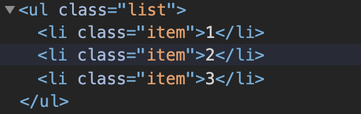
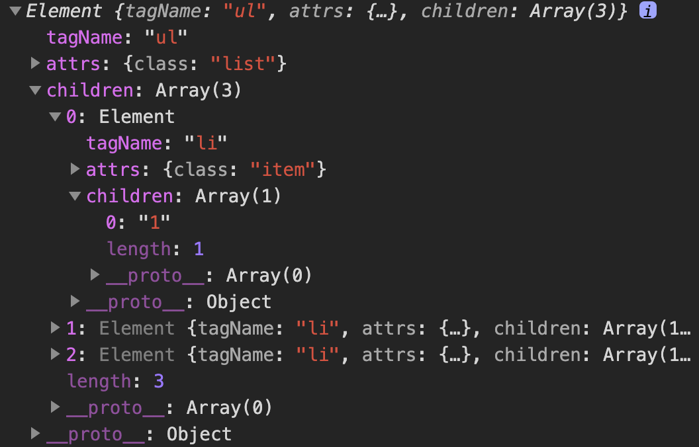
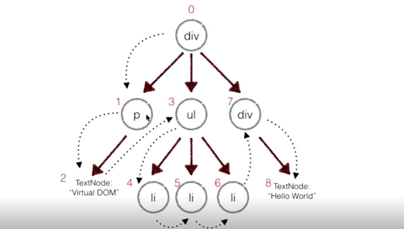

Virtual DOM是对DOM的抽象，本质上是JavaScript对象，这个对象就是更加轻量级的对DOM的描述。

<!---more-->

浏览器的虚拟DOM与真实DOM的区别：

1. 虚拟DOM不会进行回流与重绘操作
2. 虚拟DOM进行频繁修改，然后一次性比较并修改真实DOM中需要改的部分，最后在真实DOM中进行回流与重绘，减少过多DOM节点回流与重绘损耗
3. 真实DOM频繁回流与重绘的效率是相当低的
4. 虚拟DOM有效降低大面积（真实DOM节点）的重绘与回流，因为最终与真实DOM比较差异，可以只渲染局部

使用虚拟DOM的损耗计算：

```
总损耗 = 虚拟DOM增删改 + （与Diff算法效率有关）真实DOM差异增删改 + （较少的节点）回流与重绘
```

直接使用真实DOM的损耗计算：

```
总损耗 = 真实DOM完全增删改 + （可能较多的节点）回流与重绘
```

在前端性能优化的一个秘诀就是尽可能少地操作DOM，不仅仅是DOM相对较慢，更因为频繁变动DOM会造成浏览器的回流或者重绘，这些都是性能的杀手，因此我们需要这一层抽象，在patch过程中尽可能地一次性将差异更新到DOM中，这样保证了DOM不会出现性能很差的情况。

Virtual DOM最初的目的，就是更好的跨平台，比如Node.js就没有DOM，如果想实现SSR(服务端渲染)，那么一个方式就是借助Virtual DOM，因为Virtual DOM本身是JavaScript对象。

# 一、v-dom和dom-diff简单实现

## 1.JS对象模拟dom

首先明白一个dom节点所必须的要素：

+ tagName 标签名
+ attrs 属性
+ children 子节点

~~~JS
class Element {
  constructor(tagName, attrs, children) {
    this.tagName = tagName;
    this.attrs = attrs;
    this.children = children || [];
  }
}
function createElement(tagName, attrs, children) {
  return new Element(tagName, attrs, children);
}
~~~

比如说这时候我想模拟如下的DOM结构：



~~~JS
let ul1 = createElement('ul', {
  class: 'list'
}, [
  createElement('li', {
    class: 'item'
  }, ['1']),
  createElement('li', {
    class: 'item'
  }, ['2']),
  createElement('li', {
    class: 'item'
  }, ['3'])
]);
~~~



此时`ul1`就是上述真实DOM结构的虚拟DOM，那么如何将虚拟的DOM转换成真实DOM呢？

## 2.虚拟dom转换成真实dom插入

虚拟dom转换为真实dom的方法为实例方法，如下：

~~~JS
class Element {
  constructor(tagName, attrs, children) {
    this.tagName = tagName;
    this.attrs = attrs;
    this.children = children || [];
  }
  //把一个虚拟的DOM节点渲染成一个真实的DOM节点
  render() {
    //创建一个真实的DOM节点
    let element = document.createElement(this.tagName);
    //给真实DOM元素节点增加属性
    for (let attr in this.attrs) {
      element.setAttribute(attr,this.attrs[attr]);
    }
    this.children.forEach(child => {
      //子元素有俩种情况
      //1.仍然是Element实例 那么我需要递归的渲染
      //2.文本节点
      let childElement = (child instanceof Element) ? child.render() : document.createTextNode(child);
      element.appendChild(childElement);
    });
    return element;
  }
}
~~~

只要将上述`ul1`调用`ul1.render()`，得到真实dom，再挂载到页面上即可。

## 3.dom diff

diff的目的就是比较新旧Virtual DOM Tree找出差异并更新。

正常来说两个树做diff比较的时间复杂度为O(n^3)，如何优化到O(n)？

+ DOM节点的跨层级移动特别少，可以忽略不计，只比较同一层级，不跨级比较

- tag不相同，则直接删掉重建，不再深度比较
- tag和key俩者都相同，则认为是相同节点，不再深度比较，即使是顺序发生改变，如果key相同，说明该dom节点可以复用

实际的代码中， 会对新旧两棵树进行一个深度优先的遍历，这样每个节点都会有一个唯一的标记， 在深度优先遍历的时候， 每遍历到一个节点就把该节点和新的树进行对比。 如果有差异的话就记录到一个对象里面。



首先我们要确定需要对比哪些差异？

1. 同样位置上新节点没有元素，说明是被删除了
2. 新老节点同样位置都是文本节点，那么需要对比
3. tagName相同，则需要对比属性有没有改变，包括子节点等
4. 上述情况都不符合，说明我要将这个节点整个替换成新节点

~~~JS
let utils = require('./utils');
let keyIndex = 0;

function diff(oldTree, newTree) {
  //记录差异的空对象。key就是老节点在原来虚拟DOM树中的序号，值就是一个差异对象数组
  let patches = {};
  keyIndex = 0;
  let index = 0;
  walk(oldTree, newTree, index, patches);
  return patches;
}
 
function walk(oldNode, newNode, index, patches) {
  let currentPatches = []; 
  if (!newNode) { //如果新节点没有了，则认为此节点被删除了
    currentPatches.push({
      type: utils.REMOVE,
      index
    });
    //如果说老节点和新节点都是文本节点的话
  } else if (utils.isString(oldNode) && utils.isString(newNode)) {
    //如果新的字符符值和旧的不一样
    if (oldNode != newNode) {
      ///文本改变 
      currentPatches.push({
        type: utils.TEXT,
        content: newNode
      });
    }
  } else if (oldNode.tagName == newNode.tagName) {
    //比较新旧元素的属性对象
    let attrsPatch = diffAttr(oldNode.attrs, newNode.attrs);
    //如果新旧元素有差异 的属性的话
    if (Object.keys(attrsPatch).length > 0) {
      //添加到差异数组中去
      currentPatches.push({
        type: utils.ATTRS,
        attrs: attrsPatch
      });
    }
    //自己比完后再比自己的儿子们
    diffChildren(oldNode.children, newNode.children, index, patches, currentPatches);
  } else {
    currentPatches.push({
      type: utils.REPLACE,
      node: newNode
    });
  }
  if (currentPatches.length > 0) {
    patches[index] = currentPatches;
  }
}
啊、
function diffChildren(oldChildren, newChildren, index, patches, currentPatches) {
  oldChildren.forEach((child, idx) => {
    walk(child, newChildren[idx], ++keyIndex, patches);
  });
}

function diffAttr(oldAttrs, newAttrs) {
  let attrsPatch = {};
  for (let attr in oldAttrs) {
    //如果说老的属性和新属性不一样。一种是值改变 ，一种是属性被删除 了
    if (oldAttrs[attr] != newAttrs[attr]) {
      attrsPatch[attr] = newAttrs[attr];
    }
  }
  for (let attr in newAttrs) {
    if (!oldAttrs.hasOwnProperty(attr)) {
      attrsPatch[attr] = newAttrs[attr];
    }
  }
  return attrsPatch;
}
~~~

## 4.patch

将上述中的差异对象应用到真正的dom树上

~~~JS
let keyIndex = 0;
let utils = require('./utils');
let allPatches; //这里就是完整的补丁包
//root是真实dom，patches为差异对象
function patch(root, patches) {
  allPatches = patches;
  walk(root);
}

function walk(node) {
  let currentPatches = allPatches[keyIndex++];
  (node.childNodes || []).forEach(child => walk(child));
  if (currentPatches) {
    doPatch(node, currentPatches);
  }
}

function doPatch(node, currentPatches) {
  currentPatches.forEach(patch => {
    switch (patch.type) {
      case utils.ATTRS:
        for (let attr in patch.attrs) {
          let value = patch.attrs[attr];
          if (value) {
            utils.setAttr(node, attr, value);
          } else {
            node.removeAttribute(attr);
          }
        }
        break;
      case utils.TEXT:
        node.textContent = patch.content;
        break;
      case utils.REPLACE:
        let newNode = (patch.node instanceof Element) ? path.node.render() : document.createTextNode(path.node);
        node.parentNode.replaceChild(newNode, node);
        break;
      case utils.REMOVE:
        node.parentNode.removeChild(node);
        break;
    }
  });
}
~~~


# 二、Vue源码中的v-dom

`vm.__patch__`是整个virtual-dom中最核心的方法，主要完成oldVnode和Vnode的`diff`过程，并根据需要操作的vdom节点打patch，最后生成新的真实dom节点并完成视图的更新操作。

`vm.__patch__`方法定义在`src/core/vdom/patch.js`中。

~~~JS
function patch (oldVnode, vnode, hydrating, removeOnly) {
    ......
    if (isUndef(oldVnode)) {
      // 当oldVnode不存在时，创建新的节点
      isInitialPatch = true
      createElm(vnode, insertedVnodeQueue)
    } else {
      // 对oldVnode和vnode进行diff，并对oldVnode打patch  
      const isRealElement = isDef(oldVnode.nodeType)
      if (!isRealElement && sameVnode(oldVnode, vnode)) {
        // patch existing root node
        patchVnode(oldVnode, vnode, insertedVnodeQueue, null, null, removeOnly)
      } 
	......
  }
}
~~~

在 `patch` 方法中，分为两种情况，一种是当 `oldVnode` 不存在时，会创建新的节点；另一种则是已经存在 `oldVnode` ，那么会对 `oldVnode` 和 `vnode` 进行 `diff` 及 `patch` 的过程。其中 `patch` 过程中会调用 `sameVnode` 方法来对对传入的2个 `vnode` 进行基本属性的比较，只有当基本属性相同的情况下才认为这个2个`vnode` 只是局部发生了更新，然后才会对这2个 `vnode` 进行 `diff`，如果2个 `vnode` 的基本属性存在不一致的情况，那么就会直接跳过 `diff` 的过程，进而依据 `vnode` 新建一个真实的 `dom`，同时删除老的 `dom`节点。

~~~JS
function sameVnode (a, b) {
  return (
    a.key === b.key &&
    a.tag === b.tag &&
    a.isComment === b.isComment &&
    isDef(a.data) === isDef(b.data) &&
    sameInputType(a, b)
  )
}
~~~

`diff` 过程中主要是通过调用 `patchVnode` 方法进行的：

~~~JS
  function patchVnode (oldVnode, vnode, insertedVnodeQueue, ownerArray, index, removeOnly) {
    ...... 
    const elm = vnode.elm = oldVnode.elm
    const oldCh = oldVnode.children
    const ch = vnode.children
    // 如果vnode没有文本节点
    if (isUndef(vnode.text)) {
      // 如果oldVnode的children属性存在且vnode的children属性也存在  
      if (isDef(oldCh) && isDef(ch)) {
        // updateChildren，对子节点进行diff  
        if (oldCh !== ch) updateChildren(elm, oldCh, ch, insertedVnodeQueue, removeOnly)
      } else if (isDef(ch)) {
        if (process.env.NODE_ENV !== 'production') {
          checkDuplicateKeys(ch)
        }
        // 如果oldVnode的text存在，那么首先清空text的内容,然后将vnode的children添加进去  
        if (isDef(oldVnode.text)) nodeOps.setTextContent(elm, '')
        addVnodes(elm, null, ch, 0, ch.length - 1, insertedVnodeQueue)
      } else if (isDef(oldCh)) {
        // 删除elm下的oldchildren
        removeVnodes(elm, oldCh, 0, oldCh.length - 1)
      } else if (isDef(oldVnode.text)) {
        // oldVnode有子节点，而vnode没有，那么就清空这个节点  
        nodeOps.setTextContent(elm, '')
      }
    } else if (oldVnode.text !== vnode.text) {
      // 如果oldVnode和vnode文本属性不同，那么直接更新真是dom节点的文本元素
      nodeOps.setTextContent(elm, vnode.text)
    }
    ......
  }
~~~

从上面代码可以看出：

1. 首先会进行文本节点的判断，如果 `oldVnode.text !== vnode.text`，那么就会直接进行文本节点的替换

2. 在`vnode`没有文本节点的情况下，进入子节点的`diff`
    + 当`vnode`的子节点和`oldVnode`的子节点都存在且不相同的情况下，调用`updateChildren`对子节点进行`diff`
    + 若 `oldCh`不存在，`ch` 存在，首先清空 `oldVnode` 的文本节点，同时调用 `addVnodes` 方法将 `ch` 添加到`elm`真实 `dom` 节点当中
    + 若 `oldCh`存在，`ch`不存在，则删除 `elm` 真实节点下的 `oldCh` 子节点；

