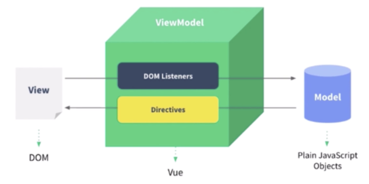
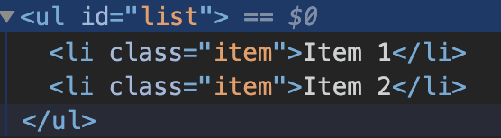
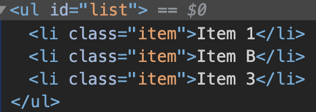
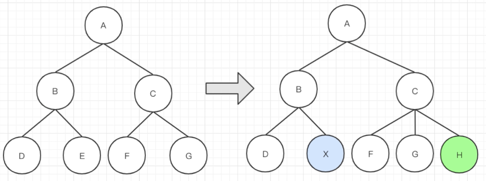
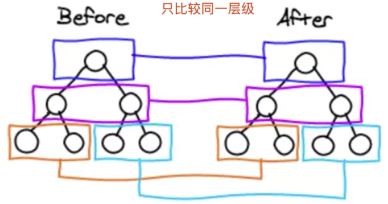
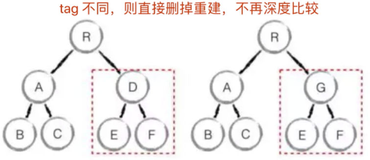

## 1.基本使用

**v-html**

~~~html
<p v-html="rawHtml"></p>
~~~

将整个标签内容替换成rawHtml中的内容，如果标签内还有子元素，会被覆盖。

`防止XSS攻击`


**computed和watch**

<!---more-->

## 2.原理

### 2.1.MVVM

**MVC**

传统的MVC模式就是modul,view,controller三层，但是当初的网页比较简单，前端所需要的数据，一般都能通过后端处理好再发给前端。但是H5的出现让网页开始向app靠拢，为了实现H5的移动端和原生app一样，逐渐的发展为MVVM模式。
**MVC的缺点** ：

1. 开发者在代码中大量调用相同的DOM API，处理繁琐，操作冗余，使得代码难以维护。
2. 大量的DOM 操作使页面渲染性能降低，加载速度变慢，影响用户体验。
3. 当 Model 频繁发生变化，开发者需要主动更新到View ；当用户的操作导致 Model 发生变化，开发者同样需要将变化的数据同步到Model 中，这样的工作不仅繁琐，而且很难维护复杂多变的数据状态。

**MVVM**简介：
MVVM 极大地提高了前端开发效率。MVVM的核心是ViewModel 层，它就像是一个中转站（value converter），负责转换Model中的数据对象来让数据变得更容易管理和使用，该层向上与视图层进行双向数据绑定，向下与Model层通过接口请求进行数据交互，起呈上启下作用。


其实可以看出对于前端，只是在view和viewModule层进行编写代码。

+ view层

    View 是视图层，也就是用户界面。前端的html和css构建，与viewModel实现数据绑定

+ Model层

    Model是指数据模型，也就是后端的数据操控，一般前端利用ajax操作进行在viewModule层对其进行数据请求

+ viewModel层

    在该层所封装的数据类型包括视图的状态（数据）和一些行为，而 Model 层的数据模型是只包含状态的。
    由于实现了双向绑定，ViewModel的内容会实时展现在View层，这是激动人心的，因为前端开发者再也不必低效又麻烦地通过操纵DOM去更新视图，MVVM框架已经把最脏最累的一块做好了，我们开发者只需要处理和维护 ViewModel，更新数据视图就会自动得到相应更新，真正实现数据驱动开发。
    **视图状态**：这一块展示什么（数据）
    **视图行为**：用户发生了什么行为（触发了什么事件），要作什么，执行什么函数

**例子**

vue的模板就是view层

```
<div id="app">
    <p>{{message}}</p>
    <button v-on:click="showMessage()">Click me</button>
</div>
```

Vue的ViewModel层

```
var app = new Vue({
    el: '#app',
    data: {     // 用于描述视图状态（有基于 Model 层数据定义的，也有纯前端定义）
        message: 'Hello Vue!',  // 纯前端定义
        server: {}, // 存放基于 Model 层数据的二次封装数据
    },
    methods: {  // 用于描述视图行为（完全前端定义）
        showMessage(){
            let vm = this;
            alert(vm.message);
        }
    },
    created(){
        let vm = this;
        // Ajax 获取 Model 层的数据
        ajax({
            url: '/your/server/data/api',
            success(res){
                // TODO 对获取到的 Model 数据进行转换处理，做二次封装
                vm.server = res;
            }
        });
    }
})
```

服务器的model层

```
{
    "url": "/your/server/data/api",
    "res": {
        "success": true,
        "name": "zhou"
    }
}
```




### 2.2.实现双向数据绑定

Object.defineProperty()

缺点：

+ 深度监听，需要递归到底，一次性计算量大
+ 无法监听新增属性/删除属性(Vue.set、Vue.delete)

Vue3.0启用proxy()，但是兼容性不好，无法用polyfill

### 2.3.vdom和diff

#### 2.3.1 vdom

+ 用JS模拟DOM结构(vnode)

+ 新旧vnode对比，得出最小更新范围，最后更新DOM

+ 数据驱动视图模式下，有效控制DOM操作

~~~html
<div id="div1" class="container">
    <p>vdom</p>
    <ul style="font-size: 20px">
        <li>a</li>
    </ul>
</div>
~~~

下面是用js模拟的DOM结构：

~~~JS
{
    tag: 'div',
    props: {
        className: 'container',
        id: 'div1'
    }
    children: [
        {
            tag: 'p',
            children: 'vdom'
        },
        {
            tag 'ul',
            props: {style: 'font-size: 20px'}
            children: [
                {
                    tag: 'li'
                    children: 'a'
                }
                //...
            ]
        }
    ]
}
~~~


vnode => patch第一次 到空的dom元素 首次渲染 => newVnode => patch第二次 新旧对比


由于虚拟dom有那么多的好处而且现代前端框架中react和vue均不同程度的使用了虚拟dom的技术，因此通过一个简单的 库赖学习虚拟dom技术就十分必要了，至于为什么会选择snabbdom.js这个库呢？原因主要有两个：

1. 源码简短，总体代码行数不超过500行。
2. 著名的vue的虚拟dom实现也是参考了snabbdom.js的实现。


**用snabbdom来体验一下**

~~~JS
const snabbdom = window.snabbdom

// 定义 patch
const patch = snabbdom.init([
    snabbdom_class,
    snabbdom_props,
    snabbdom_style,
    snabbdom_eventlisteners
])

// 定义 h
const h = snabbdom.h

const container = document.getElementById('container')

// 生成 vnode
const vnode = h('ul#list', {}, [
    h('li.item', {}, 'Item 1'),
    h('li.item', {}, 'Item 2')
])
patch(container, vnode)

document.getElementById('btn-change').addEventListener('click', () => {
    // 生成 newVnode
    const newVnode = h('ul#list', {}, [
        h('li.item', {}, 'Item 1'),
        h('li.item', {}, 'Item B'),
        h('li.item', {}, 'Item 3')
    ])
    patch(vnode, newVnode)
})
~~~





在页面刷新的时候，发现`item1`并没有更新。那么是怎么做到的呢？


#### 2.3.2 diff算法

+ diff即对比，是一个广泛的概念，如Linux diff命令、git diff命令
+ 俩个js对象也可以diff，如<https://github.com/cujojs/jiff>
+ 俩个树做diff，如这里的vdom diff



正常来说俩个树做diff比较的时间复杂度为O(n^3)，如何优化到O(n)？

+ 只比较同一层级，不跨级比较
+ tag不相同，则直接删掉重建，不再深度比较
+ tag和key俩者都相同，则认为是相同节点，不再深度比较





