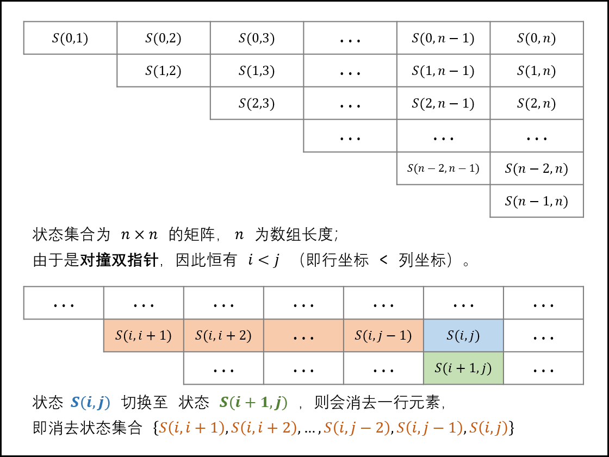

剑指offer算法题

<!---more-->


## 面试题03. 数组中重复的数字

找出数组中重复的数字。


在一个长度为 n 的数组 nums 里的所有数字都在 0～n-1 的范围内。数组中某些数字是重复的，但不知道有几个数字重复了，也不知道每个数字重复了几次。请找出数组中任意一个重复的数字。

示例 1：

输入：
[2, 3, 1, 0, 2, 5, 3]
输出：2 或 3 

解法一：用自身做哈希表 O(n) O(1)

> 因为所有数字都在0~n-1，所以我们可以将数字映射到数字中相应的位置上

~~~JS
var findRepeatNumber = function(nums) {
    let len=nums.length;
    for(let i=0;i<len;i++) {
        while(nums[i]!=i) {
            //此时说明nums[i]该在的位置已经被占用了，说明他是重复的
            if(nums[nums[i]]===nums[i]) return nums[i];
            let index=nums[i];
            [nums[i],nums[index]]=[nums[index],nums[i]];
        }
    }
};
~~~

解法二：排序后遍历 O(nlogn) O(1)

解法三：hash表 O(n) O(n)


## 面试题04. 二维数组中的查找

在一个 n * m 的二维数组中，每一行都按照从左到右递增的顺序排序，每一列都按照从上到下递增的顺序排序。请完成一个函数，输入这样的一个二维数组和一个整数，判断数组中是否含有该整数。

现有矩阵 matrix 如下：

[
  [1,   4,  7, 11, 15],
  [2,   5,  8, 12, 19],
  [3,   6,  9, 16, 22],
  [10, 13, 14, 17, 24],
  [18, 21, 23, 26, 30]
]
给定 target = 5，返回 true。

给定 target = 20，返回 false。

~~~JS
//站在右上角看，是一个类似的二叉搜索树，双指针
var findNumberIn2DArray = function(matrix, target) {
    if(!matrix||!matrix.length) return false;
    let m=matrix.length,
        n=matrix[0].length,
        i=0,
        j=n-1;
    while(i<m&&j>=0) {
        if(matrix[i][j]>target) j--;
        else if(matrix[i][j]<target) i++;
        else return true;
    }
    return false;
};
~~~


## 面试题05. 替换空格

请实现一个函数，把字符串 s 中的每个空格替换成"%20"。

 

示例 1：

输入：s = "We are happy."
输出："We%20are%20happy."

~~~JS
/**
 * @param {string} s
 * @return {string}
 */
var replaceSpace = function(s) {
    return s.split(' ').join('%20');
};
~~~


## 面试题06. 从尾到头打印链表

输入一个链表的头节点，从尾到头反过来返回每个节点的值（用数组返回）。

```JS
输入：head = [1,3,2]
输出：[2,3,1]
```

解法一：栈 使得倒过来输出

解法二：递归

~~~JS
var reversePrint = function(head) {
    if(!head) return [];
    return reversePrint(head.next).concat(head.val);
};
~~~


## 面试题07. 重建二叉树

输入某二叉树的前序遍历和中序遍历的结果，请重建该二叉树。假设输入的前序遍历和中序遍历的结果中都不含重复的数字。

例如，给出

前序遍历 preorder = [3,9,20,15,7]
中序遍历 inorder = [9,3,15,20,7]
返回如下的二叉树：

      3
     / \
    9  20
      /  \
     15   7
~~~JS
var buildTree = function(preorder, inorder) {
    let pLeft=0,
        pRight=preorder.length-1,
        iLeft=0,
        iRight=inorder.length-1;
    return build(pLeft,pRight,iLeft,iRight);
    function build(pLeft,pRight,iLeft,iRight) {
        if(pLeft>pRight||iLeft>iRight) return null;
        let i=iLeft;
        while(i<=iRight) {
            if(inorder[i]===preorder[pLeft]) break;
            i++;
        }
        let node=new TreeNode(preorder[pLeft]);
        node.left=build(pLeft+1,pLeft+i-iLeft,iLeft,i-1);
        node.right=build(pLeft+i-iLeft+1,pRight,i+1,iRight);
        return node;
    }
};
~~~


## [面试题09. 用两个栈实现队列](https://leetcode-cn.com/problems/yong-liang-ge-zhan-shi-xian-dui-lie-lcof/)

~~~JS
var CQueue = function() {
    this.stack=[];
    this.help=[];
};

/** 
 * @param {number} value
 * @return {void}
 */
CQueue.prototype.appendTail = function(value) {
    this.stack.push(value);
};

/**
 * @return {number}
 */
CQueue.prototype.deleteHead = function() {
    if(!this.stack.length) return -1;
    while(this.stack.length) {
        this.help.push(this.stack.pop());
    }
    let val=this.help.pop();
    while(this.help.length) {
        this.stack.push(this.help.pop());
    }
    return val;
};

/**
 * Your CQueue object will be instantiated and called as such:
 * var obj = new CQueue()
 * obj.appendTail(value)
 * var param_2 = obj.deleteHead()
 */
~~~

## [面试题10- I. 斐波那契数列](https://leetcode-cn.com/problems/fei-bo-na-qi-shu-lie-lcof/)

~~~JS
var fib = function(n) {
    let pre=0,
        cur=1;
    for(let i=1;i<=n;i++) {
        let sum=(pre+cur)%1000000007;
        pre=cur;
        cur=sum;
    }
    return pre%1000000007;
};
~~~

> 记忆化搜索

~~~JS
const memo=new Map();
var fib = function(n) {
    if(memo.has(n)) return memo.get(n);
    if(n<=1) return n;
    memo.set(n,fib(n-1)%1000000007+fib(n-2)%1000000007);
    return memo.get(n)%1000000007;
};
~~~

## [面试题10- II. 青蛙跳台阶问题](https://leetcode-cn.com/problems/qing-wa-tiao-tai-jie-wen-ti-lcof/)

~~~JS
const base=1000000007;
var numWays = function(n) {
    const dp=Array(n+1).fill(0);
    dp[0]=1;
    dp[1]=1;
    for(let i=2;i<=n;i++) {
        dp[i]=dp[i-1]%base+dp[i-2]%base;
    }
    return dp[n]%base;
};
~~~

~~~JS
const base=1000000007;
const memo=new Map();
var numWays = function(n) {
    if(memo.has(n)) return memo.get(n);
    if(n<=1) return 1;
    memo.set(n,numWays(n-1)%base+numWays(n-2)%base);
    return memo.get(n)%base;
};
~~~

## [面试题11. 旋转数组的最小数字](https://leetcode-cn.com/problems/xuan-zhuan-shu-zu-de-zui-xiao-shu-zi-lcof/)

把一个数组最开始的若干个元素搬到数组的末尾，我们称之为数组的旋转。输入一个递增排序的数组的一个旋转，输出旋转数组的最小元素。例如，数组 [3,4,5,1,2] 为 [1,2,3,4,5] 的一个旋转，该数组的最小值为1。

> 

~~~JS
var minArray = function(numbers) {
    let l=0,
        r=numbers.length-1;
    while(l<r) {
        let mid=Math.floor(l+(r-l)/2);
        if(numbers[mid]<numbers[r]) r=mid;
        else if(numbers[mid]>numbers[r]) l=mid+1;
        else r--;
    }
    return numbers[l];
};
~~~

## [面试题12. 矩阵中的路径](https://leetcode-cn.com/problems/ju-zhen-zhong-de-lu-jing-lcof/)

请设计一个函数，用来判断在一个矩阵中是否存在一条包含某字符串所有字符的路径。路径可以从矩阵中的任意一格开始，每一步可以在矩阵中向左、右、上、下移动一格。如果一条路径经过了矩阵的某一格，那么该路径不能再次进入该格子。例如，在下面的3×4的矩阵中包含一条字符串“bfce”的路径（路径中的字母用加粗标出）。

[["a","**b**","c","e"],
["s","**f**","**c**","s"],
["a","d","**e**","e"]]

~~~JS
var exist = function(board, word) {
    if(!word) return true;
    if(!board||!board.length) return false;
    let m=board.length,
        n=board[0].length;
    const visited=Array(m).fill().map(arr=>Array(n).fill(false));
    for(let i=0;i<m;i++) {
        for(let j=0;j<n;j++) {
            let res=backtrack(i,j,0);
            if(res) return true;
        }
    }
    return false;
    function backtrack(i,j,index) {
        if(i<0||i>=m||j<0||j>=n||visited[i][j]||board[i][j]!=word[index]) return false;
        visited[i][j]=true;
        if(index+1===word.length) return true;
        let res=backtrack(i+1,j,index+1)||backtrack(i,j+1,index+1)||backtrack(i-1,j,index+1)||backtrack(i,j-1,index+1);
        visited[i][j]=false;
        return res;
    }
};
~~~

## [面试题13. 机器人的运动范围](https://leetcode-cn.com/problems/ji-qi-ren-de-yun-dong-fan-wei-lcof/)

地上有一个m行n列的方格，从坐标 [0,0] 到坐标 [m-1,n-1] 。一个机器人从坐标 [0, 0] 的格子开始移动，它每次可以向左、右、上、下移动一格（不能移动到方格外），也不能进入行坐标和列坐标的数位之和大于k的格子。例如，当k为18时，机器人能够进入方格 [35, 37] ，因为3+5+3+7=18。但它不能进入方格 [35, 38]，因为3+5+3+8=19。请问该机器人能够到达多少个格子？

```
输入：m = 2, n = 3, k = 1
输出：3
```

~~~JS
var movingCount = function(m, n, k) {
    const visited=Array(m).fill().map(arr=>Array(n).fill(false));
    return dfs(0,0,0,0);
    function dfs(i,j,si,sj) {
        if(i>=m||j>=n||si+sj>k||visited[i][j]) return 0;
        visited[i][j]=true;
        return 1+dfs(i+1,j,(i+1)%10!=0?si+1:si-8,sj)+dfs(i,j+1,si,(j+1)%10!=0?sj+1:sj-8);
    }
};
~~~

## [面试题14- I. 剪绳子](https://leetcode-cn.com/problems/jian-sheng-zi-lcof/)

~~~
输入: 10
输出: 36
解释: 10 = 3 + 3 + 4, 3 × 3 × 4 = 36
~~~

~~~JS
var cuttingRope = function(n) {
    const dp=Array(n+1).fill(-1);
    dp[1]=1;
    for(let i=2;i<=n;i++) {
        for(let j=1;j<i;j++) {
            dp[i]=Math.max(dp[i],dp[j]*(i-j),j*(i-j));
        }
    }
    return dp[n];
};
~~~

## [面试题14- II. 剪绳子 II](https://leetcode-cn.com/problems/jian-sheng-zi-ii-lcof/)

给你一根长度为 n 的绳子，请把绳子剪成整数长度的 m 段（m、n都是整数，n>1并且m>1），每段绳子的长度记为 k[0],k[1]...k[m] 。请问 k[0]*k[1]*...*k[m] 可能的最大乘积是多少？例如，当绳子的长度是8时，我们把它剪成长度分别为2、3、3的三段，此时得到的最大乘积是18。

答案需要取模 1e9+7（1000000007），如计算初始结果为：1000000008，请返回 1。

> 1.当所有绳段长度相等时，乘积最大
>
> 由均值不等式可以得到
>
> 2.最优的绳段长度为3 
>
> y=x^(1/x)，求它的最大值，极值点为x=e，从而推断x=3的时候为最大值，每段尽可能分为3
>
> 剪绳子数学问题其实就是尽可能多地切3的片段，我们可以以n>4来作为循环跳出点
>
> 边界条件：
>
> n=2，等于说无限除以3，最后余下绳子长度为2，此时将res乘以2即可
>
> n=3，绳子全部用完，直接所有3相乘即可
>
> n=4，等于说余下绳子长度为1，因为4%3=1，但是3<2*2，也就是4本身，故最后乘4

~~~JS
const base=1000000007;
var cuttingRope = function(n) {
    if(n<=3) return n-1;
    let a=Math.floor(n/3),
        b=a%3,
        res=1;
    while(n>4) {
        res*=3;
        res%=base;
        n-=3;
    }
    return res*n%base;
};
~~~

## [面试题15. 二进制中1的个数](https://leetcode-cn.com/problems/er-jin-zhi-zhong-1de-ge-shu-lcof/)

~~~
输入：11111111111111111111111111111101
输出：31
解释：输入的二进制串 11111111111111111111111111111101 中，共有 31 位为 '1'。
~~~

> n&1可以判断最后一位是不是1，判断完再n>>>1，将二进制右移1位

~~~JS
var hammingWeight = function(n) {
    let res=0;
    while(n) {
        res+=(n&1);
        n>>>=1;
    }
    return res;
};
~~~

> 一个数n与一个比它小1的数（n - 1）进行与运算&之后，得到的结果会消除n中最低位的1

~~~JS
var hammingWeight = function(n) {
    let res=0;
    while(n) {
        n&=(n-1);
        res++;
    }
    return res;
};
~~~

## [面试题16. 数值的整数次方](https://leetcode-cn.com/problems/shu-zhi-de-zheng-shu-ci-fang-lcof/)

~~~
输入: 2.10000, 3
输出: 9.26100
~~~

~~~JS
var myPow = function(x, n) {
    if(n===0) return 1;
    if(n<0) return 1/myPow(x,-n);
    return (n&1)===0?myPow(x*x,n>>>1):myPow(x*x,(n-1)>>>1)*x;
};
~~~

## [面试题17. 打印从1到最大的n位数](https://leetcode-cn.com/problems/da-yin-cong-1dao-zui-da-de-nwei-shu-lcof/)

输入数字 `n`，按顺序打印出从 1 到最大的 n 位十进制数。比如输入 3，则打印出 1、2、3 一直到最大的 3 位数 999。

~~~JS
var printNumbers = function(n) {
    const res=[];
    for(let i=1;i<10**n;i++) {
        res.push(i);
    }
    return res;
};
~~~

## [面试题18. 删除链表的节点](https://leetcode-cn.com/problems/shan-chu-lian-biao-de-jie-dian-lcof/)

给定单向链表的头指针和一个要删除的节点的值，定义一个函数删除该节点。

返回删除后的链表的头节点

~~~
输入: head = [4,5,1,9], val = 5
输出: [4,1,9]
解释: 给定你链表中值为 5 的第二个节点，那么在调用了你的函数之后，该链表应变为 4 -> 1 -> 9.
~~~

~~~JS
var deleteNode = function(head, val) {
    let dummy=new ListNode(0),
        pre=dummy,
        cur=head;
    dummy.next=head;
    while(cur) {
        if(cur.val===val) {
            pre.next=cur.next;
            break;
        }
        pre=cur;
        cur=cur.next;
    }
    return dummy.next;
};
~~~

## [面试题19. 正则表达式匹配](https://leetcode-cn.com/problems/zheng-ze-biao-da-shi-pi-pei-lcof/)

请实现一个函数用来匹配包含'. '和'*'的正则表达式。模式中的字符'.'表示任意一个字符，而'*'表示它前面的字符可以出现任意次（含0次）。在本题中，匹配是指字符串的所有字符匹配整个模式。例如，字符串"aaa"与模式"a.a"和"ab*ac*a"匹配，但与"aa.a"和"ab*a"均不匹配。

~~~
输入:
s = "aa"
p = "a"
输出: false
解释: "a" 无法匹配 "aa" 整个字符串。
~~~

~~~JS
var isMatch = function(s, p) {
    let reg=RegExp("^("+p+")$");
    console.log(reg.source);
    return reg.test(s);
    

};
~~~

## [面试题20. 表示数值的字符串](https://leetcode-cn.com/problems/biao-shi-shu-zhi-de-zi-fu-chuan-lcof/)

请实现一个函数用来判断字符串是否表示数值（包括整数和小数）。例如，字符串"+100"、"5e2"、"-123"、"3.1416"、"0123"都表示数值，但"12e"、"1a3.14"、"1.2.3"、"+-5"、"-1E-16"及"12e+5.4"都不是。

~~~JS
var isNumber = function(s) {
    s=s.trim();
    if(!s) return false;
    return !isNaN(s);
};
~~~


## [面试题21. 调整数组顺序使奇数位于偶数前面](https://leetcode-cn.com/problems/diao-zheng-shu-zu-shun-xu-shi-qi-shu-wei-yu-ou-shu-qian-mian-lcof/)

输入一个整数数组，实现一个函数来调整该数组中数字的顺序，使得所有奇数位于数组的前半部分，所有偶数位于数组的后半部分。

~~~
输入：nums = [1,2,3,4]
输出：[1,3,2,4] 
注：[3,1,2,4] 也是正确的答案之一。
~~~

> 双指针，每次至少能确定一个元素的位置

~~~JS
var exchange = function(nums) {
    let l=0,
        r=nums.length-1;
    while(l<r) {
        if(nums[l]%2===1&&nums[r]%2===0) {
            l++;
            r--;
        }else if(nums[l]%2===0&&nums[r]%2===1) {
            [nums[l],nums[r]]=[nums[r],nums[l]];
        }else if(nums[l]%2===1&&nums[r]%2===1) {
            l++;
        }else {
            r--;
        }
    }
    return nums;
};
~~~


## [面试题22. 链表中倒数第k个节点](https://leetcode-cn.com/problems/lian-biao-zhong-dao-shu-di-kge-jie-dian-lcof/)

~~~
给定一个链表: 1->2->3->4->5, 和 k = 2.

返回链表 4->5.
~~~

~~~JS
var getKthFromEnd = function(head, k) {
    let slow=fast=head;
    while(k--) fast=fast.next;
    while(slow&&fast) {
        slow=slow.next;
        fast=fast.next;
    }
    return slow;
};
~~~


## [面试题24. 反转链表](https://leetcode-cn.com/problems/fan-zhuan-lian-biao-lcof/)

定义一个函数，输入一个链表的头节点，反转该链表并输出反转后链表的头节点。

```
输入: 1->2->3->4->5->NULL
输出: 5->4->3->2->1->NULL
```

非递归版

~~~JS
var reverseList = function(head) {
    let pre=null,
        cur=head;
    while(cur) {
        let nxt=cur.next;
        cur.next=pre;
        pre=cur;
        cur=nxt;
    }
    return pre;
};
~~~

递归版

> 对于递归算法，最重要的就是明确递归函数的定义。具体来说，我们的 `reverseList` 函数定义是这样的：
>
> **输入一个节点head，将以head为起点的链表反转，并返回反转之后的头结点。**

~~~JS
var reverseList = function(head) {
    if(!head||!head.next) return head;
    let last=reverseList(head.next);
    head.next.next=head;
    head.next=null;
    return last;
};
~~~

## [面试题25. 合并两个排序的链表](https://leetcode-cn.com/problems/he-bing-liang-ge-pai-xu-de-lian-biao-lcof/)

~~~
输入：1->2->4, 1->3->4
输出：1->1->2->3->4->4
~~~

递归版

~~~JS
var mergeTwoLists = function(l1, l2) {
    if(!l1) return l2;
    if(!l2) return l1;
    let cur;
    if(l1.val<l2.val) {
        cur=l1;
        cur.next=mergeTwoLists(l1.next,l2);
    }else{
        cur=l2;
        cur.next=mergeTwoLists(l1,l2.next);
    }
    return cur;
};
~~~

迭代版

~~~JS
var mergeTwoLists = function(l1, l2) {
    let dummy=new ListNode(0),
        cur=dummy;
    while(l1&&l2) {
        if(l1.val<l2.val) {
            cur.next=l1;
            l1=l1.next;
        }else {
            cur.next=l2;
            l2=l2.next;
        }
        cur=cur.next;
    }
    cur.next=l1||l2;
    return dummy.next;
};
~~~


## [面试题26. 树的子结构](https://leetcode-cn.com/problems/shu-de-zi-jie-gou-lcof/)

输入两棵二叉树A和B，判断B是不是A的子结构。(约定空树不是任意一个树的子结构)

B是A的子结构， 即 A中有出现和B相同的结构和节点值。

~~~JS
var isSubStructure = function(A, B) {
    if(!A&&!b) return true;
    if(!A||!B) return false;
    return isSubStructure(A.left,B)||isSubStructure(A.right,B)||isSub(A,B);
};

function isSub(a,b) {
    if(!a&&!b) return true;
    if(!a&&b) return false;
    if(a&&!b) return true;
    if(a.val!=b.val) return false;
    return isSub(a.left,b.left)&&isSub(a.right,b.right);
}
~~~


## [面试题27. 二叉树的镜像](https://leetcode-cn.com/problems/er-cha-shu-de-jing-xiang-lcof/)

请完成一个函数，输入一个二叉树，该函数输出它的镜像。

~~~JS
var mirrorTree = function(root) {
    if(!root) return null;
    [root.left,root.right]=[mirrorTree(root.right),mirrorTree(root.left)];
    return root;
};
~~~

~~~JS
var mirrorTree = function(root) {
    const queue=[root];
    while(queue.length) {
        let node=queue.shift();
        if(node) {
            [node.left,node.right]=[node.right,node.left];
            queue.push(node.left,node.right);
        }
    }
    return root;
};
~~~


## [面试题28. 对称的二叉树](https://leetcode-cn.com/problems/dui-cheng-de-er-cha-shu-lcof/)

请实现一个函数，用来判断一棵二叉树是不是对称的。如果一棵二叉树和它的镜像一样，那么它是对称的。

~~~JS
/**
 * Definition for a binary tree node.
 * function TreeNode(val) {
 *     this.val = val;
 *     this.left = this.right = null;
 * }
 */
/**
 * @param {TreeNode} root
 * @return {boolean}
 */
var isSymmetric = function(root) {
    if(!root) return true;
    const queue=[root.left,root.right];
    while(queue.length) {
        let node1=queue.pop(),
            node2=queue.pop();
        if(!node1&&!node2) continue;
        if(!node1||!node2||node1.val!=node2.val) return false;
        queue.push(node1.left,node2.right,node1.right,node2.left);
    }
    return true;
};
~~~

~~~JS
var isSymmetric = function(root) {
    if(!root) return true;
    return isSame(root.left,root.right);
};

function isSame(l,r) {
    if(!l&&!r) return true;
    if(!l||!r) return false;
    if(l.val!==r.val) return false;
    return isSame(l.left,r.right)&&isSame(l.right,r.left);
}
~~~

## [面试题29. 顺时针打印矩阵](https://leetcode-cn.com/problems/shun-shi-zhen-da-yin-ju-zhen-lcof/)

输入一个矩阵，按照从外向里以顺时针的顺序依次打印出每一个数字。

~~~JS
var spiralOrder = function(matrix) {
    if(!matrix||!matrix.length) return [];
    let m=matrix.length,
        n=matrix[0].length,
        top=0,
        bottom=m-1,
        left=0,
        right=n-1,
        res=[];
    while(true) {
        for(let i=left;i<=right;i++) res.push(matrix[top][i]);
        if(++top>bottom) break;
        for(let i=top;i<=bottom;i++) res.push(matrix[i][right]);
        if(--right<left) break;
        for(let i=right;i>=left;i--) res.push(matrix[bottom][i]);
        if(--bottom<top) break;
        for(let i=bottom;i>=top;i--) res.push(matrix[i][left]);
        if(++left>right) break;
    }
    return res;
};
~~~

## [面试题30. 包含min函数的栈](https://leetcode-cn.com/problems/bao-han-minhan-shu-de-zhan-lcof/)

~~~
MinStack minStack = new MinStack();
minStack.push(-2);
minStack.push(0);
minStack.push(-3);
minStack.min();   --> 返回 -3.
minStack.pop();
minStack.top();      --> 返回 0.
minStack.min();   --> 返回 -2.
~~~

~~~JS
var MinStack = function() {
    this.stack=[];
    this.minStack=[];
};

/** 
 * @param {number} x
 * @return {void}
 */
MinStack.prototype.push = function(x) {
    this.stack.push(x);
    if(!this.minStack.length||x<this.minStack[this.minStack.length-1]) this.minStack.push(x);
};

/**
 * @return {void}
 */
MinStack.prototype.pop = function() {
    if(this.stack.pop()===this.minStack[this.minStack.length-1]) this.minStack.pop();
};

/**
 * @return {number}
 */
MinStack.prototype.top = function() {
    return this.stack[this.stack.length-1];
};

/**
 * @return {number}
 */
MinStack.prototype.min = function() {
    return this.minStack[this.minStack.length-1];
};
~~~

## [面试题31. 栈的压入、弹出序列](https://leetcode-cn.com/problems/zhan-de-ya-ru-dan-chu-xu-lie-lcof/)

输入两个整数序列，第一个序列表示栈的压入顺序，请判断第二个序列是否为该栈的弹出顺序。假设压入栈的所有数字均不相等。例如，序列 {1,2,3,4,5} 是某栈的压栈序列，序列 {4,5,3,2,1} 是该压栈序列对应的一个弹出序列，但 {4,3,5,1,2} 就不可能是该压栈序列的弹出序列。

~~~JS
var validateStackSequences = function(pushed, popped) {
    let i=0,
        len=pushed.length;
        stack=[];
    for(let v of pushed) {
        stack.push(v);
        while(stack.length&&stack[stack.length-1]===popped[i]) {
            stack.pop();
            i++;
        }
    }
    return !stack.length;
};
~~~


## [面试题32 - I. 从上到下打印二叉树](https://leetcode-cn.com/problems/cong-shang-dao-xia-da-yin-er-cha-shu-lcof/)

从上到下打印出二叉树的每个节点，同一层的节点按照从左到右的顺序打印。

例如:
给定二叉树: [3,9,20,null,null,15,7],

    3
   / \
  9  20
    /  \
   15   7
返回：

[3,9,20,15,7]

~~~JS
var levelOrder = function(root) {
    if(!root) return [];
    const res=[],
          queue=[root];
    while(queue.length) {
        let node=queue.shift();
        if(node) {
            res.push(node.val);
            queue.push(node.left,node.right);
        }
    }
    return res;
};
~~~

## [面试题32 - II. 从上到下打印二叉树 II](https://leetcode-cn.com/problems/cong-shang-dao-xia-da-yin-er-cha-shu-ii-lcof/)

给定二叉树: [3,9,20,null,null,15,7],

​    3

   / \
  9  20
    /  \
   15   7
返回其层次遍历结果：

[
  [3],
  [9,20],
  [15,7]
]

~~~JS
var levelOrder = function(root) {
    if(!root) return [];
    const res=[],
          queue=[root];
    while(queue.length) {
        let len=queue.length,
            temp=[];
        for(let i=0;i<len;i++) {
            let node=queue[i];
            temp.push(node.val);
            if(node.left) queue.push(node.left);
            if(node.right) queue.push(node.right);
        }
        res.push(temp);
        queue.splice(0,len);
    }
    return res;
};
~~~


## [面试题32 - III. 从上到下打印二叉树 III](https://leetcode-cn.com/problems/cong-shang-dao-xia-da-yin-er-cha-shu-iii-lcof/)

请实现一个函数按照之字形顺序打印二叉树，即第一行按照从左到右的顺序打印，第二层按照从右到左的顺序打印，第三行再按照从左到右的顺序打印，其他行以此类推。
给定二叉树: [3,9,20,null,null,15,7],

​    3

   / \
  9  20
    /  \
   15   7
返回其层次遍历结果：

[
  [3],
  [20,9],
  [15,7]
]

~~~JS
var levelOrder = function(root) {
    if(!root) return [];
    let res=[],
        queue=[root],
        flag=true;
    while(queue.length) {
        let len=queue.length,
            temp=[];
        for(let i=0;i<len;i++) {
            let node=queue[i];
            if(flag) temp.push(node.val);
            else temp.unshift(node.val);
            if(node.left) queue.push(node.left);
            if(node.right) queue.push(node.right);
        }
        res.push(temp);
        queue.splice(0,len);
        flag=!flag;
    }
    return res;
};
~~~

## [面试题33. 二叉搜索树的后序遍历序列](https://leetcode-cn.com/problems/er-cha-sou-suo-shu-de-hou-xu-bian-li-xu-lie-lcof/)

输入一个整数数组，判断该数组是不是某二叉搜索树的后序遍历结果。如果是则返回 `true`，否则返回 `false`。假设输入的数组的任意两个数字都互不相同。

> 根据二叉搜索树的定义，可以通过递归，判断所有子树的 **正确性** （即其后序遍历是否满足二叉搜索树的定义） ，若所有子树都正确，则此序列为二叉搜索树的后序遍历。
>
> 终止条件：当j-i<=1，说明子树节点个数为2，一定是正确的
>
> 划分左子树、右子树，p能走到最右边，说明当前这一层树是正确的。

~~~JS
var verifyPostorder = function(postorder) {
    return recur(postorder,0,postorder.length-1);
};

function recur(arr,l,r) {
    if(r-l<=1) return true;
    let p=l;
    while(arr[p]<arr[r]) p++;
    let q=p;
    while(arr[p]>arr[r]) p++;
    return p===r&&recur(arr,l,q-1)&&recur(arr,q,r-1);
}
~~~


## [面试题34. 二叉树中和为某一值的路径](https://leetcode-cn.com/problems/er-cha-shu-zhong-he-wei-mou-yi-zhi-de-lu-jing-lcof/)

输入一棵二叉树和一个整数，打印出二叉树中节点值的和为输入整数的所有路径。从树的根节点开始往下一直到叶节点所经过的节点形成一条路径。
给定如下二叉树，以及目标和 sum = 22，

              5
             / \
            4   8
           /   / \
          11  13  4
         /  \    / \
        7    2  5   1
返回:

[
   [5,4,11,2],
   [5,8,4,5]
]

~~~JS
var pathSum = function(root, sum) {
    const res=[];
    traverse(root,sum,[]);
    return res;
    function traverse(root,sum,tempArr) {
        if(!root) return;
        if(root&&!root.left&&!root.right&&sum===root.val) return res.push([...tempArr,root.val]);
        tempArr.push(root.val);
        traverse(root.left,sum-root.val,tempArr);
        traverse(root.right,sum-root.val,tempArr);
        tempArr.pop();
    }
};
~~~

## [面试题35. 复杂链表的复制](https://leetcode-cn.com/problems/fu-za-lian-biao-de-fu-zhi-lcof/)

请实现 copyRandomList 函数，复制一个复杂链表。在复杂链表中，每个节点除了有一个 next 指针指向下一个节点，还有一个 random 指针指向链表中的任意节点或者 null。

> 用一个哈希表表示映射关系：键是原节点，值是复制的节点
>
> + 第一次遍历，复制每个节点指针，并且保存“原节点-复制节点”的映射关系
> + 第二次遍历，通过哈希表获得节点对应的复制节点，更新 random 指针

~~~JS
var copyRandomList = function(head) {
    const map=new Map();
    let cur=head;
    while(cur) {
        if(cur) map.set(cur,new Node(cur.val));
        cur=cur.next;
    }
    cur=head;
    while(cur) {
        map.get(cur).next=map.get(cur.next)||null;
        map.get(cur).random=map.get(cur.random)||null;
        cur=cur.next;
    }
    return map.get(head);
};
~~~

> 原地复制，再拆分链表

~~~JS
var copyRandomList = function(head) {
    if(!head) return null;
    //将拷贝节点放到原节点后面，例如1->2->3这样的链表就变成了这样1->1'->2'->3->3'
    for(let node=head;node!=null;node=node.next.next) {
        let copy=new ListNode(node.val);
        copy.next=node.next;
        node.next=copy;
    }
    //把拷贝节点的random指针安排上
    for(let node=head;node;node=node.next.next) {
        if(node.random) node.next.random=node.random.next;
    }
    let newHead=head.next;
    //分离拷贝节点和原节点，变成1->2->3和1'->2'->3'两个链表，后者就是答案
    for(let node=head;node!=null&&node.next!=null;) {
        let temp=node.next;
        node.next=temp.next;
        node=temp;
    }
    return newHead;
};
~~~


## [面试题36. 二叉搜索树与双向链表](https://leetcode-cn.com/problems/er-cha-sou-suo-shu-yu-shuang-xiang-lian-biao-lcof/)

输入一棵二叉搜索树，将该二叉搜索树转换成一个排序的循环双向链表。要求不能创建任何新的节点，只能调整树中节点指针的指向。

> 递归版
>
> 初始化一个代表上一个节点的 pre 变量。递归中要做的就是：pre 的 right 指针指向当前节点 node，node 的 left 指向 pre，并且将 pre 更新为 node。
>
> 要注意的是，当递归到最下面的左节点时，pre 为空，要保留节点作为循环链表的 head。并在中序遍历结束后，处理头节点和尾节点的指针关系。
>

~~~JS
var treeToDoublyList = function(root) {
    if(!root) return null;
    let head=null,
        pre=null;
    inorder(root);
    pre.right=head;
    head.left=pre;
    return head;
    function inorder(node) {
        if(!node) return;
        inorder(node.left);
        if(!pre) {
            head=node;
            pre=node;
        }else {
            pre.right=node;
            node.left=pre;
            pre=node;
        }
        inorder(node.right);
    }
};
~~~

> 非递归版

~~~JS
var treeToDoublyList = function(root) {
    if(!root) return null;
    let stack=[],
        cur=root,
        pre=head=null;
    while(cur||stack.length) {
        while(cur) {
            stack.push(cur);
            cur=cur.left;
        }
        let node=stack.pop();
        if(!pre) {
            head=node;
        }else {
            pre.right=node;
            node.left=pre;
        }
        pre=node;
        cur=node.right;
    }
    pre.right=head;
    head.left=pre;
    return head;
};
~~~


## [面试题37. 序列化二叉树](https://leetcode-cn.com/problems/xu-lie-hua-er-cha-shu-lcof/)

~~~JS
/**
 * Definition for a binary tree node.
 * function TreeNode(val) {
 *     this.val = val;
 *     this.left = this.right = null;
 * }
 */

/**
 * Encodes a tree to a single string.
 *
 * @param {TreeNode} root
 * @return {string}
 */
var serialize = function(root) {
    if(!root) return '';
    const queue=[root],
          res=[];
    while(queue.length) {
        let node=queue.shift();
        if(node) {
            res.push(node.val);
            queue.push(node.left);
            queue.push(node.right);
        }else res.push(null);
    }
    while(res[res.length-1]===null) res.pop();
    return JSON.stringify(res);
};

/**
 * Decodes your encoded data to tree.
 *
 * @param {string} data
 * @return {TreeNode}
 */
var deserialize = function(data) {
    if(!data) return null;
    const arr=JSON.parse(data),
          root=new TreeNode(arr.shift()),
          queue=[root];
    while(queue.length) {
        let node=queue.shift(),
            l=arr.shift(),
            r=arr.shift();
        node.left=(l||l === 0) ? new TreeNode(l) : null;
        node.right=(r||r === 0) ? new TreeNode(r) : null;
        if(node.left) queue.push(node.left);
        if(node.right) queue.push(node.right);
    }
    return root;
};

/**
 * Your functions will be called as such:
 * deserialize(serialize(root));
 */
~~~


## [面试题38. 字符串的排列](https://leetcode-cn.com/problems/zi-fu-chuan-de-pai-lie-lcof/)

输入一个字符串，打印出该字符串中字符的所有排列。

~~~
输入：s = "abc"
输出：["abc","acb","bac","bca","cab","cba"]
~~~

> 暴力dfs，使用indexOf决定这个排列是否出现过

~~~JS
var permutation = function(s) {
    const res=[];
    s=s.split("").sort().join("");
    backtrack("",[]);
    return res;
    function backtrack(temp,visited) {
        if(temp.length===s.length) {
            if(res.indexOf(temp)===-1) res.push(temp);
            return;
        }
        for(let i=0;i<s.length;i++) {
            if(visited[i]) continue;
            visited[i]=true;
            temp+=s[i];
            backtrack(temp,visited);
            temp=temp.slice(0,temp.length-1);
            visited[i]=false;
        }
    }
};
~~~

> 通过
>
> 1.`s=s.split("").sort().join("");`
>
> 2.`if(i>0&&s[i]===s[i-1]&&!visited[i-1]) continue;`来优化重复的元素

~~~JS
var permutation = function(s) {
    const res=[];
    s=s.split("").sort().join("");
    backtrack("",[]);
    return res;
    function backtrack(temp,visited) {
        if(temp.length===s.length) return res.push(temp);
        for(let i=0;i<s.length;i++) {
            if(visited[i]) continue;
            if(i>0&&s[i]===s[i-1]&&!visited[i-1]) continue;
            visited[i]=true;
            temp+=s[i];
            backtrack(temp,visited);
            temp=temp.slice(0,temp.length-1);
            visited[i]=false;
        }
    }
};
~~~

## [面试题39. 数组中出现次数超过一半的数字](https://leetcode-cn.com/problems/shu-zu-zhong-chu-xian-ci-shu-chao-guo-yi-ban-de-shu-zi-lcof/)

数组中有一个数字出现的次数超过数组长度的一半，请找出这个数字。

~~~
输入: [1, 2, 3, 2, 2, 2, 5, 4, 2]
输出: 2
~~~

> 排序，那么处在数组中间位置的一定是出现次数超过一半的数字 时间空间复杂度分别为O(NlogN)和O(1)

~~~JS
var majorityElement = function(nums) {
    nums.sort((a,b)=>a-b);
    return nums[Math.floor(nums.length/2)];
};
~~~

> hash表 时间空间复杂度都为O(N)

~~~JS
var majorityElement = function(nums) {
    const hash=new Map();
    nums.forEach(v=>{
        if(hash.has(v)) hash.set(v,hash.get(v)+1);
        else hash.set(v,1);
    })
    for(let [k,v] of hash) {
        if(v>Math.floor(nums.length/2)) return k;
    }
};
~~~

> 摩尔投票法：核心理念为“正负抵消”；时间和空间复杂度分别为O(N)和O(1)，最佳解法

~~~JS
var majorityElement = function(nums) {
    let x=0,
        votes=0;
    for(let v of nums) {
        if(votes===0) x=v;
        votes+=v===x?1:-1;
    }
    return x;
};
~~~

## [面试题40. 最小的k个数](https://leetcode-cn.com/problems/zui-xiao-de-kge-shu-lcof/)

输入整数数组 `arr` ，找出其中最小的 `k` 个数。例如，输入4、5、1、6、2、7、3、8这8个数字，则最小的4个数字是1、2、3、4。

~~~
输入：arr = [3,2,1], k = 2
输出：[1,2] 或者 [2,1]
~~~

> 直接排序

~~~JS
var getLeastNumbers = function(arr, k) {
    return arr.sort((a,b)=>a-b).slice(0,k);
};
~~~

> 大根堆：节点值大于子节点的值，堆顶元素是最大元素
>
> 1.创建大小为k的大根堆
>
> 2.将数组的前k个元素放入堆中
>
> 3.从下标k继续开始依次遍历数组的剩余元素
>
> + 如果元素小于堆顶元素，那么取出堆顶元素，将当前元素入堆
> + 如果元素大于/等于堆顶元素，不做操作
>
> 由于堆的大小是K，空间复杂度是O(K)，时间复杂度是O(NlogK)

~~~JS
function swap(arr,i,j) {
    [arr[i],arr[j]]=[arr[j],arr[i]];
}

class MaxHeap {
    constructor(arr=[]) {
        this.container=[];
        if(Array.isArray(arr)) {
            arr.forEach(v=>this.insert(v));
        }
    }
    insert(data) {
        const arr=this.container;
        arr.push(data);
        let index=arr.length-1;
        while(index) {
            let parent=Math.floor((index-1)/2);
            if(arr[parent]>=arr[index]) break;
            swap(arr,index,parent);
            index=parent;
        }
    }
    extract() {
        const arr=this.container;
        if(!arr.length) return null;
        swap(arr,0,arr.length-1);
        const res=arr.pop(),
              len=arr.length;
        let index = 0,
            exchange = index * 2 + 1;
        while (exchange < len) {
            // 如果有右节点，并且右节点的值大于左节点的值
            let right = index * 2 + 2;
            if (right < len && arr[right] > arr[exchange]) {
                exchange = right;
            }
            if (arr[exchange] <= arr[index]) {
                break;
            }
            swap(arr, exchange, index);
            index = exchange;
            exchange = index * 2 + 1;
        }
        return res;
    }
    top() {
        if(this.container.length) return this.container[0];
        return null;
    }
}


/**
 * @param {number[]} arr
 * @param {number} k
 * @return {number[]}
 */
var getLeastNumbers = function(arr, k) {
    const len=arr.length;
    if(len<=k) return arr;
    const heap=new MaxHeap(arr.slice(0,k));
    for(let i=k;i<len;i++) {
        if(arr[i]<heap.top()) {
            heap.extract();
            heap.insert(arr[i]);
        }
    }
    return heap.container;
};
~~~

> 快速排序

~~~JS
var getLeastNumbers = function(arr, k) {
    const len=arr.length;
    if(len<=k) return arr;
    let l=0,
        r=len-1;
    shuffle(arr);
    while(l<=r) {
        let mid=partition(arr,l,r);
        if(mid<k) l=mid+1;
        else if(mid>k) r=mid-1;
        else return arr.slice(0,k);
    }
};

function shuffle(arr) {
    for(let i=arr.length;i;i--) {
        let random=Math.floor(Math.random()*i); //random [0,1)
        [arr[i-1],arr[random]]=[arr[random],arr[i-1]];
    }
    return arr;
}

function partition(arr,l,r) {
    let pivot=arr[l],
        index=l;
    for(let i=l+1;i<=r;i++) {
        if(arr[i]<pivot) {
            ++index;
            [arr[i],arr[index]]=[arr[index],arr[i]];
        }
    }
    [arr[l],arr[index]]=[arr[index],arr[l]];
    return index;
}
~~~

## [面试题41. 数据流中的中位数](https://leetcode-cn.com/problems/shu-ju-liu-zhong-de-zhong-wei-shu-lcof/)

如何得到一个数据流中的中位数？如果从数据流中读出奇数个数值，那么中位数就是所有数值排序之后位于中间的数值。如果从数据流中读出偶数个数值，那么中位数就是所有数值排序之后中间两个数的平均值。

[2,3,4] 的中位数是 3

[2,3] 的中位数是 (2 + 3) / 2 = 2.5

设计一个支持以下两种操作的数据结构：

void addNum(int num) - 从数据流中添加一个整数到数据结构中。
double findMedian() - 返回目前所有元素的中位数。

~~~
输入：
["MedianFinder","addNum","addNum","findMedian","addNum","findMedian"]
[[],[1],[2],[],[3],[]]
输出：[null,null,null,1.50000,null,2.00000]
~~~

> 二分查找：不需要每次添加元素的时候，都对全部元素重新排序。如果之前一直保证元素是有序的，那么添加新元素的时候，只需要将元素插入到正确位置即可，查找正确位置可以通过二分搜索来完成。
>
> 二分查找需要O(logN)的复杂度，移动元素需要O(N)复杂度，所以时间复杂度是O(N)。

~~~JS
/**
 * initialize your data structure here.
 */
var MedianFinder = function() {
    this.data=[];
};

/** 
 * @param {number} num
 * @return {void}
 */
MedianFinder.prototype.addNum = function(num) {
    if(!this.data.length) {
        this.data.push(num);
        return;
    }
    let l=0,
        r=this.data.length-1;
    while(l<=r) {
        let mid=Math.floor(l+(r-l)/2);
        if(this.data[mid]===num) {this.data.splice(mid,0,num);return;}
        else if(this.data[mid]<num) l=mid+1;
        else r=mid-1;
    }
    this.data.splice(l,0,num);
};

/**
 * @return {number}
 */
MedianFinder.prototype.findMedian = function() {
    const len=this.data.length;
    if(!len) return null;
    const mid=Math.floor((len-1)/2);
    if(len%2) return this.data[mid];
    else return (this.data[mid]+this.data[mid+1])/2;
};

/**
 * Your MedianFinder object will be instantiated and called as such:
 * var obj = new MedianFinder()
 * obj.addNum(num)
 * var param_2 = obj.findMedian()
 */
~~~

> 大根堆+小根堆
>
> + 大根堆：存放数据流中较小的一半元素
> + 小根堆：存放数据流中较大的一半元素
>
> 需要保证这2个堆的“平衡”。这里的平衡指得是：大根堆的大小 = 小根堆的大小，或者大根堆的大小 = 小根堆的大小 + 1。
>
> 当调用findMedian查询中位数的时候，中位数就是大根堆的堆顶元素，或者 (大根堆的堆顶元素 + 小根堆的堆顶元素)/2
>
> 怎么保证堆的平衡？
>
> + 先让 num 入 maxHeap
> + 取出 maxHeap 的堆顶元素，放入 minHeap
> + 若此时大根堆的大小 < 小根堆的大小，取出 minHeap 的堆顶元素，让入 maxHeap
>
> 时间复杂度是O(logN)，空间复杂度是O(N)。

~~~JS
const defaultCmp=(a,b)=>a>b; // 默认是大根堆
const swap=(arr,i,j)=>([arr[i],arr[j]]=[arr[j],arr[i]]);

class Heap {
    constructor(cmp=defaultCmp) {
        this.container=[];
        this.cmp=cmp;
    }
    insert(data) {
        const {container,cmp}=this;
        container.push(data);
        let index=container.length-1;
        while(index) {
            let parent=Math.floor((index-1)/2);
            if(cmp(container[parent],container[index])) return;
            swap(container,parent,index);
            index=parent;
        }
    }
    extract() {
        const {container,cmp}=this;
        if(!container.length) return null;
        swap(container,0,container.length-1);
        const res=container.pop(),
              len=container.length;
        let index=0,
            exchange=index*2+1;
        while(exchange<len) {
            // 以最大堆的情况来说：如果有右节点，并且右节点的值大于左节点的值
            let right=index*2+2;
            if(right<len&&cmp(container[right],container[exchange])) {
                exchange=right;
            }
            if(cmp(container[index],container[exchange])) break;
            swap(container,index,exchange);
            index=exchange;
            exchange=index*2+1;
        }
        return res;
    }
    top() {
        if(this.container.length) return this.container[0];
        return null;
    }
}
/**
 * initialize your data structure here.
 */
var MedianFinder = function() {
    this.maxHeap=new Heap();
    this.minHeap=new Heap((a,b)=>a<b);
};

/** 
 * @param {number} num
 * @return {void}
 */
MedianFinder.prototype.addNum = function(num) {
    this.maxHeap.insert(num);
    this.minHeap.insert(this.maxHeap.top());
    this.maxHeap.extract();

    if (this.maxHeap.container.length < this.minHeap.container.length) {
        this.maxHeap.insert(this.minHeap.top());
        this.minHeap.extract();
    }
};

/**
 * @return {number}
 */
MedianFinder.prototype.findMedian = function() {
    return this.maxHeap.container.length > this.minHeap.container.length
        ? this.maxHeap.top()
        : (this.maxHeap.top() + this.minHeap.top()) / 2;
};

/**
 * Your MedianFinder object will be instantiated and called as such:
 * var obj = new MedianFinder()
 * obj.addNum(num)
 * var param_2 = obj.findMedian()
 */
~~~

## [面试题42. 连续子数组的最大和](https://leetcode-cn.com/problems/lian-xu-zi-shu-zu-de-zui-da-he-lcof/)

输入一个整型数组，数组里有正数也有负数。数组中的一个或连续多个整数组成一个子数组。求所有子数组的和的最大值。

要求时间复杂度为O(n)。

~~~
输入: nums = [-2,1,-3,4,-1,2,1,-5,4]
输出: 6
解释: 连续子数组 [4,-1,2,1] 的和最大，为 6。
~~~

> dp[i]代表以nums[i]为结尾的最大连续子数组和

~~~JS
var maxSubArray = function(nums) {
    let n=nums.length,
        dp=Array(n).fill(-Infinity);
    dp[0]=nums[0];
    for(let i=1;i<n;i++) {
        dp[i]=Math.max(nums[i],dp[i-1]+nums[i]);
    }
    return Math.max(...dp);
};
~~~

> 从上面解法可以看出当dp[i-1]<=0，那么dp[i-1]对dp[i]产生负贡献，由于dp[i]只与dp[i-1]和nums[i]有关，因此可以将原数组nums用作dp列表

~~~JS
var maxSubArray = function(nums) {
    let n=nums.length;
    for(let i=1;i<n;i++) {
        nums[i]+=Math.max(nums[i-1],0);
    }
    return Math.max(...nums);
};
~~~

> 贪心做法

~~~JS
var maxSubArray = function(nums) {
    let max=-Infinity,
        now=0;
    for(let v of nums) {
        if(now<0) now=v;
        else now+=v;
        max=Math.max(max,now);
    }
    return max;
};
~~~

> 分治法

~~~JS

~~~

## [面试题43. 1～n整数中1出现的次数](https://leetcode-cn.com/problems/1nzheng-shu-zhong-1chu-xian-de-ci-shu-lcof/)

输入一个整数 n ，求1～n这n个整数的十进制表示中1出现的次数。

例如，输入12，1～12这些整数中包含1 的数字有1、10、11和12，1一共出现了5次。

> 举例 2234， high=2，pow=1000，2*dfs（999）表示0~2000 里有两次 0~999

~~~JS
var countDigitOne = function(n) {
    return f(n);
    function f(n) {
        if(n<=0) return 0;
        let str=String(n),
            h=+str[0],
            pow=Math.pow(10,str.length-1),
            last=n-h*pow;
        // 最高位是1，如1234, 此时pow = 1000,那么结果由以下三部分构成：
        // (1) dfs(pow - 1)代表[0,999]中1的个数;
        // (2) dfs(last)代表234中1出现的个数;
        // (3) last+1代表固定高位1有多少种情况。
        if(h===1) return f(pow-1)+last+1+f(last);
        // 最高位不为1，如2234，那么结果也分成以下三部分构成：
        // (1) pow代表固定高位1，有多少种情况;
        // (2) high * dfs(pow - 1)代表999以内和1999以内低三位1出现的个数;
        // (3) dfs(last)同上。
        else return pow+h*f(pow-1)+f(last);
    }
};
~~~

## [面试题44. 数字序列中某一位的数字](https://leetcode-cn.com/problems/shu-zi-xu-lie-zhong-mou-yi-wei-de-shu-zi-lcof/)

数字以0123456789101112131415…的格式序列化到一个字符序列中。在这个序列中，第5位（从下标0开始计数）是5，第13位是1，第19位是4，等等。

请写一个函数，求任意第n位对应的数字。


> 1.确定n所在数字的位数digit
>
> 2.确定n所在的数字num
>
> 3.确定n是num中的哪一位数

~~~JS
var findNthDigit = function(n) {
    let digit=1,
        start=1,
        count=9;
    while(n>count) {
        n-=count;
        digit++;
        start*=10;
        count=digit*start*9;
    }
    let num=start+Math.floor((n-1)/digit);
    return String(num)[(n-1)%digit]-'0';
};
~~~


## [面试题45. 把数组排成最小的数](https://leetcode-cn.com/problems/ba-shu-zu-pai-cheng-zui-xiao-de-shu-lcof/)

输入一个正整数数组，把数组里所有数字拼接起来排成一个数，打印能拼接出的所有数字中最小的一个。

~~~
输入: [3,30,34,5,9]
输出: "3033459"
~~~

> 此题求拼接起来的 “最小数字” ，本质上是一个排序问题。
> 数组sort 接受自定义函数，这个函数用来判断，两个数如何排序更小
> 若拼接字符串 x + y > y + x ，则 x > y ；反之，x < y ；
> 比如[3, 30], 303 < 330, 所以，使用排序规则后排序后变成，[30, 3]
>
> nums.sort((a,b)=>(a+''+b)-(b+''+a));
>
> 当ab拼接小于ba拼接出来的数子，那么a排在b前面，自定义排序规则

~~~JS
var minNumber = function(nums) {
    nums.sort((a,b)=>(a+''+b)-(b+''+a));
    return nums.join('');
};
~~~

## [面试题46. 把数字翻译成字符串](https://leetcode-cn.com/problems/ba-shu-zi-fan-yi-cheng-zi-fu-chuan-lcof/)

给定一个数字，我们按照如下规则把它翻译为字符串：0 翻译成 “a” ，1 翻译成 “b”，……，11 翻译成 “l”，……，25 翻译成 “z”。一个数字可能有多个翻译。请编程实现一个函数，用来计算一个数字有多少种不同的翻译方法。

~~~
输入: 12258
输出: 5
解释: 12258有5种不同的翻译，分别是"bccfi", "bwfi", "bczi", "mcfi"和"mzi"
~~~

>这道题其实就是一个递归：递归出口是num是只有一位数，以xyzcba为例，先取最后两位（个位和十位）即ba，如果ba>=26，必然不能分解成f(xyzcb)+f(xyzc)，此时只能分解成f(xyzcb);但还有一种情况，就是ba<=9,也就是该数十位上为0，此时也不能分解。

~~~JS
var translateNum = function(num) {
    if(num<=9) return 1;
    let x=num%100;
    if(x<=9||x>=26) return translateNum(Math.floor(num/10));
    else return translateNum(Math.floor(num/10))+translateNum(Math.floor(num/100));
};
~~~


## [面试题47. 礼物的最大价值](https://leetcode-cn.com/problems/li-wu-de-zui-da-jie-zhi-lcof/)

在一个 m*n 的棋盘的每一格都放有一个礼物，每个礼物都有一定的价值（价值大于 0）。你可以从棋盘的左上角开始拿格子里的礼物，并每次向右或者向下移动一格、直到到达棋盘的右下角。给定一个棋盘及其上面的礼物的价值，请计算你最多能拿到多少价值的礼物？

~~~
输入: 
[
  [1,3,1],
  [1,5,1],
  [4,2,1]
]
输出: 12
解释: 路径 1→3→5→2→1 可以拿到最多价值的礼物
~~~

> 递归 超时

~~~JS
var maxValue = function(grid) {
    if(!grid||!grid.length) return 0;
    let m=grid.length,
        n=grid[0].length;
    return recurse(m-1,n-1);
    function recurse(i,j) {
        if(i<0||j<0) return 0;
        return grid[i][j]+Math.max(recurse(i-1,j),recurse(i,j-1));
    }
};
~~~

> 递归+记忆化搜索

~~~JS
var maxValue = function(grid) {
    if(!grid||!grid.length) return 0;
    let m=grid.length,
        n=grid[0].length;
    const map=new Map();
    return recurse(m-1,n-1);
    function recurse(i,j) {
        if(i<0||j<0) return 0;
        if(map.has(i*n+j)) return map.get(i*n+j);
        let a=recurse(i-1,j),
            b=recurse(i,j-1);
        let max=grid[i][j]+Math.max(a,b);
        map.set(i*n+j,max);
        return max;
    }
};
~~~

> 如果不能修改原数组的话，需要另外开辟一个dp空间

~~~JS
var maxValue = function(grid) {
    if(!grid||!grid.length) return 0;
    let m=grid.length,
        n=grid[0].length;
    for(let i=1;i<n;i++) {
        grid[0][i]+=grid[0][i-1];
    }
    for(let i=1;i<m;i++) {
        grid[i][0]+=grid[i-1][0];
    }
    for(let i=1;i<m;i++) {
        for(let j=1;j<n;j++) {
            grid[i][j]+=Math.max(grid[i-1][j],grid[i][j-1]);
        }
    }
    return grid[m-1][n-1];
};
~~~


## [面试题48. 最长不含重复字符的子字符串](https://leetcode-cn.com/problems/zui-chang-bu-han-zhong-fu-zi-fu-de-zi-zi-fu-chuan-lcof/)

请从字符串中找出一个最长的不包含重复字符的子字符串，计算该最长子字符串的长度。

~~~
输入: "abcabcbb"
输出: 3 
解释: 因为无重复字符的最长子串是 "abc"，所以其长度为 3。
~~~

> 用一个hash表来记录出现过的字符，滑动窗口

~~~JS
var lengthOfLongestSubstring = function(s) {
    let l=0,
        r=-1,
        len=s.length,
        max=0,
        map=new Map();
    while(++r<len) {
        if(!map.has(s[r])) {
            map.set(s[r],true);
            max=Math.max(max,r-l+1); 
        }else {
            while(map.has(s[r])) {
                map.delete(s[l++]);
            }
            map.set(s[r],true);
        }
    }
    return max;
};
~~~

> 优化后的滑动窗口
>
> 在上一个解法的流程中，如果s[r]出现在滑动窗口内，采用的做法是左边逐步缩小滑动窗口。事实上，不需要逐步缩小。假设滑动窗口内和s[r]相同字符下标是j，那么直接跳过[l, j'] 范围即可。
>
> 为了做到“跳动优化”，需要改造一下对哈希表map的用法：key还是字符；value变为字符坐标。
>

~~~JS
var lengthOfLongestSubstring = function(s) {
    let l=0,
        r=-1,
        len=s.length,
        max=0,
        map=new Map();
    while(++r<len) {
        if(map.has(s[r])&&map.get(s[r])>=l) {
            l=map.get(s[r])+1;
        }
        map.set(s[r],r);
        max=Math.max(max,r-l+1);
    } 
    return max;
};
~~~

## [面试题49. 丑数](https://leetcode-cn.com/problems/chou-shu-lcof/)

我们把只包含因子 2、3 和 5 的数称作丑数（Ugly Number）。求按从小到大的顺序的第 n 个丑数。

~~~
输入: n = 10
输出: 12
解释: 1, 2, 3, 4, 5, 6, 8, 9, 10, 12 是前 10 个丑数。
~~~

> 动态规划
>
> 因为丑数只包含质因数2, 3, 5，所以对于下个丑数来说，一定是前面某个丑数乘2、乘3或者乘5所得。
>
> 准备三个指针ptr2、ptr3、ptr5，它们指向的数只能乘2、3 和 5。在循环过程中，每次选取 2 * res[ptr2]、3 * res[ptr3] 和 5 * res[ptr5]这三个数中结果最小的数，并且将对应的指针向前移动。有效循环是 n 次，当循环结束后，res 数组中就按从小到大的顺序保存了丑数。
>

~~~JS
var nthUglyNumber = function(n) {
    const res=new Array(n);
    res[0]=1;
    let ptr2=0,
        ptr3=0,
        ptr5=0,
        i=1;
    while(i<n) {
        res[i]=Math.min(res[ptr2]*2,res[ptr3]*3,res[ptr5]*5);
        if(res[i]===res[ptr2]*2) ptr2++;
        if(res[i]===res[ptr3]*3) ptr3++;
        if(res[i]===res[ptr5]*5) ptr5++;
        i++;
    }
    return res[n-1];
};
~~~

> 小根堆
>
> 借助小根堆，可以在 O(logN) 时间复杂度内找到当前最小的元素。整体算法流程是：
>
> + 准备最小堆 heap。准备 map，用于记录丑数是否出现过。
> + 将 1 放入堆中，从 0 开始，遍历 n 次：
> + 取出堆顶元素，放入数组 res 中，用堆顶元素依此乘以 2、3、5，检查结果是否出现过。若没有出现过，那么放入堆中，更新 map返回 res 最后一个数字

~~~JS
const defaultCmp = (a, b) => a > b; // 默认是大根堆
const swap = (arr, i, j) => ([arr[i], arr[j]] = [arr[j], arr[i]]);

class Heap {
  constructor(cmp = defaultCmp) {
    this.container = [];
    this.cmp = cmp;
  }
  insert(data) {
    const {
      container,
      cmp
    } = this;
    container.push(data);
    let index = container.length - 1;
    while (index) {
      let parent = Math.floor((index - 1) / 2);
      if (cmp(container[parent], container[index])) return;
      swap(container, parent, index);
      index = parent;
    }
  }
  extract() {
    const {
      container,
      cmp
    } = this;
    if (!container.length) return null;
    swap(container, 0, container.length - 1);
    const res = container.pop(),
      len = container.length;
    let index = 0,
      exchange = index * 2 + 1;
    while (exchange < len) {
      // 以最大堆的情况来说：如果有右节点，并且右节点的值大于左节点的值
      let right = index * 2 + 2;
      if (right < len && cmp(container[right], container[exchange])) {
        exchange = right;
      }
      if (cmp(container[index], container[exchange])) break;
      swap(container, index, exchange);
      index = exchange;
      exchange = index * 2 + 1;
    }
    return res;
  }
  top() {
    if (this.container.length) return this.container[0];
    return null;
  }
}
/**
 * @param {number} n
 * @return {number}
 */
var nthUglyNumber = function(n) {
    const heap = new Heap((x, y) => x < y);
    const res = new Array(n);
    const map = {};
    const primes = [2, 3, 5];

    heap.insert(1);
    map[1] = true;
    for (let i = 0; i < n; ++i) {
        res[i] = heap.extract();

        for (const prime of primes) {
            let tmp = res[i] * prime;
            if (!map[tmp]) {
                heap.insert(tmp);
                map[tmp] = true;
            }
        }
    }
    return res[n - 1];
};
~~~

## [面试题50. 第一个只出现一次的字符](https://leetcode-cn.com/problems/di-yi-ge-zhi-chu-xian-yi-ci-de-zi-fu-lcof/)

在字符串 s 中找出第一个只出现一次的字符。如果没有，返回一个单空格。 s 只包含小写字母。

~~~
s = "abaccdeff"
返回 "b"

s = "" 
返回 " "
~~~

> 哈希表map
>
> 时间复杂度O(2*N) 空间复杂度O(N)，需要遍历俩次，第一次获取每个元素的次数，第二次来寻找第一个出现一次的元素

~~~JS
var firstUniqChar = function(s) {
    const map=new Map();
    for(let v of s) {
        map.set(v,map.get(v)?map.get(v)+1:1);
    }
    for(let v of s) {
        if(map.get(v)===1) return v;
    }
    return " ";
};
~~~

> 用数组来存储字母，这样可以将空间复杂度降到O(1)，因为需要开辟的空间与s大小无关

~~~JS
var firstUniqChar = function(s) {
    let arr=new Array(26).fill(0);
    for(let c of s) {
        arr[c.charCodeAt()-97]+=1;
    }
    for(let c of s) {
        if(arr[c.charCodeAt()-97]===1) return c;
    }
    return " ";
};
~~~

## [面试题51. 数组中的逆序对](https://leetcode-cn.com/problems/shu-zu-zhong-de-ni-xu-dui-lcof/)

在数组中的两个数字，如果前面一个数字大于后面的数字，则这两个数字组成一个逆序对。输入一个数组，求出这个数组中的逆序对的总数。

~~~
输入: [7,5,6,4]
输出: 5
~~~

> 逆序对反映了一个数组的有序程度

> 暴力解法，TLE

~~~JS
var reversePairs = function(nums) {
    let count=0,
        len=nums.length;
    for(let i=0;i<len;i++) {
        for(let j=i+1;j<len;j++) {
            if(nums[i]>nums[j]) count++;
        }
    }
    return count;
};
~~~

> 逆序对是归并排序的副产物
>
> 归并排序计算逆序对
>
> 以arr = [7,5,6,4]这个例子来讲解为什么一遍归并排序就看可以解决逆序对的问题。
>
> 按照归并排序的思路，会将arr分解为arrL = [7,5],arrR = [6,4];
>
> 继续分解为arrLL = [7], arrLR = [5]; arrRL = [6], arrRR = [4];
>
> 自此分解完成。
>
> 接下来合并：
>
> 假设i为arrLL的数组下标，j为arrLR的数组下标, index为新数组res的下标，初始值都为0
>
> 首先arrLL与arrLR合并，因为arrLL[i] > arrLRj，
>
> 所以可以说明arrLL中7及其之后的所有数字都大于arrLR中的5，
>
> 也就是说7及其之后的所有元素都可以与5组成逆序对，
>
> 所以此时7及其之后的所有元素个数（leftLen - i）即我们要的逆序对数，需要添加到结果sum中。即sum += leftLen - 1
>
> （这也就是此算法高效的地方，一次可以查找到好多次的逆序对数，而且不会重复）
>
> 合并之后为arrL=[5,7].
>
> 根据上述方法将arrRL和arrRR合并为arrR=[4,6];
>
> 现在将arrL和arrR合并为arr：
>
> 5 > 4，说明5及其之后的所有元素都能与4组成逆序对；所以sum += （leftLen - 1）；
>
> 5 < 6，正常排序，不做处理
>
> 7 > 6，说明7及其之后的所有元素都能与6组成逆序对；所以sum += （leftLen - 1）；
>
> 7，正常排序，不作处理
>
> 最后sum就是所有逆序对的总个数！
>

~~~JS
var reversePairs = function(nums) {
    // 归并排序
    let sum = 0;
    mergeSort(nums);
    return sum;

    function mergeSort (nums) {
        if(nums.length < 2) return nums;
        const mid = parseInt(nums.length / 2);
        let left = nums.slice(0,mid);
        let right = nums.slice(mid);
        return merge(mergeSort(left), mergeSort(right));
    }

    function merge(left, right) {
        let res = [];
        let leftLen = left.length;
        let rightLen = right.length;
        let len = leftLen + rightLen;
        for(let index = 0, i = 0, j = 0; index < len; index ++) {
            if(i >= leftLen) res[index] = right[j ++];
            else if (j >= rightLen) res[index] = left[i ++];
            else if (left[i] <= right[j]) res[index] = left[i ++];
            else {
                res[index] = right[j ++];
                sum += leftLen - i;//在归并排序中唯一加的一行代码
            }
        }
        return res;
    }
};
~~~


## [面试题52. 两个链表的第一个公共节点](https://leetcode-cn.com/problems/liang-ge-lian-biao-de-di-yi-ge-gong-gong-jie-dian-lcof/)

~~~JS
var getIntersectionNode = function(headA, headB) {
    let cur1=headA,
        cur2=headB;
    while(cur1!==cur2) {
        cur1=cur1?cur1.next:headB;
        cur2=cur2?cur2.next:headA;
    }
    return cur1;
};
~~~

## [面试题53 - I. 在排序数组中查找数字 I](https://leetcode-cn.com/problems/zai-pai-xu-shu-zu-zhong-cha-zhao-shu-zi-lcof/)

统计一个数字在排序数组中出现的次数。

> 求出左边界右边界

~~~JS
var search = function(nums, target) {
    let left=left_bound(nums,target),
        right=right_bound(nums,target);
    if(left===-1||right===-1) return 0;
    return right-left+1;
};

function left_bound(nums,target) {
    let l=0,
        r=nums.length-1;
    while(l<=r) {
        let mid=Math.floor(l+(r-l)/2);
        if(nums[mid]===target) r=mid-1;
        else if(nums[mid]<target) l=mid+1;
        else r=mid-1;
    }
    if(l>=nums.length||nums[l]!=target) return -1;
    return l;
}

function right_bound(nums,target) {
    let l=0,
        r=nums.length-1;
    while(l<=r) {
        let mid=Math.floor(l+(r-l)/2);
        if(nums[mid]===target) l=mid+1;
        else if(nums[mid]<target) l=mid+1;
        else r=mid-1;
    }
    if(r<0||nums[r]!=target) return -1;
    return r;
}
~~~

~~~JS
var search = function(nums, target) {
    let left=left_bound(nums,target),
        count=0;
    if(left===-1) return 0;
    else {
        while(nums[left++]===target) count++;
        return count;
    }
};

function left_bound(nums,target) {
    let l=0,
        r=nums.length-1;
    while(l<=r) {
        let mid=Math.floor(l+(r-l)/2);
        if(nums[mid]===target) r=mid-1;
        else if(nums[mid]<target) l=mid+1;
        else r=mid-1;
    }
    if(l>=nums.length||nums[l]!=target) return -1;
    return l;
}
~~~

## [面试题53 - II. 0～n-1中缺失的数字](https://leetcode-cn.com/problems/que-shi-de-shu-zi-lcof/)

一个长度为n-1的递增排序数组中的所有数字都是唯一的，并且每个数字都在范围0～n-1之内。在范围0～n-1内的n个数字中有且只有一个数字不在该数组中，请找出这个数字。

~~~
输入: [0,1,3]
输出: 2
~~~

> 自身做hash表

~~~JS
var missingNumber = function(nums) {
    let len=nums.length;
    for(let i=0;i<len;i++) {
        while(nums[i]>=0&&nums[i]<=len-1&&nums[i]!=i&&nums[nums[i]]!=nums[i]) {
            let index=nums[i];
            [nums[i],nums[index]]=[nums[index],nums[i]];
        }
    }
    let i=0;
    for(;i<len;i++) {
        if(nums[i]!=i) return i;
    }
    if(i===len) return len;
};
~~~

> 排序数组中的搜索问题，首先想到 二分法 解决。
>
> 如果nums[mid]===mid，说明此时mid及mid以前都是正确的，缺失的一定在mid后面
>
> `r = mid - 1` 对应的是 `“左子数组的末位元素” 一定在闭区间 [l,mid−1] 中` 。换而言之， `r` 是在找最后一个相等的数 ，而 `l` 才是在找第一个不等的数 。 这个取决于二分法的写法~

~~~JS
var missingNumber = function(nums) {
    let l=0,
        r=nums.length-1;
    while(l<=r) {
        let mid=Math.floor(l+(r-l)/2);
        if(nums[mid]===mid) l=mid+1;
        else r=mid-1;
    }
    return l;
};
~~~

> 异或
>
> 我们知道i^i=0
>
> 数字在[0,len]，数组中的len个数字在[0,len]之间，所以我们`res^=v^i`，可以找出缺失的那个

~~~JS
var missingNumber = function(nums) {
    let res=nums.length;
    nums.forEach((v,i)=>res^=v^i);
    return res;
};
~~~

> 求和然后差值

~~~JS
var missingNumber = function(nums) {
    let len=nums.length,
        count=Math.floor(len*(len+1)/2);
    return nums.reduce((pre,cur)=>pre-cur,count)
};
~~~


## [面试题54. 二叉搜索树的第k大节点](https://leetcode-cn.com/problems/er-cha-sou-suo-shu-de-di-kda-jie-dian-lcof/)

给定一棵二叉搜索树，请找出其中第k大的节点。

> 按照右根左的顺序遍历，可得到从大到小的序列

~~~JS
var kthLargest = function(root, k) {
    let count=0,
        res;
    traverse(root);
    return res;
    function traverse(root) {
        if(!root) return;
        traverse(root.right);
        if(++count===k) return res=root.val;
        traverse(root.left);
    }
};
~~~

> 根据二叉搜索树的特性

~~~JS
var kthLargest = function(root, k) {
    let count=findCount(root.right);
    if(count===k-1) return root.val;
    else if(count<k-1) return kthLargest(root.left,k-count-1);
    else return kthLargest(root.right,k);
};

function findCount(root) {
    if(!root) return 0;
    else return 1+findCount(root.left)+findCount(root.right);
}
~~~


## [面试题55 - I. 二叉树的深度](https://leetcode-cn.com/problems/er-cha-shu-de-shen-du-lcof/)

输入一棵二叉树的根节点，求该树的深度。从根节点到叶节点依次经过的节点（含根、叶节点）形成树的一条路径，最长路径的长度为树的深度。

> 递归

~~~JS
var maxDepth = function(root) {
    if(!root) return 0;
    let l=maxDepth(root.left),
        r=maxDepth(root.right);
    return 1+Math.max(l,r);
};
~~~

> 层序

~~~JS
var maxDepth = function(root) {
    if(!root) return 0;
    let queue=[root],
        depth=0;
    while(queue.length) {
        let len=queue.length;
        depth++;
        for(let i=0;i<len;i++) {
            let node=queue[i];
            if(node.left) queue.push(node.left);
            if(node.right) queue.push(node.right);
        }
        queue.splice(0,len);
    }
    return depth;
};
~~~


## [面试题55 - II. 平衡二叉树](https://leetcode-cn.com/problems/ping-heng-er-cha-shu-lcof/)

输入一棵二叉树的根节点，判断该树是不是平衡二叉树。如果某二叉树中任意节点的左右子树的深度相差不超过1，那么它就是一棵平衡二叉树。

> 先序遍历 + 判断深度 （从顶至底）

~~~JS
var isBalanced = function(root) {
    if(!root) return true;
    let l=depth(root.left),
        r=depth(root.right);
    return Math.abs(l-r)<=1&&isBalanced(root.left)&&isBalanced(root.right);
};

function depth(root) {
    return root?Math.max(depth(root.left),depth(root.right))+1:0;
}
~~~

## [面试题56 - I. 数组中数字出现的次数](https://leetcode-cn.com/problems/shu-zu-zhong-shu-zi-chu-xian-de-ci-shu-lcof/)

一个整型数组 `nums` 里除两个数字之外，其他数字都出现了两次。请写程序找出这两个只出现一次的数字。要求时间复杂度是O(n)，空间复杂度是O(1)。

~~~
输入：nums = [4,1,4,6]
输出：[1,6] 或 [6,1]
~~~

~~~JS
var singleNumbers = function(nums) {
    let res=0,
        a=0,
        b=0;
    nums.forEach(v=>res^=v);
    let h=res^(res&(res-1));
    nums.forEach(v=>{
        if((h&v)===0) a^=v;
        else b^=v;
    })
    return [a,b];
};
~~~

## [面试题56 - II. 数组中数字出现的次数 II](https://leetcode-cn.com/problems/shu-zu-zhong-shu-zi-chu-xian-de-ci-shu-ii-lcof/)

在一个数组 `nums` 中除一个数字只出现一次之外，其他数字都出现了三次。请找出那个只出现一次的数字。

~~~
输入：nums = [3,4,3,3]
输出：4
~~~

~~~JS
var singleNumber = function(nums) {
    let res=0;
    for(let i=0;i<32;i++) {
        let cnt=0,
            bit=1<<i;
        nums.forEach(v=>{
            if(bit&v) cnt++;
        })
        if(cnt%3) res|=bit;
    }
    return res;
};
~~~

## [面试题57. 和为s的两个数字](https://leetcode-cn.com/problems/he-wei-sde-liang-ge-shu-zi-lcof/)

输入一个递增排序的数组和一个数字s，在数组中查找两个数，使得它们的和正好是s。如果有多对数字的和等于s，则输出任意一对即可。

~~~
输入：nums = [2,7,11,15], target = 9
输出：[2,7] 或者 [7,2]
~~~

> 正确性证明：
>
> 记每个状态S(i,j)=nums[i]+nums[j];假设S(i,j)<target，则执行i=i+1，即状态切换至S(i+1,j)，可以看出我们消去了一行解，即S(i,j)(0<=j<=n)，只要证明这消去的一行解没有将正确答案消除就好了，我们知道S(i,j)<target，由于i，j位于俩侧，并且数组顺序排列，所以j减小，S(i,j)仍然小于target，所以证明"每次指针i的移动操作，都不会导致解的丢失"，同理，对于指针j可得出同样的推论，因此双指针是可行的。



O(n) O(1)

~~~JS
var twoSum = function(nums, target) {
    let l=0,
        r=nums.length-1;
    while(l<r) {
        if(nums[l]+nums[r]<target) l++;
        else if(nums[l]+nums[r]>target) r--;
        else return [nums[l],nums[r]];
    }
};
~~~

## [面试题57 - II. 和为s的连续正数序列](https://leetcode-cn.com/problems/he-wei-sde-lian-xu-zheng-shu-xu-lie-lcof/)

输入一个正整数 target ，输出所有和为 target 的连续正整数序列（至少含有两个数）。

序列内的数字由小到大排列，不同序列按照首个数字从小到大排列。

~~~
输入：target = 15
输出：[[1,2,3,4,5],[4,5,6],[7,8]]
~~~

> 暴力超时

~~~JS
var findContinuousSequence = function(target) {
    const nums=Array(target+1).fill(0).map((item,index)=>index),
          res=[];
    for(let i=1;i<=Math.floor(target/2);i++) {
        for(let j=i+1;j<=Math.ceil(target/2);j++) {
            let sum=Math.floor((i+j)*(j-i+1)/2);
            if(sum===target) {
                res.push(nums.slice(i,j+1));
                break;
            }
        }
    }
    return res;
};
~~~

> 滑动窗口
>
> 1.窗口何时扩大，何时缩小？
>
> + 当窗口的和小于target的时候，窗口的和需要增加，所以要扩大窗口，窗口的右边界向右移动
> + 当窗口的和大于target的时候，窗口的和需要减少，所以要缩小窗口，窗口的左边界向右移动
> + 当窗口的和恰好等于target的时候，我们需要记录此时的结果。设此时的窗口为[i, j]，那么我们已经找到了一个i开头的序列，也是唯一一个i开头的序列，接下来需要找 i+1开头的序列，所以窗口的左边界要向右移动
>
>
> 2.滑动窗口能找到全部的解吗？
> 因为是连续的子序列，所以对于每一个i，一定最多只有一组解，所以一旦没有解或者已经求得一组解，只要i++即可，所以一定能得到所有解。

~~~JS
var findContinuousSequence = function(target) {
    const nums=Array(target+1).fill(0).map((item,index)=>index),
          res=[];
    let i=1,
        j=2;
    while(i<=Math.floor(target/2)) {
        let sum=Math.floor((i+j)*(j-i+1)/2);
        if(sum<target) j++;
        else if(sum>target) i++;
        else {
            res.push(nums.slice(i,j+1));
            i++;
        }
    }
    return res;
};
~~~

> 下面解法适用于非连续递增整数序列

~~~JS
var findContinuousSequence = function(target) {
    const nums=Array(target+1).fill(0).map((item,index)=>index),
          res=[];
    let i=1,
        j=2,
        sum=3;
    while(i<=Math.floor(target/2)) {
        if(sum<target) {
            j++;
            sum+=j;
        }else if(sum>target) {
            sum-=i;
            i++;
        }else {
            res.push(nums.slice(i,j+1));
            sum-=i;
            i++;
        }
    }
    return res;
};
~~~

## [面试题58 - I. 翻转单词顺序](https://leetcode-cn.com/problems/fan-zhuan-dan-ci-shun-xu-lcof/)

输入一个英文句子，翻转句子中单词的顺序，但单词内字符的顺序不变。为简单起见，标点符号和普通字母一样处理。例如输入字符串"I am a student. "，则输出"student. a am I"。

~~~
输入: "  hello world!  "
输出: "world! hello"
解释: 输入字符串可以在前面或者后面包含多余的空格，但是反转后的字符不能包括。
输入: "a good   example"
输出: "example good a"
解释: 如果两个单词间有多余的空格，将反转后单词间的空格减少到只含一个。
~~~

~~~JS
var reverseWords = function(s) {
    return s.split(" ").filter(x=>x).reverse().join(" ");
};
~~~

> 双指针
>
> 这里必须要判断s[i]!=' '，而不能用s[i]，因为' '也是true

~~~JS
var reverseWords = function(s) {
    s=s.trim();
    let i=j=s.length-1,
        res=[];
    while(i>=0) {
        while(i>=0&&s[i]!=' ') i--;
        res.push(s.slice(i+1,j+1));
        while(s[i]===' ') i--;
        j=i;
    }
    return res.join(" ");
};
~~~

## [面试题58 - II. 左旋转字符串](https://leetcode-cn.com/problems/zuo-xuan-zhuan-zi-fu-chuan-lcof/)

字符串的左旋转操作是把字符串前面的若干个字符转移到字符串的尾部。请定义一个函数实现字符串左旋转操作的功能。比如，输入字符串"abcdefg"和数字2，该函数将返回左旋转两位得到的结果"cdefgab"。

~~~
输入: s = "abcdefg", k = 2
输出: "cdefgab"
~~~

> 空间换时间，我们将s+s形成一个两倍长度的字符串，这样s[k,len+k]就是我们要求的结果。

~~~JS
var reverseLeftWords = function(s, n) {
    let newS=s+s,
        len=s.length;
    return newS.slice(n,n+len);
};
~~~

> 取模

~~~JS
var reverseLeftWords = function(s, n) {
    let len=s.length,
        res='';
    for(let i=n;i<len+n;i++) {
        res+=s[i%len];
    }
    return res;
};
~~~

> 三次旋转

~~~JS
var reverseLeftWords = function(s, n) {
    let arr=s.split("").reverse(),
        index=arr.length-n;
    return arr.slice(0,index).reverse().concat(arr.slice(index).reverse()).join("");
};
~~~

## [面试题59 - I. 滑动窗口的最大值](https://leetcode-cn.com/problems/hua-dong-chuang-kou-de-zui-da-zhi-lcof/)

给定一个数组 `nums` 和滑动窗口的大小 `k`，请找出所有滑动窗口里的最大值。

~~~
输入: nums = [1,3,-1,-3,5,3,6,7], 和 k = 3
输出: [3,3,5,5,6,7] 
解释: 

  滑动窗口的位置                最大值
---------------               -----
[1  3  -1] -3  5  3  6  7       3
 1 [3  -1  -3] 5  3  6  7       3
 1  3 [-1  -3  5] 3  6  7       5
 1  3  -1 [-3  5  3] 6  7       5
 1  3  -1  -3 [5  3  6] 7       6
 1  3  -1  -3  5 [3  6  7]      7
~~~

> 

~~~JS
var maxSlidingWindow = function(nums, k) {
    let len=nums.length,
        maxId=-1,
        max=-Infinity,
        res=[];
    if(!nums.length) return res;
    for(let i=0,len=nums.length;i<=len-k;i++) {
        //判断最大值下标是否在滑动窗口的范围内
        if(maxId>=i) {
            //存在就只需要比较最后面的值是否大于上一个窗口最大值
            if(nums[i+k-1]>max) {
                max=nums[i+k-1];
                maxId=i+k-1;
            }
        }else {//如果不在就重新寻找当前窗口最大值
            max=nums[i];
            for(let j=i;j<=i+k-1;j++) {
                if(max<nums[j]) {
                    max=nums[j];
                    maxId=j;
                }
            }
        }
        res.push(max);
    }
    return res;
};
~~~

## [面试题59 - II. 队列的最大值](https://leetcode-cn.com/problems/dui-lie-de-zui-da-zhi-lcof/)

请定义一个队列并实现函数 max_value 得到队列里的最大值，要求函数max_value、push_back 和 pop_front 的均摊时间复杂度都是O(1)。

若队列为空，pop_front 和 max_value 需要返回 -1

~~~
输入: 
["MaxQueue","push_back","push_back","max_value","pop_front","max_value"]
[[],[1],[2],[],[],[]]
输出: [null,null,null,2,1,2]
~~~

> 使用一个双端队列deque，在每次入队时，如果deque队尾元素小于即将入队的元素value，则将小于value的元素全部出队后，再将value入队；否则直接入队。
>
> 然后再出队时，如果当前元素和help队列队首元素相同，则同时出队，否则只出队queue，此时help队首仍然是当前队列最大的。

~~~JS
var MaxQueue = function() {
    this.queue=[];
    this.help=[];
};

/**
 * @return {number}
 */
MaxQueue.prototype.max_value = function() {
    return this.help.length?this.help[0]:-1;
};

/** 
 * @param {number} value
 * @return {void}
 */
MaxQueue.prototype.push_back = function(value) {
    this.queue.push(value);
    while(this.help.length&&this.help[this.help.length-1]<value) this.help.pop();
    this.help.push(value);
};

/**
 * @return {number}
 */
MaxQueue.prototype.pop_front = function() {
    if(this.queue.length) {
        let val=this.queue.shift(),
        top=this.help[0];
        if(val===top) this.help.shift();
        return val;
    }else return -1;
};

/**
 * Your MaxQueue object will be instantiated and called as such:
 * var obj = new MaxQueue()
 * var param_1 = obj.max_value()
 * obj.push_back(value)
 * var param_3 = obj.pop_front()
 */
~~~

## [面试题60. n个骰子的点数](https://leetcode-cn.com/problems/nge-tou-zi-de-dian-shu-lcof/)

把n个骰子扔在地上，所有骰子朝上一面的点数之和为s。输入n，打印出s的所有可能的值出现的概率。

~~~
输入: 2
输出: [0.02778,0.05556,0.08333,0.11111,0.13889,0.16667,0.13889,0.11111,0.08333,0.05556,0.02778]
~~~

> n个骰子，每个骰子6个面，总情况数为6^n^
>
> 设F(n,s)代表当骰子个数为n，和为s的情况总数
>
> 当n=1时，F(n,s)=1 (1<=s<=6)
>
> 当n>=2时，F(n,s)=F(n-1,s-1)+F(n-1,s-2)+F(n-1,s-3)+F(n-1,s-4)+F(n-1,s-5)+F(n-1,s-6)

~~~JS
var twoSum = function(n) {
    const dp=Array(n+1).fill().map(arr=>Array(6*n+1).fill(0)),
          base=Math.pow(6,n);
    for(let i=1;i<=6;i++) dp[1][i]=1;
    for(let i=2;i<=n;i++) {
        for(let s=2;s<=6*i;s++) {
            //求dp[i][s]
            for(let d=1;d<=6;d++) {
                if(s-d<i-1) break;
                dp[i][s]+=dp[i-1][s-d];
            }
        }
    }
    let ans=[];
    for(let i=n;i<=n*6;i++) {
        ans.push(dp[n][i]/base);
    }
    return ans;
};
~~~

> 空间优化 
>
> 每个阶段的状态都只和它前一阶段的状态有关，因此我们不需要用额外的一维来保存所有阶段
>
> 这地方有点没懂。。。。

~~~JS
var twoSum = function(n) {
    const dp=Array(6*n+1).fill(0),
          base=Math.pow(6,n);
    for(let i=1;i<=6;i++) dp[i]=1;
    for(let i=2;i<=n;i++) {
        for(let s=6*i;s>=i;s--) {
            //求dp[s]
            dp[s]=0;
            for(let d=1;d<=6;d++) {
                if(s-d<i-1) break;
                dp[s]+=dp[s-d];
            }
        }
    }
    let ans=[];
    for(let i=n;i<=n*6;i++) {
        ans.push(dp[i]/base);
    }
    return ans;
};
~~~

## [面试题61. 扑克牌中的顺子](https://leetcode-cn.com/problems/bu-ke-pai-zhong-de-shun-zi-lcof/)

从扑克牌中随机抽5张牌，判断是不是一个顺子，即这5张牌是不是连续的。2～10为数字本身，A为1，J为11，Q为12，K为13，而大、小王为 0 ，可以看成任意数字。A 不能视为 14。

~~~
输入: [1,2,3,4,5]
输出: True
~~~

> 1.除大小王外，所有牌 **无重复**
>
> 2.设此5张牌中最大的牌为max，最小的牌为min（大小王除外），则需满足：max - min < 5

> 集合set+遍历
>
> 时间复杂度O(N)=O(5)=O(1)
>
> 空间复杂度O(N)=O(5)=O(1)

~~~JS
var isStraight = function(nums) {
    const set=new Set();
    let max=0,min=14;
    for(let v of nums) {
        if(v===0) continue;// 跳过大小王
        if(v>max) max=v;// 最大牌
        if(v<min) min=v;// 最小牌
        if(set.has(v)) return false;// 若有重复，提前返回 false
        set.add(v);// 添加此牌至 Set
    }
    return max-min<5;// 最大牌 - 最小牌 < 5 则可构成顺子
};
~~~

> 排序+遍历
>
> 时间复杂度O(NlogN)=O(5log5)=O(1)
>
> 空间复杂度O(1)

~~~JS
var isStraight = function(nums) {
    let joker=0;
    nums.sort((a,b)=>a-b);
    for(let i=0;i<5;i++) {
        if(nums[i]===0) joker++;
        else if(nums[i]===nums[i+1]) return false;
    }
    return nums[4]-nums[joker]<5;
};
~~~

## [面试题62. 圆圈中最后剩下的数字](https://leetcode-cn.com/problems/yuan-quan-zhong-zui-hou-sheng-xia-de-shu-zi-lcof/)

0,1,,n-1这n个数字排成一个圆圈，从数字0开始，每次从这个圆圈里删除第m个数字。求出这个圆圈里剩下的最后一个数字。

例如，0、1、2、3、4这5个数字组成一个圆圈，从数字0开始每次删除第3个数字，则删除的前4个数字依次是2、0、4、1，因此最后剩下的数字是3。

~~~
输入: n = 5, m = 3
输出: 3
~~~

> 

~~~JS

~~~

> 

~~~JS
var lastRemaining = function(n, m) {
    let pos=0;
    for(let i=2;i<=n;i++) {
        pos=(pos+m)%i;
    }
    return pos;
};
~~~


## [面试题63. 股票的最大利润](https://leetcode-cn.com/problems/gu-piao-de-zui-da-li-run-lcof/)

假设把某股票的价格按照时间先后顺序存储在数组中，请问买卖该股票一次可能获得的最大利润是多少？

~~~
输入: [7,1,5,3,6,4]
输出: 5
解释: 在第 2 天（股票价格 = 1）的时候买入，在第 5 天（股票价格 = 6）的时候卖出，最大利润 = 6-1 = 5 。
     注意利润不能是 7-1 = 6, 因为卖出价格需要大于买入价格。
~~~

> 维护一个min，截止目前最小值
>
> 1.如果prices[i]大于min，则去更新一下利润res
>
> 2.否则说明当前的prices[i]比min还小，则更新min

~~~JS
var maxProfit = function(prices) {
    if(!prices||!prices.length) return 0;
    let n=prices.length,
        min=Infinity,
        res=0;
    for(let price of prices) {
        min=Math.min(min,price);
        res=Math.max(res,price-min);
        // if(price<min) {
        //     min=price;
        //     continue;
        // }else {
        //     res=Math.max(res,price-min);
        // }
    }
    return res;
};
~~~

> `dp[i][0]`代表当前是第i天，并且手上没有股票时最大利润
>
> `dp[i][1]`代表当前是第i天，并且手上持有股票时最大利润

~~~JS
var maxProfit = function(prices) {
    if(!prices||!prices.length) return 0;
    let n=prices.length,
        dp=Array(n).fill().map(arr=>Array(2).fill(0));
    for(let i=0;i<n;i++) {
        if(i===0) {
            dp[0][0]=0;
            dp[0][1]=-prices[0];
            continue;
        }
        dp[i][0]=Math.max(dp[i-1][0],dp[i-1][1]+prices[i]);
        dp[i][1]=Math.max(dp[i-1][1],-prices[i])
    }
    return dp[n-1][0];
};
~~~

> 简化

~~~JS
var maxProfit = function(prices) {
    if(!prices||!prices.length) return 0;
    let n=prices.length,
        dp_i_0=0,
        dp_i_1=-Infinity;
    for(let i=0;i<n;i++) {
        dp_i_0=Math.max(dp_i_0,dp_i_1+prices[i]);
        dp_i_1=Math.max(dp_i_1,-prices[i])
    }
    return dp_i_0;
};
~~~


## [面试题64. 求1+2+…+n](https://leetcode-cn.com/problems/qiu-12n-lcof/)

求 `1+2+...+n` ，要求不能使用乘除法、for、while、if、else、switch、case等关键字及条件判断语句（A?B:C）。

~~~
输入: n = 3
输出: 6
~~~

> 利用&&短路效应，当n>=1的时候，才会执行

~~~JS
var sumNums = function(n) {
    n&&(n+=sumNums(n-1));
    return n;
};
~~~

## [面试题65. 不用加减乘除做加法](https://leetcode-cn.com/problems/bu-yong-jia-jian-cheng-chu-zuo-jia-fa-lcof/)

写一个函数，求两个整数之和，要求在函数体内不得使用 “+”、“-”、“*”、“/” 四则运算符号。

~~~
输入: a = 1, b = 1
输出: 2
~~~

~~~JS
var add = function(a, b) {
    if(b===0) return a;
    if(a===0) return b;
    return add(a^b,(a&b)<<1);
};
~~~

## [面试题66. 构建乘积数组](https://leetcode-cn.com/problems/gou-jian-cheng-ji-shu-zu-lcof/)

给定一个数组 A[0,1,…,n-1]，请构建一个数组 B[0,1,…,n-1]，其中 B 中的元素 B[i]=A[0]×A[1]×…×A[i-1]×A[i+1]×…×A[n-1]。不能使用除法。

~~~
输入: [1,2,3,4,5]
输出: [120,60,40,30,24]
~~~

> left、right数组放的是左边累计乘和右边累计乘

~~~JS
var constructArr = function(a) {
    let n=a.length;
    const left=Array(n).fill(1),
          right=Array(n).fill(1),
          res=[];
    for(let i=1;i<n;i++) {
        left[i]*=a[i-1]*left[i-1];
    }
    for(let i=n-2;i>=0;i--) {
        right[i]*=a[i+1]*right[i+1];
    }
    for(let i=0;i<n;i++) {
        res.push(left[i]*right[i]);
    }
    return res;
};
~~~

~~~JS
var constructArr = function(a) {
    let n=a.length;
    const res=Array(n).fill(1);
    let left=1;
    for(let i=0;i<n;i++) {
        res[i]=left;
        left*=a[i];
    }
    let right=1;
    for(let i=n-1;i>=0;i--) {
        res[i]*=right;
        right*=a[i];
    }
    return res;
};
~~~

## [面试题67. 把字符串转换成整数](https://leetcode-cn.com/problems/ba-zi-fu-chuan-zhuan-huan-cheng-zheng-shu-lcof/)

> 

~~~JS
var strToInt = function(str) {
    str=str.trim();//去处前后的空格
    let res=parseInt(str);//转换为数字
    if(isNaN(res)) return 0;
    let min=Math.pow(-2,31),
        max=Math.pow(2,31)-1;
    if(res<min) return min;
    if(res>max) return max;
    return res;
};
~~~


## [面试题68 - I. 二叉搜索树的最近公共祖先](https://leetcode-cn.com/problems/er-cha-sou-suo-shu-de-zui-jin-gong-gong-zu-xian-lcof/)

给定一个二叉搜索树, 找到该树中两个指定节点的最近公共祖先。

百度百科中最近公共祖先的定义为：“对于有根树 T 的两个结点 p、q，最近公共祖先表示为一个结点 x，满足 x 是 p、q 的祖先且 x 的深度尽可能大（一个节点也可以是它自己的祖先）。”

~~~JS
var lowestCommonAncestor = function(root, p, q) { 
    if(root.val>p.val&&root.val>q.val) return lowestCommonAncestor(root.left,p,q);
    if(root.val<p.val&&root.val<q.val) return lowestCommonAncestor(root.right,p,q);
    return root;
};
~~~

## [面试题68 - II. 二叉树的最近公共祖先](https://leetcode-cn.com/problems/er-cha-shu-de-zui-jin-gong-gong-zu-xian-lcof/)

给定一个二叉树, 找到该树中两个指定节点的最近公共祖先。

百度百科中最近公共祖先的定义为：“对于有根树 T 的两个结点 p、q，最近公共祖先表示为一个结点 x，满足 x 是 p、q 的祖先且 x 的深度尽可能大（一个节点也可以是它自己的祖先）。”

~~~JS
var lowestCommonAncestor = function(root, p, q) {
    if(!root||root===p||root===q) return root;
    let l=lowestCommonAncestor(root.left,p,q),
        r=lowestCommonAncestor(root.right,p,q);
    if(!l) return r;
    if(!r) return l;
    return root;
};
~~~

