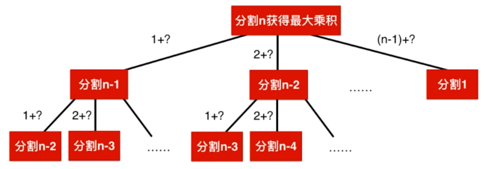
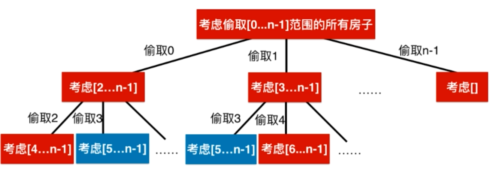
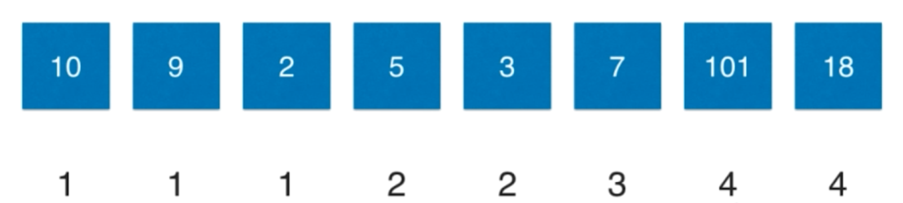
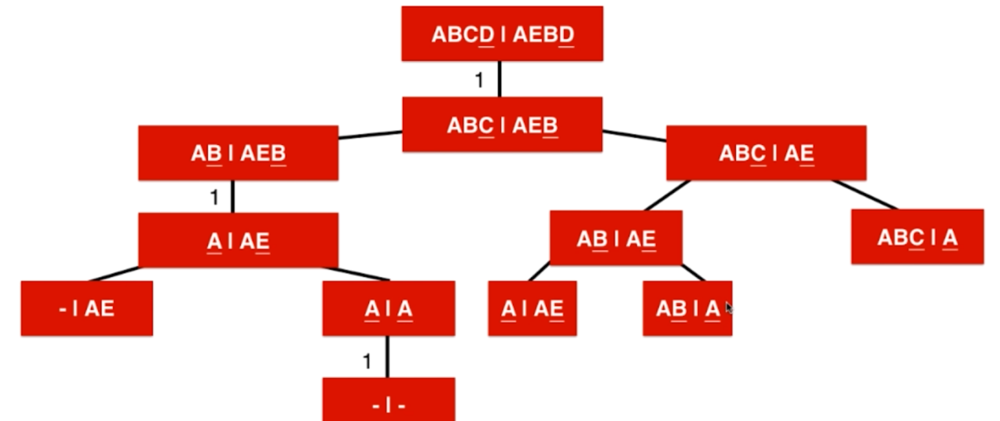

关于动态规划算法题的总结

<!---more-->

> 递归问题->重叠子问题、最优子结构->
>
> 1.记忆化搜索(自顶向下的解决问题) 
>
> 2.动态规划(自底向上的解决问题)

## 1.基本题目

### 1.爬楼梯(70)

状态转移方程：f(n)=f(n-1)+f(n-2)

边界：f(1)=1 f(2)=2

~~~
Input: 2
Output: 2
Explanation: There are two ways to climb to the top.
1. 1 step + 1 step
2. 2 steps
~~~

解法一：记忆化搜索(自顶向下)

~~~JS
const map=new Map();
var climbStairs = function(n) {
    if(n<3) return n;
    if(!map.get(n)) map.set(n,climbStairs(n-1)+climbStairs(n-2));
    return map.get(n);
};
~~~

解法二：动态规划(自底向上)

~~~JS
var climbStairs = function(n) {
    let arr=[];
    arr[1]=1;
    arr[2]=2;
    for(let i=3;i<=n;i++) {
        arr[i]=arr[i-1]+arr[i-2];
    }
    return arr[n];
};
~~~


### 2.分割整数(343)

Given a positive integer *n*, break it into the sum of **at least** two positive integers and maximize the product of those integers. Return the maximum product you can get.

**Example 1:**

```
Input: 2
Output: 1
Explanation: 2 = 1 + 1, 1 × 1 = 1.
```



解法一：递归 会发现有大量的重复运算

~~~JS
var integerBreak = function(n) {
    if(n===1) return 1;
    let res=-1;
    for(let i=1;i<n;i++) {
        res=Math.max(res,i*(n-i),i*integerBreak(n-i));
    }
    return res;
};
~~~

解法二：记忆化搜索 优化上述方案，自顶向下

~~~JS
const memo=new Map();
var integerBreak = function(n) {
    if(n===1) return 1;
    if(memo.has(n)) return memo.get(n);
    let res=-1;
    for(let i=1;i<n;i++) {
        //integerBreak(n)分割成了integerBreak(n-i)
        res=Math.max(res,i*(n-i),i*integerBreak(n-i));
    }
    memo.set(n,res);
    return res;
};
~~~


解法三：动态规划

~~~JS
var integerBreak = function(n) {
    const dp=new Array(n+1).fill(-1);
    dp[1]=1;
    for(let i=2;i<=n;i++) {
        for(let j=1;j<=i-1;j++) {
            //分割成j、i-j
            dp[i]=Math.max(dp[i],j*(i-j),j*dp[i-j]);
        }
    }
    return dp[n];
};
~~~

### 3.三角形(120)

~~~
[
     [2],
    [3,4],
   [6,5,7],
  [4,1,8,3]
]
The minimum path sum from top to bottom is 11 (i.e., 2 + 3 + 5 + 1 = 11).
~~~

~~~JS
var minimumTotal = function (triangle) {
    for(let i=triangle.length-2;i>=0;i--) {
        for(let j=0;j<=i;j++) {
            triangle[i][j]+=Math.min(triangle[i+1][j],triangle[i+1][j+1]);
        }
    }
    return triangle[0][0];
};
~~~

~~~JS
var minimumTotal = function (triangle) {
    const min=triangle[triangle.length-1];
    for(let i=triangle.length-2;i>=0;i--) {
        for(let j=0;j<=i;j++) {
            min[j]=triangle[i][j]+Math.min(min[j],min[j+1]);
        }
    }
    return min[0];
};
~~~

### 4.最小路径和(64)

~~~
Input:
[
  [1,3,1],
  [1,5,1],
  [4,2,1]
]
Output: 7
Explanation: Because the path 1→3→1→1→1 minimizes the sum.
~~~

~~~JS
var minPathSum = function(grid) {
    if(!grid||!grid.length) return 0;
    let m=grid.length,
        n=grid[0].length,
        dp=Array(m).fill().map(arr=>Array(n).fill(0));
    for(let i=0;i<m;i++) {
        for(let j=0;j<n;j++) {
            if(i===0&&j===0) dp[i][j]=grid[i][j];
            else if(i===0) dp[i][j]=grid[i][j]+dp[i][j-1];
            else if(j===0) dp[i][j]=grid[i][j]+dp[i-1][j];
            else dp[i][j]=grid[i][j]+Math.min(dp[i][j-1],dp[i-1][j]);
        }
    }
    return dp[m-1][n-1];
};
~~~

### 5.单词拆分(139)

给定一个**非空**字符串 *s* 和一个包含**非空**单词列表的字典 *wordDict*，判定 *s* 是否可以被空格拆分为一个或多个在字典中出现的单词。

~~~
输入: s = "leetcode", wordDict = ["leet", "code"]
输出: true
解释: 返回 true 因为 "leetcode" 可以被拆分成 "leet code"。
~~~

> 暴力递归

~~~JS
var wordBreak = function(s, wordDict) {
    return dfs(s);
    function dfs(s) {
        if(!s.length) return true;
        for(let v of wordDict) {
            if(s.indexOf(v)===0&&dfs(s.substring(v.length))) {
                return true;
            }
        }
        return false;
    }
};
~~~

> 记忆化搜索
>
> 有很多重复的子结构，所以可以用记忆化搜索

~~~JS
var wordBreak = function(s, wordDict) {
    const memo=new Map();
    return dfs(s);
    function dfs(s) {
        if(!s.length) return true;
        if(memo.has(s)) return memo.get(s);
        for(let v of wordDict) {
            if(s.indexOf(v)===0&&dfs(s.substring(v.length))) {
                memo.set(s,true);
                return true;
            }
        }
        memo.set(s,false);
        return false;
    }
};
~~~

> dp[i]代表s[0,…,i-1]这个字符串是不是符合要求的

~~~JS
var wordBreak = function(s, wordDict) {
    const set=new Set(wordDict),
          dp=Array(s.length+1).fill(false);
    dp[0]=true;
    for(let i=1;i<=s.length;i++) {
        for(let j=0;j<i;j++) {
            if(dp[j]&&set.has(s.substring(j,i))) {
                dp[i]=true;
                break;
            }
        }
    }
    return dp[s.length];
};
~~~

### 6.单词拆分2(140)

~~~
输入:
s = "catsanddog"
wordDict = ["cat", "cats", "and", "sand", "dog"]
输出:
[
  "cats and dog",
  "cat sand dog"
]
~~~

~~~JS
var wordBreak = function(s, wordDict) {
    const set=new Set(wordDict),
          dp=Array(s.length+1).fill(false);
    dp[0]=true;
    for(let i=1;i<=s.length;i++) {
        for(let j=0;j<i;j++) {
            if(dp[j]&&set.has(s.substring(j,i))) {
                dp[i]=true;
                break;
            }
        }
    }
    if(!dp[s.length]) return [];
    const res=[];
    backtrack(s,[]);
    return res;
    function backtrack(s,tempArr) {
        if(s.length===0) return res.push(tempArr.join(" "));
        for(let word of wordDict) {
            if(s.indexOf(word)===0) {
                tempArr.push(word);
                backtrack(s.substring(word.length),tempArr);
                tempArr.pop();
            }
        }
    }
};
~~~

### 7.最大正方形(221)

在一个由 0 和 1 组成的二维矩阵内，找到只包含 1 的最大正方形，并返回其面积。

~~~
输入: 

1 0 1 0 0
1 0 1 1 1
1 1 1 1 1
1 0 0 1 0

输出: 4
~~~

> `dp[i][j]`代表以i、j为右下角的正方形，`dp[i][j]=Math.min(dp[i-1][j],dp[i][j-1],dp[i-1][j-1])+1`

~~~JS
var maximalSquare = function(matrix) {
    if(!matrix||!matrix.length) return 0;
    let m=matrix.length,
        n=matrix[0].length,
        res=0;
    const dp=Array(m).fill().map(arr=>Array(n).fill(0));
    for(let i=0;i<m;i++) {
        for(let j=0;j<n;j++) {
            if(!i||!j) dp[i][j]=matrix[i][j]-'0';
            else if(matrix[i][j]==='1') dp[i][j]=Math.min(dp[i-1][j],dp[i][j-1],dp[i-1][j-1])+1;
            res=Math.max(res,dp[i][j]);
        }
    }
    return res*res;
};
~~~


## 2.House Robber系列

### 1.不能偷取相邻的(198)

```
Input: [1,2,3,1]
Output: 4
Explanation: Rob house 1 (money = 1) and then rob house 3 (money = 3).
             Total amount you can rob = 1 + 3 = 4.
```



解法一：记忆化搜索

~~~JS
const memo=new Map();
var rob = function(nums) {
    return dp(nums,0);
};
function dp(nums,start) {
    if(start>=nums.length) return 0;
    if(memo.has(start)) return memo.get(start);
    let res=Math.max(dp(nums,start+1),dp(nums,start+2)+nums[start]);
    memo.set(start,res);
    return res;
}
~~~

解法二：动态规划

~~~JS
//dp[i] [0,i]最多能偷多少
var rob = function(nums) {
    let n=nums.length;
    if(!n) return 0;
    const dp=Array(n).fill(0);
    dp[0]=nums[0];
    dp[1]=Math.max(nums[0],nums[1]);
    for(let i=2;i<n;i++) {
        dp[i]=Math.max(dp[i-1],dp[i-2]+nums[i]);
    }
    return dp[n-1];
};
~~~

### 2.不能偷取相邻的，并且数组是环形的(213)

> 因为是环形的数组，意味着数组的第一位和最后一位不能同时偷取，这是和上一题的区别，所以我们可以分俩种区间偷取，然后取这俩种结果较大的那个。
>
> [0,nums.length-2] [1,nums.length-1]

~~~JS
var rob = function(nums) {
    let len=nums.length;
    if(!len) return 0;
    if(len===1) return nums[0];
    return Math.max(robRange(nums,0,len-2),robRange(nums,1,len-1))
};

function robRange(nums,start,end) {
    const dp=Array(end+1).fill(0);
    dp[start]=nums[start];
    dp[start+1]=Math.max(nums[start],nums[start+1]);
    for(let i=start+2;i<=end;i++) {
        dp[i]=Math.max(dp[i-2]+nums[i],dp[i-1]);
    }
    return dp[end];
}
~~~

### 3.打家劫舍3(337)

~~~
Input: [3,2,3,null,3,null,1]

     3
    / \
   2   3
    \   \ 
     3   1

Output: 7 
Explanation: Maximum amount of money the thief can rob = 3 + 3 + 1 = 7.
~~~

~~~JS
var rob = function(root) {
    const map=new Map();
    return robSub(root);
    function robSub(root) {
        if(!root) return 0;
        if(map.has(root)) return map.get(root);
        //抢
        let do_it=root.val+(root.left?robSub(root.left.left)+robSub(root.left.right):0)+(root.right?robSub(root.right.left)+robSub(root.right.right):0);
        //不抢
        let not_do_it=robSub(root.left)+robSub(root.right);
        let max=Math.max(do_it,not_do_it);
        map.set(root,max);
        return max;
    }
};
~~~


## 3.Buy and Sell Stock系列

### 1.买卖股票的最佳时机(121)

> 一次买卖

~~~
Input: [7,1,5,3,6,4]
Output: 5
Explanation: Buy on day 2 (price = 1) and sell on day 5 (price = 6), profit = 6-1 = 5.
             Not 7-1 = 6, as selling price needs to be larger than buying price.
~~~

~~~JS
var maxProfit = function(prices) {
    if(!prices||!prices.length) return 0;
    let len=prices.length,
        dp=Array(len).fill().map(arr=>Array(2).fill(0));
    for(let i=0;i<len;i++) {
        if(i===0) {
            dp[0][0]=0;
            dp[0][1]=-prices[0];
            continue;
        }
        dp[i][0]=Math.max(dp[i-1][0],dp[i-1][1]+prices[i]);
        dp[i][1]=Math.max(dp[i-1][1],-prices[i]);
    }
    return dp[len-1][0];
};
~~~

### 2.买卖股票的最佳时机2(122)

> 无限次买卖

~~~
Input: [7,1,5,3,6,4]
Output: 7
Explanation: Buy on day 2 (price = 1) and sell on day 3 (price = 5), profit = 5-1 = 4.
             Then buy on day 4 (price = 3) and sell on day 5 (price = 6), profit = 6-3 = 3.
~~~

~~~JS
var maxProfit = function(prices) {
    if(!prices||!prices.length) return 0;
    let len=prices.length,
        dp=Array(len).fill().map(arr=>Array(2).fill(0));
    for(let i=0;i<len;i++) {
        if(i===0) {
            dp[0][0]=0;
            dp[0][1]=-prices[0];
            continue;
        }
        dp[i][0]=Math.max(dp[i-1][0],dp[i-1][1]+prices[i]);
        dp[i][1]=Math.max(dp[i-1][1],dp[i-1][0]-prices[i]);
    }
    return dp[len-1][0];
};
~~~

### 3.买卖股票的最佳时机3(123)

> 最多俩次买卖

~~~
Input: [3,3,5,0,0,3,1,4]
Output: 6
Explanation: Buy on day 4 (price = 0) and sell on day 6 (price = 3), profit = 3-0 = 3.
             Then buy on day 7 (price = 1) and sell on day 8 (price = 4), profit = 4-1 = 3.
~~~

~~~JS
var maxProfit = function(prices) {
    let n=prices.length;
    const dp=Array(n).fill(0).map(x=>Array(3).fill(0).map(x=>Array(2).fill(0)));
    for(let i=0;i<n;i++) {
        for(let j=1;j<=2;j++) {
            if(i-1===-1) {
                dp[i][j][0]=0;
                dp[i][j][1]=-prices[i];
                continue;
            }
            dp[i][j][0]=Math.max(dp[i-1][j][0],dp[i-1][j][1]+prices[i]);
            dp[i][j][1]=Math.max(dp[i-1][j][1],dp[i-1][j-1][0]-prices[i]);
        }
    }
    if(!n) return 0;
    return dp[n-1][2][0];
};
~~~

### 4.买卖股票的最佳时机4(188)

> 最多k次买卖，注意当k>n/2说明此时k对于数组来说不限次数了

~~~JS
var maxProfit = function(k, prices) {
    let n=prices.length;
    if(k>n/2) return maxProfit1(prices);
    const dp=Array(n).fill().map(arr=>Array(k+1).fill().map(arr=>Array(2).fill(0)));
    for(let i=0;i<n;i++) {
        for(let j=1;j<=k;j++) {
            if(i===0) {
                dp[i][j][0]=0;
                dp[i][j][1]=-prices[i];
                continue;
            }
            dp[i][j][0]=Math.max(dp[i-1][j][0],dp[i-1][j][1]+prices[i]);
            dp[i][j][1]=Math.max(dp[i-1][j][1],dp[i-1][j-1][0]-prices[i]);
        }
    }
    if(!n||!k) return 0;
    return dp[n-1][k][0];
};

function maxProfit1(prices) {
    let n=prices.length,
        dp=Array(n).fill().map(arr=>Array(2).fill(0));
    for(let i=0;i<n;i++) {
        if(i===0) {
            dp[0][0]=0;
            dp[0][1]=-prices[0];
            continue;
        }
        dp[i][0]=Math.max(dp[i-1][0],dp[i-1][1]+prices[i]);
        dp[i][1]=Math.max(dp[i-1][1],dp[i-1][0]-prices[i]);
    }
    if(!n) return 0;
    return dp[n-1][0];
}
~~~

### 5.买卖股票的最佳时期含手续费(714)

~~~
Input: prices = [1, 3, 2, 8, 4, 9], fee = 2
Output: 8
Explanation: The maximum profit can be achieved by:
Buying at prices[0] = 1
Selling at prices[3] = 8
Buying at prices[4] = 4
Selling at prices[5] = 9
The total profit is ((8 - 1) - 2) + ((9 - 4) - 2) = 8.
~~~

~~~JS
var maxProfit = function(prices, fee) {
    let n=prices.length,
        dp=Array(n).fill().map(arr=>Array(2).fill(0));
    if(!n) return 0;
    for(let i=0;i<n;i++) {
        if(i===0) {
            dp[0][0]=0;
            dp[0][1]=-fee-prices[i];
            continue;
        }
        dp[i][0]=Math.max(dp[i-1][0],dp[i-1][1]+prices[i]);
        dp[i][1]=Math.max(dp[i-1][1],dp[i-1][0]-fee-prices[i]);
    }
    return dp[n-1][0];
};
~~~

### 6.买卖股票的最佳时期含冷冻期(309)

~~~
Input: [1,2,3,0,2]
Output: 3 
Explanation: transactions = [buy, sell, cooldown, buy, sell]
~~~

~~~JS
var maxProfit = function(prices) {
    let n=prices.length,
        dp=Array(n).fill().map(arr=>Array(2).fill(0));
    if(!n) return 0;
    for(let i=0;i<n;i++) {
        if(i===0) {
            dp[0][0]=0;
            dp[0][1]=-prices[i];
            continue;
        }
        if(i===1) {
            dp[i][0]=Math.max(dp[i-1][0],dp[i-1][1]+prices[i]);
            dp[i][1]=Math.max(dp[i-1][1],-prices[i]);
            continue;
        }
        dp[i][0]=Math.max(dp[i-1][0],dp[i-1][1]+prices[i]);
        dp[i][1]=Math.max(dp[i-1][1],dp[i-2][0]-prices[i]);
    }
    return dp[n-1][0];
};
~~~


## 4.0-1背包问题

给你一个可装载重量为 `W` 的背包和 `N` 个物品，每个物品有重量和价值两个属性。其中第 `i` 个物品的重量为 `wt[i]`，价值为 `val[i]`，现在让你用这个背包装物品，最多能装的价值是多少？

`dp[i][w]`表示：对于前 `i` 个物品，当前背包的容量为 `w` 时，这种情况下可以装下的最大价值是 `dp[i][w]`

所以`dp[i][w]=max(dp[i-1][w],val[i-1]+dp[i-1][w-wt[i-1]])`

### 1.Coin Change(322)

You are given coins of different denominations and a total amount of money *amount*. Write a function to compute the fewest number of coins that you need to make up that amount. If that amount of money cannot be made up by any combination of the coins, return `-1`.

**Example 1:**

```
Input: coins = [1, 2, 5], amount = 11
Output: 3 
Explanation: 11 = 5 + 5 + 1
```


## 5.子序列问题系列

### 1.最长上升子序列(300) LIS

~~~
Input: [10,9,2,5,3,7,101,18]
Output: 4 
Explanation: The longest increasing subsequence is [2,3,7,101], therefore the length is 4.
~~~

dp[i] 表示以 nums[i] 这个数结尾的最长递增子序列的长度



如果我们此时得到了最长的递增子序列，如何求得这个具体的序列呢？

> 首先找到长度为dp[i]=4的，然后往前查找，找到了dp[j]，如果满足dp[j]+1=dp[i]，且nums[j]<nums[i]，说明我们要找的前一个数就是这个，依次往前找，就能找到这个具体的最长递增子序列

~~~JS
var lengthOfLIS = function(nums) {
    if(!nums.length) return 0;
    const len=nums.length,
          dp=Array(len).fill(1);
    for(let i=0;i<len;i++) {
        for(let j=0;j<i;j++) {
            if(nums[i]>nums[j]) dp[i]=Math.max(dp[j]+1,dp[i]);
        }
    }
    return Math.max(...dp);
};
~~~


### 2.最长公共子序列(1143) LCS

~~~
Input: text1 = "abcde", text2 = "ace" 
Output: 3  
Explanation: The longest common subsequence is "ace" and its length is 3.
~~~

`dp[i][j]` 的含义是：对于 `s1[1..i]` 和 `s2[1..j]`，它们的 LCS 长度是 `dp[i][j]`



~~~JS
var longestCommonSubsequence = function(text1, text2) {
    const m=text1.length,
          n=text2.length,
          dp=Array(m+1).fill().map(arr=>Array(n+1).fill(0));
    
    for(let i=1;i<=m;i++) {
        for(let j=1;j<=n;j++) {
            if(text1[i-1]===text2[j-1]) dp[i][j]=dp[i-1][j-1]+1;
            else dp[i][j]=Math.max(dp[i-1][j],dp[i][j-1]);
        }
    }
    return dp[m][n];
};
~~~

### 3.最长回文子序列(516) 非连续

~~~
"bbbab"
4
~~~

注意遍历方向，由于我们`dp[i][j]`是根据`dp[i+1][j]、dp[i][j-1]以及dp[i-1][j+1]`即下左和左下三个方向来的，所以我们遍历要反着遍历。

~~~JS
var longestPalindromeSubseq = function(s) {
    const len=s.length,
          dp=Array(len).fill().map(arr=>Array(len).fill(0));
    for(let i=0;i<len;i++) dp[i][i]=1;
    for(let i=len-1;i>=0;i--) {
        for(let j=i+1;j<len;j++) {
            if(s[i]===s[j]) dp[i][j]=dp[i+1][j-1]+2;
            else dp[i][j]=Math.max(dp[i+1][j],dp[i][j-1]);
        }
    }
    return dp[0][len-1];
};
~~~

### 4.最长递增子序列的个数(673)

```
Input: [1,3,5,4,7]
Output: 2
Explanation: The two longest increasing subsequence are [1, 3, 4, 7] and [1, 3, 5, 7].
```

> 相比lc300问题，需要多开一个数组来记录LIS的组合数
>
> 不光在dp中需要更新以`[i]`结尾的最长上升子序列的长度`dp[i]`，还需要更新**通往**以[i]结尾的最长子序列的方法数`count[i]`。
>
> 初始化：两个数组初始化为全1是有意义的，因为无论如何最长子序列长度至少为1，且通往的方法数至少为1（自身）。

```JS
var findNumberOfLIS = function(nums) {
    if(!nums.length) return 0;
    let len=nums.length,
        dp=Array(len).fill(1),
        count=Array(len).fill(1),
        max=0,
        res=0;
    for(let i=0;i<len;i++) {
        for(let j=0;j<i;j++) {
            if(nums[j]<nums[i]) {
                if(dp[j]+1>dp[i]) {//代表第一次遇到最长子序列
                    dp[i]=dp[j]+1;
                    count[i]=count[j];
                }else if(dp[j]+1===dp[i]) count[i]+=count[j];//代表已经遇到过最长子序列
            }
        }
    }
    max=Math.max(...dp);
    for(let i=0;i<len;i++) {
        if(dp[i]===max) res+=count[i];
    }
    return res;
};
```


### 5.俄罗斯套娃信封问题(354)

```
Input: [[5,4],[6,4],[6,7],[2,3]]
Output: 3 
Explanation: The maximum number of envelopes you can Russian doll is 3 ([2,3] => [5,4] => [6,7]).
```

> 这题相当于二维数组的LIS
>
> 对w进行顺序排列，相同的w按照h逆序排

```JS
var maxEnvelopes = function(envelopes) {
    if(!envelopes.length) return 0;
    envelopes.sort(function(a,b){
        if(a[0]!==b[0]) return  a[0]-b[0];
        else return b[1]-a[1];
    })
    let len=envelopes.length,
        dp=Array(len).fill(1);
    for(let i=0;i<len;i++) {
        for(let j=0;j<i;j++) {
            if(envelopes[i][1]>envelopes[j][1]) dp[i]=Math.max(dp[i],dp[j]+1);
        }
    }
    return Math.max(...dp);
};
```

### 6.最大子序和(53)

```
Input: [-2,1,-3,4,-1,2,1,-5,4],
Output: 6
Explanation: [4,-1,2,1] has the largest sum = 6.
```

~~~JS
var maxSubArray = function(nums) {
    let len=nums.length,
        dp=Array(len);
    if(!len) return 0;
    dp[0]=nums[0];
    for(let i=1;i<len;i++) {
        dp[i]=Math.max(dp[i-1]+nums[i],nums[i]);
    }
    return Math.max(...dp);
};
~~~

~~~JS
var maxSubArray = function(nums) {
    let res=nums[0],
        sum=0;
    for(let v of nums) {
        if(sum>0) sum+=v;
        else sum=v;
        res=Math.max(res,sum);
    }
    return res;
};
~~~

### 7.乘积最大子数组(152)

~~~
find the contiguous subarray within an array (containing at least one number) which has the largest product.
Input: [2,3,-2,4]
Output: 6
Explanation: [2,3] has the largest product 6.
~~~

> 这题的关键点在于有奇数个负数还是偶数个负数，偶数个负数其实就是非0的数相乘，奇数个负数，它的最大值一定是从左边开始乘或者从右边开始乘，到第一个为负数的地方，一定是最大值

~~~JS
var maxProduct = function(nums) {
    let max=-Infinity,
        multi=1;
    for(let v of nums) {
        multi*=v;
        max=Math.max(max,multi);
        if(multi===0) multi=1;
    }
    multi=1;
    for(let i=nums.length-1;i>=0;i--) {
        multi*=nums[i];
        max=Math.max(max,multi);
        if(multi===0) multi=1;
    }
    return max;
};
~~~

### 8.乘积小于k的子数组(713)

~~~
Input: nums = [10, 5, 2, 6], k = 100
Output: 8
Explanation: The 8 subarrays that have product less than 100 are: [10], [5], [2], [6], [10, 5], [5, 2], [2, 6], [5, 2, 6].
Note that [10, 5, 2] is not included as the product of 100 is not strictly less than k.
~~~

> 双指针法，如果一个子串的乘积小于k，那么他的每个子集都小于k，而一个长度为n的数组，他的所有连续子串数量是`1+2+...n`，但是会和前面的重复。 比如例子中`[10, 5, 2, 6]`，第一个满足条件的子串是`[10]`，第二个满足的是`[10, 5]`，但是第二个数组的子集`[10]`和前面的已经重复了，因此我们只需要计算包含最右边的数字的子串数量，就不会重复了，也就是在计算`[10, 5]`这个数组的子串是，只加入`[5]`和`[10, 5]`，而不加入`[10]`，这部分的子串数量刚好是`r - l + 1`

~~~JS
var numSubarrayProductLessThanK = function (nums, k) {
    if(!k||k===1) return 0;
    let l=0,
        r=0,
        len=nums.length,
        prod=1,
        count=0;
    while(r<len) {
        prod*=nums[r];
        while(prod>=k) {
            prod=Math.floor(prod/nums[l++]);
        }
        count+=r-l+1;
        r++;
    }
    return count;
};
~~~


## 6.子串问题系列

> 碰到回文子串的问题，可以通过从**中间开始向两边扩散来判断回文串**
>
> 因为考虑到，回文串的长度可能是奇数也可能是偶数，所以传入俩个参数l、r

### 1.最长回文子串(5) 连续

```
Input: "babad"
Output: "bab"
Note: "aba" is also a valid answer.
```

~~~JS
var longestPalindrome = function(s) {
    let len=s.length,
        res=''
    for(let i=0;i<len;i++) {
        let str1=Palindrome(s,i,i);
        let str2=Palindrome(s,i,i+1);
        res=res.length>str1.length?res:str1;
        res=res.length>str2.length?res:str2;
    }
    return res;
};

function Palindrome(s,l,r) {
    while(l>=0&&r<s.length&&s[l]===s[r]) {
        l--;
        r++;
    }
    return s.substring(l+1,r);
}
~~~


### 2.回文子串的个数(647)

~~~
Input: "aaa"
Output: 6
Explanation: Six palindromic strings: "a", "a", "a", "aa", "aa", "aaa".
~~~

~~~JS
var countSubstrings = function(s) {
    let len=s.length,
        count=0;
    for(let i=0;i<len;i++) {
        Palindromic(s,i,i);
        Palindromic(s,i,i+1);
    }
    function Palindromic(s,l,r) {
        while(l>=0&&r<s.length&&s[l]===s[r]) {
            count++;
            l--;
            r++;
        }
    }
    return count;
};
~~~

### 3.最长重复子数组(718)

给两个整数数组 `A` 和 `B` ，返回两个数组中公共的、长度最长的子数组的长度。

~~~
输入:
A: [1,2,3,2,1]
B: [3,2,1,4,7]
输出: 3
解释: 
长度最长的公共子数组是 [3, 2, 1]。
~~~

> 和最长公共子序列那题一起看
>
> `dp[i][j]` 的含义是：对于 `A[1..i]` 和 `B[1..j]`，它们的最长重复子数组长度是`dp[i][j]`
>
> 当`A[i-1]!=B[j-1]`，`dp[i][j]=0`，这地方和LCS那题有点不一样

~~~JS
var findLength = function(A, B) {
    let len1=A.length,
        len2=B.length,
        max=0;
    const dp=Array(len1+1).fill().map(arr=>Array(len2+1).fill(0));
    for(let i=1;i<=len1;i++) {
        for(let j=1;j<=len2;j++) {
            if(A[i-1]===B[j-1]) {
                dp[i][j]=dp[i-1][j-1]+1;
                max=Math.max(dp[i][j],max);
            }else dp[i][j]=0;
        }
    }
    return max;
};
~~~


## 7.基本问题

### 1.完全平方数(279)

~~~
find the least number of perfect square numbers (for example, 1, 4, 9, 16, ...) which sum to n.
Input: n = 12
Output: 3 
Explanation: 12 = 4 + 4 + 4.
~~~

> `dp[n]=Math.min(dp[n-1*1]+1,dp[n-2*2]+1,...,dp[n-i*i]+1,...)`

~~~JS
var numSquares = function(n) {
    const dp=Array(n+1);
    dp[0]=0;
    for(let i=1;i<=n;i++) {
        let min=Number.MAX_VALUE,
            j=1;
        while(i-j*j>=0) {
            min=Math.min(min,dp[i-j*j]+1);
            j++;
        }
        dp[i]=min;
    }
    return dp[n];
};
~~~


### 2.不同路径(62)

~~~
Input: m = 3, n = 2
Output: 3
Explanation:
From the top-left corner, there are a total of 3 ways to reach the bottom-right corner:
1. Right -> Right -> Down
2. Right -> Down -> Right
3. Down -> Right -> Right
~~~

~~~JS
var uniquePaths = function(m, n) {
    const dp=Array(m).fill().map(arr=>Array(n).fill(0));
    for(let i=0;i<m;i++) {
        for(let j=0;j<n;j++) {
            if(i===0||j===0) dp[i][j]=1;
            else dp[i][j]=dp[i-1][j]+dp[i][j-1];
        }
    }
    return dp[m-1][n-1];
}
~~~

优化：空间复杂度

> `dp[i][j]=dp[i-1][j]+dp[i][j-1];`
>
> 一维的dp数组定义为当前行中，每个元素对应的步数。 对于二维数组`dp[i][j] = dp[i-1][j] + dp[i][j-1]` 对于一维数组， 对于第i行来说，dp[j] = dp[j] + dp[j-1], 等号右边的未赋值之前的dp[j]就是上一行的第j个数据对应的步数，即`dp[i-1][j] `等号右边的dp[j-1]是已经更新过的本行的第j-1个数据对应的步数，即`dp[i][j-1] `，本行的dp[j] = 上一行的dp[j] + 本行的dp[j-1]， 所以dp[j] = dp[j] + dp[j-1].

~~~JS
var uniquePaths = function(m, n) {
    const dp=Array(n).fill(1)
    for(let i=1;i<m;i++) {
        for(let j=1;j<n;j++) {
            dp[j]=dp[j]+dp[j-1];
        }
    }
    return dp[n-1];
}
~~~

### 3.不同路径2(63)

~~~
Input:
[
  [0,0,0],
  [0,1,0],
  [0,0,0]
]
Output: 2
Explanation:
There is one obstacle in the middle of the 3x3 grid above.
There are two ways to reach the bottom-right corner:
1. Right -> Right -> Down -> Down
2. Down -> Down -> Right -> Right
~~~

> 要注意入口位置和出口位置有障碍物

~~~JS
var uniquePathsWithObstacles = function(obstacleGrid) {
    let m=obstacleGrid.length,
        n=obstacleGrid[0].length,
        dp=Array(m).fill().map(arr=>Array(n).fill(0)),
        flag=false;
    for(let i=0;i<m;i++){
        if(obstacleGrid[i][0]) flag=true
        if(flag) dp[i][0]=0
        else dp[i][0]=1
    }
    flag=false;
    for(let i=0;i<n;i++){
        if(obstacleGrid[0][i]) flag=true
        if(flag) dp[0][i]=0
        else dp[0][i]=1
    }
    for(let i=1;i<m;i++) {
        for(let j=1;j<n;j++) {
            dp[i][j]=(obstacleGrid[i-1][j]===1?0:dp[i-1][j])+(obstacleGrid[i][j-1]===1?0:dp[i][j-1])
        }
    }
    if(obstacleGrid[0][0]||obstacleGrid[m-1][n-1]) return 0;
    return dp[m-1][n-1];
};
~~~