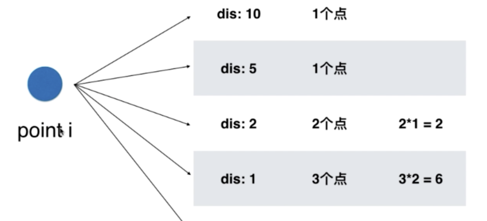

关于数组算法题的总结

<!---more-->

## 1.二分查找系列

> 注意边界问题，要明确你定义的l、r的含义

### 1.在于有序的数组中查找target值

~~~JS
function binarySearch(arr, target) {
  let l = 0,
    r = arr.length - 1; //我们要在[l...r]中寻找target，要清楚的知道l、r的定义

  while (l <= r) { //当l===r时，区间[l...r]依然是有效的
    let mid = Math.floor(l + (r - l) / 2);
    if (arr[mid] === target) return mid;
    else if (target > arr[mid]) l = mid + 1; //target在[mid+1...r]中
    else r = mid - 1;
  }
  return -1;
}
~~~

~~~JS
function binarySearch(arr, target) {
  let l = 0,
    r = arr.length; //我们要在[l...r)中寻找target

  while (l < r) { //当l===r时，区间[l...r)就变得无效了
    let mid = Math.floor(l + (r - l) / 2);
    if (arr[mid] === target) return mid;
    else if (target > arr[mid]) l = mid + 1; //target在[mid+1...r)中
    else r = mid; //target<arr[mid]，注意此时r应该更新为mid，而不是mid-1，因为右边是开区间，其实也没有包含到mid
  }
  return -1;
}
~~~

### 2.寻找左侧边界的二分查找

~~~
nums = [1,2,2,2,3]
~~~

> 比如上面这个nums有序数组，target=2，那么此算法返回的索引是 2，但是事实上target左侧边界索引是1，右侧边界索引是3，这是常规的二分搜索无法获得的

~~~JS
function left_bound(arr, target) {
  let l = 0,
    r = arr.length - 1;

  while (l <= r) {
    let mid = Math.floor(l + (r - l) / 2);
    if (arr[mid] === target) r = mid - 1;
    else if (target > arr[mid]) l = mid + 1;
    else r = mid - 1;
  }
  if (l >= arr.length || arr[l] !== target) return -1;
  return l;
}
~~~

### 3.寻找右侧边界的二分查找

~~~JS
function right_bound(arr, target) {
  let l = 0,
    r = arr.length - 1;

  while (l <= r) {
    let mid = Math.floor(l + (r - l) / 2);
    if (arr[mid] === target) l = mid + 1;
    else if (target > arr[mid]) l = mid + 1;
    else r = mid - 1;
  }
  if (r < 0 || arr[r] !== target) return -1;
  return r;
}
~~~


### 4.在排序数组中查找元素的第一个和最后一个位置(34)

~~~
Input: nums = [5,7,7,8,8,10], target = 8
Output: [3,4]
~~~

~~~JS
var searchRange = function(nums, target) {
    return [left_bound(nums,target),right_bound(nums,target)];
};

function left_bound(nums,target) {
    let l=0,
        r=nums.length-1;
    while(l<=r) {
        let mid=Math.floor(l+(r-l)/2);
        if(nums[mid]===target) r=mid-1;
        else if(nums[mid]<target) l=mid+1;
        else r=mid-1;
    }
    if(l>=nums.length||nums[l]!==target) return -1;
    return l;
}

function right_bound(nums,target) {
    let l=0,
        r=nums.length-1;
    while(l<=r) {
        let mid=Math.floor(l+(r-l)/2);
        if(nums[mid]===target) l=mid+1;
        else if(nums[mid]<target) l=mid+1;
        else r=mid-1;
    }
    if(r<0||nums[r]!==target) return -1;
    return r;
}
~~~


### 5.搜索旋转排序数组(33)

~~~
Input: nums = [4,5,6,7,0,1,2], target = 0
Output: 4
~~~

~~~JS
var search = function(nums, target) {
    let l=0,
        r=nums.length-1;
    while(l<=r) {
        let mid=Math.floor(l+(r-l)/2);
        if(nums[mid]===target) return mid;
        //左半部分有序
        if(nums[l]<=nums[mid]) {
            if(nums[l]<=target&&target<=nums[mid]) r=mid-1;
            else l=mid+1;
        }else{
            if(nums[mid]<=target&&target<=nums[r]) l=mid+1;
            else r=mid-1;
        }
    }
    return -1;
};
~~~

### 6.旋转排序数组最小值(153)

~~~
Input: [3,4,5,1,2] 
Output: 1
~~~

~~~JS
var findMin = function(nums) {
    let l=0,
        h=nums.length-1;
    while(l<h) {
        let mid=Math.floor((l+h)/2);
        if(nums[mid]<nums[h]) h=mid;
        else l=mid+1;
    }
    return nums[l];
};
~~~

### 7.旋转排序数组最小值(154)

~~~
Input: [2,2,2,0,1]
Output: 0
~~~

~~~JS
var findMin = function(nums) {
    let l=0,
        r=nums.length-1;
    while(l<r) {
        let mid=Math.floor(l+(r-l)/2);
        if(nums[mid]<nums[r]) r=mid;
        else if(nums[mid]>nums[r]) l=mid+1;
        else r--;
    }
    return nums[l];
};
~~~


### 8.x的平方根(69)

~~~
Input: 8
Output: 2
Explanation: The square root of 8 is 2.82842..., and since 
             the decimal part is truncated, 2 is returned.
~~~

~~~JS
var mySqrt = function(x) {
    let l=1,
        r=Math.floor(x/2)+1;
    while(l<=r) {
        let mid=Math.floor(l+(r-l)/2);
        if(mid*mid>x) r=mid-1;
        else if(mid*mid<x) l=mid+1;
        else return mid;
    }
    return r;
};
~~~

### 9.搜索二维矩阵(74)

~~~
Integers in each row are sorted from left to right.
The first integer of each row is greater than the last integer of the previous row.
Input:
matrix = [
  [1,   3,  5,  7],
  [10, 11, 16, 20],
  [23, 30, 34, 50]
]
target = 3
Output: true
~~~

> 可以将二维矩阵看成有序数组 长度为m*n，然后采用二分搜索

~~~JS
var searchMatrix = function(matrix, target) {
    if(!matrix||!matrix.length) return false;
    let m=matrix.length,
        n=matrix[0].length,
        l=0,
        r=m*n-1;
    while(l<=r) {
        let mid=Math.floor(l+(r-l)/2),
            i=Math.floor(mid/n),
            j=mid%n;
        if(matrix[i][j]===target) return true;
        else if(matrix[i][j]>target) r=mid-1;
        else l=mid+1
    }
    return false;
};
~~~


### 10.搜索二维矩阵2(240)

~~~
Integers in each row are sorted in ascending from left to right.
Integers in each column are sorted in ascending from top to bottom.
[
  [1,   4,  7, 11, 15],
  [2,   5,  8, 12, 19],
  [3,   6,  9, 16, 22],
  [10, 13, 14, 17, 24],
  [18, 21, 23, 26, 30]
]
~~~

> 从右往左递减
>
> 做上到下递增

~~~JS
var searchMatrix = function(matrix, target) {
    if(!matrix||!matrix.length) return false;
    let m=matrix.length,
        n=matrix[0].length,
        i=0,
        j=n-1;
    while(i<m&&j>=0) {
        if(target===matrix[i][j]) return true;
        else if(target>matrix[i][j]) i++;
        else j--;
    }
    return false;
};
~~~

### 11.矩阵置0(73)

~~~
Given a m x n matrix, if an element is 0, set its entire row and column to 0. Do it in-place.
Input: 
[
  [1,1,1],
  [1,0,1],
  [1,1,1]
]
Output: 
[
  [1,0,1],
  [0,0,0],
  [1,0,1]
]
~~~

> 额外空间O(m+n)

~~~JS
var setZeroes = function(matrix) {
    const set1=new Set(),
          set2=new Set();
    let m=matrix.length,
        n=matrix[0].length;
    for(let i=0;i<m;i++) {
        for(let j=0;j<n;j++) {
            if(matrix[i][j]===0) {
                set1.add(i);
                set2.add(j);
            }
        }
    }
    for(let i=0;i<m;i++) {
        for(let j=0;j<n;j++) {
            if(set1.has(i)||set2.has(j)) {
                matrix[i][j]=0;
            }
        }
    }
};
~~~

> 用matrix第一行和第一列记录该行该列是否有0，作为标志位
>
> 对于第一行和第一列要设置一个标志位，为了防止自己这一行(一列)也有0的情况
>
> 空间复杂度O(1)

~~~JS
var setZeroes = function(matrix) {
    let m=matrix.length,
        n=matrix[0].length,
        row_flag=false,
        col_flag=false;
    for(let i=0;i<m;i++) {
        if(matrix[i][0]===0) {
            col_flag=true;
            break;
        }
    }
    for(let i=0;i<n;i++) {
        if(matrix[0][i]===0) {
            row_flag=true;
            break;
        }
    }
    //当matrix[i][j]===0说明，此时第i行和第j列的所有元素都要置为0，记录到第一行或第一列
    for(let i=1;i<m;i++) {
        for(let j=1;j<n;j++) {
            if(matrix[i][j]===0) {
                matrix[i][0]=0;
                matrix[0][j]=0;
            }
        }
    }
    for(let i=1;i<m;i++) {
        for(let j=1;j<n;j++) {
            if(matrix[i][0]===0||matrix[0][j]===0) {
                matrix[i][j]=0;
            }
        }
    }
    //第一行有0，所以全置为0
    if(row_flag) {
        for(let i=0;i<n;i++) {
            matrix[0][i]=0;
        }
    }
    if(col_flag) {
        for(let i=0;i<m;i++) {
            matrix[i][0]=0;
        }
    }  
};
~~~

### 12.螺旋矩阵(54)

~~~
Input:
[
 [ 1, 2, 3 ],
 [ 4, 5, 6 ],
 [ 7, 8, 9 ]
]
Output: [1,2,3,6,9,8,7,4,5]
~~~

> 1.首先设定上下左右边界
>
> 2.其次向右移动到最右，此时第一行因为已经使用过了，可以将其从图中删去，体现在代码中就是重新定义上边界
>
> 3.判断若重新定义后，上下边界交错，表明螺旋矩阵遍历结束，跳出循环，返回答案
>
> 4.若上下边界不交错，则遍历还未结束，接着向下向左向上移动，操作过程与第一，二步同理
>
> 5.断循环以上步骤，直到某两条边界交错，跳出循环，返回答案

~~~JS
var spiralOrder = function(matrix) {
    const res=[];
    if(!matrix||!matrix.length) return res;
    let top=0,
        bottom=matrix.length-1,
        left=0,
        right=matrix[0].length-1;
    while(true) {
        for(let i=left;i<=right;i++) res.push(matrix[top][i]);
        if(++top>bottom) break;
        for(let i=top;i<=bottom;i++) res.push(matrix[i][right]);
        if(--right<left) break;
        for(let i=right;i>=left;i--) res.push(matrix[bottom][i]);
        if(--bottom<top) break;
        for(let i=bottom;i>=top;i--) res.push(matrix[i][left]);
        if(++left>right) break;
    }
    return res;
};
~~~

### 13.螺旋矩阵2(59)

~~~
Given a positive integer n, generate a square matrix filled with elements from 1 to n2 in spiral order.
Input: 3
Output:
[
 [ 1, 2, 3 ],
 [ 8, 9, 4 ],
 [ 7, 6, 5 ]
]
~~~

~~~JS
var generateMatrix = function(n) {
    let target=n*n,
        top=0,
        bottom=n-1,
        left=0,
        right=n-1,
        num=1,
        matrix=Array(n).fill().map(arr=>Array(n).fill(0));
    while(num<=target) {
        for(let i=left;i<=right;i++) matrix[top][i]=num++;
        top++;
        for(let i=top;i<=bottom;i++) matrix[i][right]=num++;
        right--;
        for(let i=right;i>=left;i--) matrix[bottom][i]=num++;
        bottom--;
        for(let i=bottom;i>=top;i--) matrix[i][left]=num++;
        left++;
    }
    return matrix;
};
~~~

### 13.寻找俩个正序数组的中位数(4)

给定两个大小为 m 和 n 的正序（从小到大）数组 nums1 和 nums2。

请你找出这两个正序数组的中位数，并且要求算法的时间复杂度为 O(log(m + n))。

你可以假设 nums1 和 nums2 不会同时为空。

~~~
nums1 = [1, 3]
nums2 = [2]

则中位数是 2.0
~~~

> 暴力解法
>
> 开辟一个m+n的数组，将俩个数组合并，再直接获取中位数
>
> 时间复杂度：遍历全部数组，O(m+n)
>
> 空间复杂度：O(m+n)

~~~JS
var findMedianSortedArrays = function(nums1, nums2) {
    let m=nums1.length,
        n=nums2.length;
    if(!m) return (nums2[Math.floor((n-1)/2)]+nums2[Math.floor(n/2)])/2;
    if(!n) return (nums1[Math.floor((m-1)/2)]+nums1[Math.floor(m/2)])/2;
    let arr=Array(m+n),
        i=m-1,
        j=n-1;
    while(i>=0&&j>=0) {
        if(nums1[i]>nums2[j]) {
            arr[i+j+1]=nums1[i];
            i--;
        }else {
            arr[i+j+1]=nums2[j];
            j--;
        }
    }
    while(i>=0) arr[i]=nums1[i--];
    while(j>=0) arr[j]=nums2[j--];
    return (arr[Math.floor((m+n-1)/2)]+arr[Math.floor((m+n)/2)])/2;
};
~~~

>优化空间复杂度
>
>我们其实只需要找到坐标为mid1=Math.floor((m+n-1)/2),mid2=Math.floor((m+n)/2)的数字就好了，无论是奇数个数字还是偶数个数字，都可以用这俩个数除以2求得

~~~JS
var findMedianSortedArrays = function(nums1, nums2) {
    let m=nums1.length,
        n=nums2.length,
        mid1=Math.floor((m+n-1)/2),
        mid2=Math.floor((m+n)/2),
        sum=0,
        index=0,
        i=0,
        j=0;
    while(i<m||j<n) {
        if(j===n) {
            if(index===mid1) sum+=nums1[i];
            if(index===mid2) {sum+=nums1[i];break;}
            index++;
            i++;
            continue;
        }
        if(i===m) {
            if(index===mid1) sum+=nums2[j];
            if(index===mid2) {sum+=nums2[j];break;}
            index++;
            j++;
            continue;
        }
        if(nums1[i]<nums2[j]) {
            if(index===mid1) sum+=nums1[i];
            if(index===mid2) {sum+=nums1[i];break;}
            index++;
            i++;
        }else {
            if(index===mid1) sum+=nums2[j];
            if(index===mid2) {sum+=nums2[j];break;}
            index++;
            j++;
        }
    }
    return sum/2;
};
~~~

> 可以转换成求第k小的问题
>
> 时间复杂度：每进行一次循环，我们就减少 k/2 个元素，所以时间复杂度是 O(log(k)，而 k=(m+n)/2，所以最终的复杂也就是 O(log(m+n))。
>
> 空间复杂度：虽然用到了递归，但是可以看到这个递归属于尾递归，所以编译器不需要不停地堆栈，所以空间复杂度为 O(1)。
>

~~~JS
var findMedianSortedArrays = function(nums1, nums2) {
    let m=nums1.length,
        n=nums2.length,
        left=Math.floor((m+n+1)/2),
        right=Math.floor((m+n+2)/2);
    //将偶数和奇数的情况合并，如果是奇数，会求两次同样的 k
    return (findKth(nums1,0,m-1,nums2,0,n-1,left)+findKth(nums1,0,m-1,nums2,0,n-1,right))/2.0;
};

function findKth(nums1,start1,end1,nums2,start2,end2,k) {
    let len1=end1-start1+1,
        len2=end2-start2+1;
    //让 len1 的长度小于 len2，这样就能保证如果有数组空了，一定是 len1
    if(len1>len2) return findKth(nums2,start2,end2,nums1,start1,end1,k);
    if(len1===0) return nums2[start2+k-1];
    if(k===1) return Math.min(nums1[start1],nums2[start2]);
    let i=start1+Math.min(len1,Math.floor(k/2))-1,
        j=start2+Math.min(len2,Math.floor(k/2))-1;
    //每次都会去除掉k的一半不符合的元素
    if(nums1[i]>nums2[j]) return findKth(nums1,start1,end1,nums2,j+1,end2,k-(j-start2+1));
    else return findKth(nums1,i+1,end1,nums2,start2,end2,k-(i-start1+1));
}
~~~


## 2.基础题目

### 1.移动0(283)

~~~
Input: [0,1,0,3,12]
Output: [1,3,12,0,0]
~~~

解法一：将不是0的元素拿出，再赋值给原数组，剩下的全置0(需要额外的数组)

~~~JS
var moveZeroes = function(nums) {
    let arr=nums.filter(i=>i);
    nums.splice(0,arr.length,...arr);
    nums.fill(0,arr.length);
    return nums;
};
~~~

解法二：直接在原数组上修改，使用一个变量用来记录不是0的个数，当作索引

~~~JS
var moveZeroes = function(nums) {
    let index=0;
    for(let i=0,len=nums.length;i<len;i++) {
        if(nums[i]) nums[index++]=nums[i];
    }
    for(let i=index,len=nums.length;i<len;i++) {
        nums[i]=0;
    }
    return nums;
};
~~~

解法三：在解法二上进行优化，我们可以当碰到不是0的时候，和index索引的位置交换，因为index索引的位置肯定是0，或者极端情况下就是我们遍历到的元素。这样的话，可以不用后序的置0操作。

~~~JS
var moveZeroes = function(nums) {
    let index=0;
    for(let i=0,len=nums.length;i<len;i++) {
        if(nums[i]) {
            if(i!==index) {
                [nums[i],nums[index]]=[nums[index],nums[i]];
            }
            index++;
        }
    }
    return nums;
};
~~~


### 2.颜色分类(75)

将所有的0移到左边，所有的2移到右边

~~~
Input: [2,0,2,1,1,0]
Output: [0,0,1,1,2,2]
~~~

~~~JS
var sortColors = function(nums) {
    let left=0,
        right=nums.length-1,
        i=0;
    while(i<=right) {
        if(nums[i]===0) {
            [nums[i],nums[left]]=[nums[left],nums[i]];
            left++;
            i++;
        }else if(nums[i]===2) {
            [nums[i],nums[right]]=[nums[right],nums[i]];
            right--;
        }else i++;
    }
    return nums;
};
~~~

### 3.删除数组中的重复项(26)

~~~
Given nums = [0,0,1,1,1,2,2,3,3,4],

Your function should return length = 5, with the first five elements of nums being modified to 0, 1, 2, 3, and 4 respectively.

It doesn't matter what values are set beyond the returned length.
~~~

~~~JS
var removeDuplicates = function(nums) {
    let cur=1;
    for(let i=1,len=nums.length;i<len;i++) {
        if(nums[i]!==nums[cur-1]) nums[cur++]=nums[i];
    }
    return cur;
};
~~~

### 4.移除元素(27)

~~~
Given nums = [0,1,2,2,3,0,4,2], val = 2,

Your function should return length = 5, with the first five elements of nums containing 0, 1, 3, 0, and 4.

Note that the order of those five elements can be arbitrary.

It doesn't matter what values are set beyond the returned length.
~~~

~~~JS
var removeElement = function(nums, val) {
    let cur=0;
    for(let i=0,len=nums.length;i<len;i++) {
        if(nums[i]!==val) nums[cur++]=nums[i];
    }
    return cur;
};
~~~

### 5.删除数组中的重复项，最多保留俩个一样(80)

~~~
Given nums = [0,0,1,1,1,1,2,3,3],

Your function should return length = 7, with the first seven elements of nums being modified to 0, 0, 1, 1, 2, 3 and 3 respectively.

It doesn't matter what values are set beyond the returned length.
~~~

~~~JS
var removeDuplicates = function(nums) {
    let cur=2;
    for(let i=2,len=nums.length;i<len;i++) {
        if(nums[i]!==nums[cur-2]) nums[cur++]=nums[i];
    }
    return cur;
};
~~~

### 6.合并俩个有序数组(88)

~~~
Input:
nums1 = [1,2,3,0,0,0], m = 3
nums2 = [2,5,6],       n = 3

Output: [1,2,2,3,5,6]
~~~

~~~JS
var merge = function(nums1, m, nums2, n) {
    let i=m-1,
        j=n-1;
    while(i>=0&&j>=0) {
        if(nums1[i]>nums2[j]) {
            nums1[i+j+1]=nums1[i];
            i--;
        }else {
            nums1[i+j+1]=nums2[j];
            j--;
        }
    }
    while(j>=0) nums1[j]=nums2[j--];
    return nums1;
};
~~~


### 7.合理的回文串(125)

~~~
Input: "A man, a plan, a canal: Panama"
Output: true
~~~

只看字母和数字，并且字母不区分大小写

~~~JS
var isPalindrome = function(s) {
    s=s.replace(/\W/g, '');
    let i=0,
        j=s.length-1;
    while(i<=j) {
        if(s[i].toLowerCase()!==s[j].toLowerCase()) return false;
        i++;
        j--;
    }
    return true;
};
~~~


### 8.反转字符串(344)

~~~
Input: ["h","e","l","l","o"]
Output: ["o","l","l","e","h"]
~~~

~~~JS
var reverseString = function(s) {
    let i=0,
        j=s.length-1;
    while(i<=j) {
        [s[i],s[j]]=[s[j],s[i]];
        i++;
        j--;
    }
    return s;
};
~~~


### 9.反转字符串中的元音字母(345)

~~~
Input: "leetcode"
Output: "leotcede"
~~~

~~~JS
var reverseVowels = function(s) {
    let arr = "aeiouAEIOU",
        i=0,
        j=s.length-1;
    s=s.split('');
    while(i<=j) {
        if(arr.indexOf(s[i])!==-1&&arr.indexOf(s[j])!==-1) {
            [s[i],s[j]]=[s[j],s[i]];
            i++;
            j--;
        }else if(arr.indexOf(s[i])===-1) {
            i++;
        }else if(arr.indexOf(s[j])===-1){
            j--;
        }else{
            i++;
            j--;   
        }
    }
    return s.join('');
};
~~~


### 10.盛最多水的容器(11)

~~~
Input: [1,8,6,2,5,4,8,3,7]
Output: 49
~~~

> S(i,j)代表[i,j]之间面积，实际上由短板决定，S(i,j)=min(h[i],h[j])*(j-i);
>
> 若我们移动长板，那么水槽的短板变小或不变，但是水槽的宽度变小，水槽面积一定变小
>
> 若我们移动短板，那么水槽的短板可能变大，所以最终水槽面积可能变大
>
> 因此向内收缩短板可以得到水槽面积最大值
>
> 在状态S(i,j)下向内移动短板至S(i+1,j)(假设h[i]<h[j])，则相当于消去了{S(i,j-1), S(i,j-2),...,S(i,i+1)}S(i,j−1),S(i,j−2),...,S(i,i+1)状态集合。而所有消去状态的面积一定<=S(i,j)<=S(i,j)：
>
> - 短板高度：相比S(i,j)相同或更短(<= h[i])
> - 底边宽度：相比S(i, j)更短
>
> 因此**所有消去的状态的面积都** < S(i, j)。通俗的讲，我们每次向内移动短板，所有的消去状态都**不会导致丢失面积最大值**

~~~JS
var maxArea = function(height) {
    let i=0,
        j=height.length-1,
        maxArea=-1;
    while(i<j) {
        maxArea=Math.max(maxArea,Math.min(height[i],height[j])*(j-i));
        if(height[i]<height[j]) i++;
        else j--;
    }
    return maxArea;
};
~~~

### 11.接雨水(42)


~~~
Input: [0,1,0,2,1,0,1,3,2,1,2,1]
Output: 6
~~~

> 按列来求，按当前节点左右俩边最高值里相对低的那个当作最终的高度
>
> 减去本身的高度，就是当前列所能蓄水的面积
>
> 如果使用暴力解法的法，对于每一个节点都往左往右找最大值，那么时间复杂度为O(n^2)
>
> 所以我们考虑到了用空间换时间，提前维护好俩个数组，分别是左边的最大值和右边的最大值

~~~JS
var trap = function(height) {
    if(height.length<=2) return 0;
    let len=height.length,
        left=Array(len),
        right=Array(len),
        ans=0;
    left[0]=height[0];
    for(let i=1;i<len;i++) {
        left[i]=Math.max(left[i-1],height[i-1]);
    }
    right[len-1]=height[len-1];
    for(let i=len-2;i>=0;i--) {
        right[i]=Math.max(right[i+1],height[i+1]);
    }
    for(let i=1;i<len-1;i++) {
        let h=Math.min(left[i],right[i]);
        if(h>height[i]) ans+=h-height[i];
    }
    return ans;
};
~~~

> 双指针
>
> left_max：左边的最大值，它是从左往右遍历找到的
>
> right_max：右边的最大值，它是从右往左遍历找到的
>
> left：从左往右处理的当前下标
>
> right：从右往左处理的当前下标

~~~JS
var trap = function(height) {
    let l=0,
        r=height.length-1,
        l_max=height[l],
        r_max=height[r],
        res=0;
    while(l<=r) {
        l_max=Math.max(l_max,height[l]);
        r_max=Math.max(r_max,height[r]);
        //无论右边将来会不会出现更大的right_max，都不影响这个结果
        if(l_max<r_max) {
            res+=l_max-height[l];
            l++;
        }else {
            res+=r_max-height[r];
            r--;
        }
    }
    return res;
};
~~~

> 栈
>
> 维护一个单调递减栈

~~~JS
var trap = function(height) {
    let len=height.length,
        ans=0,
        stack=[];
    for(let i=0;i<len;i++) {
        //如果此时值大于栈顶，则说明此时可以形成一个水槽，需要计算一下
        while(stack.length&&height[stack[stack.length-1]]<height[i]) {
            let top=stack.pop();
            if(!stack.length) break;
            let len=i-stack[stack.length-1]-1,
                min=Math.min(height[i],height[stack[stack.length-1]]);
            ans+=(min-height[top])*len;
        }
        stack.push(i);
    }
    return ans;
};
~~~


### 12.字符串相乘(43)

~~~
Input: num1 = "123", num2 = "456"
Output: "56088"
~~~

> i位与j位相乘，出现在i+j和i+j+1位，到最后注意要去除前置0

~~~JS
var multiply = function(num1, num2) {
    let m=num1.length-1,
        n=num2.length-1,
        res=[];
    for(let i=m;i>=0;i--) {
        for(let j=n;j>=0;j--) {
            let sum=num1[i]*num2[j]+(res[i+j+1]||0);
            res[i+j+1]=sum%10;
            res[i+j]=(res[i+j]||0)+Math.floor(sum/10);
        }
    }
    let i=0;
    while(i<res.length) {
        if(res[i]) break;
        i++;
    }
    if(i===res.length) return "0";
    res.splice(0,i);
    return res.join("");
};
~~~

### 13.除自身以外数组的乘积(238)

~~~
Input:  [1,2,3,4]
Output: [24,12,8,6]
~~~

>left用来保存当前节点左边的乘积
>right用来保存当前节点右边的乘积
>这样当遍历的时候，left*right就是除自身以外数组的乘积
>只需要遍历俩次

~~~JS
var productExceptSelf = function(nums) {
    let left=right=1,
        len=nums.length,
        res=[];
    for(let i=0;i<len;i++) {
        res[i]=left;
        left*=nums[i];
    }
    
    for(let i=len-1;i>=0;i--) {
        res[i]*=right;
        right*=nums[i];
    }
    return res;
};
~~~

### 14.最长连续序列(128)

~~~
Input: [100, 4, 200, 1, 3, 2]
Output: 4
Explanation: The longest consecutive elements sequence is [1, 2, 3, 4]. Therefore its length is 4.
~~~

~~~JS
var longestConsecutive = function(nums) {
    let set=new Set(nums),
        max=0;
    set.forEach(x=>{
        if(!set.has(x-1)) {
            let y=x;
            while(set.has(y)) {
                max=Math.max(max,y-x+1);
                y++;
            }
        }
    })
    return max;
};
~~~

### 15.最长公共前缀(14)

~~~
Input: ["flower","flow","flight"]
Output: "fl"
~~~

~~~JS
var longestCommonPrefix = function(strs) {
    if(!strs.length) return "";
    let res="",
        len=strs.length;
    for(let i=0;i<strs[0].length;i++) {
        let str=strs[0].slice(0,i+1),
            index=1;
        while(index<len) {
            if(strs[index].indexOf(str)!==0) break;
            index++;
        }
        if(index===len) res=str;
    }
    return res;
};
~~~

### 16.柱状图中最大的矩形(84)

Given *n* non-negative integers representing the histogram's bar height where the width of each bar is 1, find the area of largest rectangle in the histogram. 


Above is a histogram where width of each bar is 1, given height = `[2,1,5,6,2,3]`.

 


The largest rectangle is shown in the shaded area, which has area = `10` unit.

**Example:**

```
Input: [2,1,5,6,2,3]
Output: 10
```

> 这题和接雨水那题类似
>
> 暴力解法O(n2) 依次遍历柱形的高度，对于每一个高度分别向两边扩散，求出以当前高度为矩形的最大宽度多少

~~~js
var largestRectangleArea = function(heights) {
    let ans=0,
        len=heights.length;
    for(let i=0;i<len;i++) {
        let l=i,
            r=i;
        // 找左边最后 1 个不符合大于等于 heights[i] 的下标
        while(heights[l]>=heights[i]&&l>=0) l--;
        // 找右边最后 1 个不符合大于等于 heights[i] 的索引
        while(heights[r]>=heights[i]&&r<len) r++;
        //l、r是不符合条件的第一个元素，所以边界实际上是[l+1,r-1]，所以此时宽度是(r-1-(l+1)+1)=(r-l-1)
        ans=Math.max(ans,(r-l-1)*heights[i]);
    }
    return ans;
};
~~~

> 时间换空间，提前维护俩个数组

~~~JS
var largestRectangleArea = function(heights) {
    let ans=0,
        len=heights.length,
        lessFromLeft=Array(len),
        lessFromRight=Array(len);
    lessFromLeft[0]=-1;
    lessFromRight[len-1]=len;
    for(let i=1;i<len;i++) {
        let p=i-1;
        while(p>=0&&heights[p]>=heights[i]) {
            p--;
        }
        lessFromLeft[i]=p;
    }
    for(let i=len-2;i>=0;i--) {
        let p=i+1;
        while(p<len&&heights[p]>=heights[i]) {
            p++;
        }
        lessFromRight[i]=p;
    }
    for(let i=0;i<len;i++) {
        ans=Math.max(ans,(lessFromRight[i]-lessFromLeft[i]-1)*heights[i]);
    }
    return ans;
};
~~~

> 优化上面解法中的搜索边界
>
> while(p>=0&&heights[p]>=heights[i]) {
>
> ​	p=lessFromRight[p];
> }
> lessFromRight[i]=p;
>
> 上面这几句是优化的关键，当我们往俩边搜索第一次比i元素小的时候的那个边界，p可以直接跳到lessFromRight[p]，即第一次比p位置小的位置，因为只有这个位置才有可能是当前元素i的边界，否则都是访问的比p大的位置，由于p位置比i大，所以这些搜索是没必要的。

~~~JS
var largestRectangleArea = function(heights) {
    let ans=0,
        len=heights.length,
        lessFromLeft=Array(len),//比当前位置第一次小的左位置
        lessFromRight=Array(len);//比当前位置第一次小的右位置
    lessFromLeft[0]=-1;
    lessFromRight[len-1]=len;
    for(let i=1;i<len;i++) {
        let p=i-1;
        while(p>=0&&heights[p]>=heights[i]) {
            p=lessFromLeft[p];
        }
        lessFromLeft[i]=p;
    }
    for(let i=len-2;i>=0;i--) {
        let p=i+1;
        while(p<len&&heights[p]>=heights[i]) {
            p=lessFromRight[p];
        }
        lessFromRight[i]=p;
    }
    for(let i=0;i<len;i++) {
        ans=Math.max(ans,(lessFromRight[i]-lessFromLeft[i]-1)*heights[i]);
    }
    return ans;
};
~~~

> 单调栈 维护一个单调递增的栈，当碰到当前值小于栈顶的情况，说明此时可以计算以栈顶为高的矩形面积，它的宽是下标之差-1
>
> 首尾加上0好做处理，相当于哨兵，可以简化很多特殊情况

~~~JS
var largestRectangleArea = function(heights) {
    heights.unshift(0);
    heights.push(0);
    let ans=0,
        len=heights.length,
        stack=[];
    for(let i=0;i<len;i++) {
        while(stack.length&&heights[stack[stack.length-1]]>heights[i]) {
            let top=stack.pop();
            ans=Math.max(ans,(i-stack[stack.length-1]-1)*heights[top]);
        }
        stack.push(i);
    }
    return ans;
};
~~~


### 17.最短无序连续子数组(581)

~~~
Given an integer array, you need to find one continuous subarray that if you only sort this subarray in ascending order, then the whole array will be sorted in ascending order, too.

You need to find the shortest such subarray and output its length.
Input: [2, 6, 4, 8, 10, 9, 15]
Output: 5
Explanation: You need to sort [6, 4, 8, 10, 9] in ascending order to make the whole array sorted in ascending order.
~~~

解法一：从左到右找出最后一个破坏递增的数 从右到左找出最后一个破坏递减的数

> 用nums[i]和nums[len-i-1]同时进行，可以避免俩次循环

~~~JS
var findUnsortedSubarray = function(nums) {
    let len=nums.length,
        max=nums[0],
        min=nums[len-1],
        l=0,
        r=0;
    for(let i=1;i<len;i++) {
        max=Math.max(max,nums[i]);
        min=Math.min(min,nums[len-i-1]);
        if(nums[i]<max) r=i;
        if(nums[len-i-1]>min) l=len-i-1;
        
    }
    return l<r?r-l+1:0;
};
~~~

解法二：排序+双指针比较

~~~JS
var findUnsortedSubarray = function(nums) {
    let sortedArr=[].slice.call(nums).sort((a,b)=>a-b),
        len=nums.length,
        i=0,
        j=len-1;
    
    while(i<len&&sortedArr[i]===nums[i]) i++;
    while(j>=0&&sortedArr[j]===nums[j]) j--;
    return i<j ? j-i+1:0;
};
~~~

### 18.反转字符串里的单词(151)

~~~
Input: "  hello world!  "
Output: "world! hello"
Explanation: Your reversed string should not contain leading or trailing spaces.
~~~

解法一：api法

~~~JS
var reverseWords = function(s) {
    return s.split(" ").filter(x=>x!='').reverse().join(" ");
};
~~~

解法二：双指针

> 倒序遍历字符串s，记录单词左右索引边界i、j；每确定一个单词的边界，则将其添加至单词列表res，最终，将单词列表拼接为字符串
>

~~~JS
var reverseWords = function(s) {
    s=s.trim();
    let i=j=s.length-1,
        res=[];
    while(i>=0) {
        while(i>=0&&s[i]!=' ') i--;
        res.push(s.slice(i+1,j+1));
        while(s[i]===' ') i--;
        j=i;
    }
    return res.join(" ");
};
~~~

### 19.寻找峰值(162)

~~~
Input: nums = [1,2,1,3,5,6,4]
Output: 1 or 5 
Explanation: Your function can return either index number 1 where the peak element is 2, 
             or index number 5 where the peak element is 6.
~~~

解法一：暴力

~~~JS
var findPeakElement = function(nums) {
    for(let i=0,len=nums.length;i<len-1;i++) {
        if(nums[i]>nums[i+1]) return i;
    }
    return nums.length-1;
};
~~~

解法二：二分搜索

~~~JS
var findPeakElement = function(nums) {
    let l=0,
        r=nums.length-1;
    while(l<=r) {
        let mid=Math.floor(l+(r-l)/2);
        if(l===r) return l;
        if(nums[mid]<nums[mid+1]) l=mid+1; //峰值在mid+1右边
        else r=mid;
    }
};
~~~

### 20.最大数(179)

~~~
Input: [3,30,34,5,9]
Output: "9534330"
~~~

> 自定义排序规则

~~~JS
var largestNumber = function(nums) {
    nums.sort((a,b)=>Number(`${b}${a}`)-Number(`${a}${b}`));
    let i=0,
        len=nums.length;
    //去除前置0
    while(i<len) {
        if(nums[i]!='0') break;
        i++;
    }
    nums.splice(0,i);
    if(!nums.length) return '0';
    return nums.join("");
};
~~~

### 21.旋转数组(189)

~~~
Input: nums = [1,2,3,4,5,6,7], k = 3
Output: [5,6,7,1,2,3,4]
Explanation:
rotate 1 steps to the right: [7,1,2,3,4,5,6]
rotate 2 steps to the right: [6,7,1,2,3,4,5]
rotate 3 steps to the right: [5,6,7,1,2,3,4]
~~~

右移k个，和左移动len-k个是一样的问题

> 三次翻转

~~~JS
var rotate = function(nums, k) {
    let len=nums.length;
    k%=len;
    reverse(0,len-1);
    reverse(0,k-1);
    reverse(k,len-1);
    function reverse(l,r) {
        while(l<r) {
            [nums[l],nums[r]]=[nums[r],nums[l]];
            l++;
            r--;
        }
    }
};
~~~

> 

~~~JS

~~~

### 22.z字形变换(6)

将一个给定字符串根据给定的行数，以从上往下、从左到右进行 Z 字形排列。

比如输入字符串为 "LEETCODEISHIRING" 行数为 3 时，排列如下：

L   C   I   R
E T O E S I I G
E   D   H   N
之后，你的输出需要从左往右逐行读取，产生出一个新的字符串，比如："LCIRETOESIIGEDHN"。

~~~
输入: s = "LEETCODEISHIRING", numRows = 3
输出: "LCIRETOESIIGEDHN"
~~~

> 暴力解法，构造出二维数组

~~~JS
var convert = function(s, numRows) {
    if(!s.length) return '';
    if(numRows===1) return s;
    let len=s.length,
        l1=numRows*2-2,//每一轮几个数
        r1=numRows-1,//每一轮的列数
        num=Math.floor(len/l1),//多少轮
        other=(len%l1)>numRows?(len%l1)-numRows+1:1,
        arr=Array(numRows).fill().map(arr=>Array(r1*num+other).fill(0)),
        ans='',
        index=0;
    while(index<len) {
        let round=Math.floor(index/l1);
        if((index%l1)<numRows) { //此时要排列竖的那一列
            arr[index-round*l1][round*r1]=s[index];
        }else {//此时要排列斜的那一列
            let diff=index%l1-numRows+1;
            arr[numRows-1-diff][round*r1+diff]=s[index];
        }
        index++;
    }
    for(let i=0;i<numRows;i++) {
        for(let j=0;j<r1*num+other;j++) {
            if(arr[i][j]) ans+=arr[i][j];
        }
    }
    return ans;
};
~~~

> 按行存储，我们发现按顺序遍历字符串s时，每个字符c在Z字形中对应的行索引现从s1增加到sn，再从sn减小到s1，如此反复
>
> 增加还是减小的节点就是`行数===0||行数===numRow-1`的时候

~~~JS
var convert = function(s, numRows) {
    if(numRows===1) return s;
    const stringArr=Array(numRows).fill('');
    let flag=-1,
        index=0;
    for(let i=0;i<s.length;i++) {
        stringArr[index]+=s[i];
        if(index===0||index===numRows-1) flag=-flag;
        index+=flag;
    }
    return stringArr.reduce((pre,cur)=>pre+cur);
};
~~~

### 23.整数反转(7)

给出一个 32 位的有符号整数，你需要将这个整数中每位上的数字进行反转。

假设我们的环境只能存储得下 32 位的有符号整数，则其数值范围为 [−2^31,  2^31 − 1]。请根据这个假设，如果反转后整数溢出那么就返回 0。

~~~
输入: 123
输出: 321
~~~

~~~JS
var reverse = function(x) {
    let now=Math.abs(x).toString().split('').reverse().join('');
    if(x<0) return now<=Math.pow(2,31)?-now:0;
    else return now<Math.pow(2,31)?now:0;
};
~~~

~~~JS
var reverse = function(x) {
    let ord=Math.abs(x),
        now=0;
    while(ord) {
        now=now*10+ord%10;
        ord=Math.floor(ord/10);
    }
    if(x<0) return now<=Math.pow(2,31)?-now:0;
    else return now<Math.pow(2,31)?now:0;
};
~~~


## 3.滑动窗口系列

### 1.长度最小的连续子数组(209)

```
Input: s = 7, nums = [2,3,1,2,4,3]
Output: 2
Explanation: the subarray [4,3] has the minimal length under the problem constraint.
```

> 滑动窗口区间是[l,r] 双指针O(n)

```JS
var minSubArrayLen = function(s, nums) {
    let i=0,
        j=-1,
        sum=0,
        len=nums.length,
        res=len+1;
    while(i<len) {
        if(j+1<len&&sum<s) {
            j++;
            sum+=nums[j];
        }else sum-=nums[i++];
        if(sum>=s) res=Math.min(res,j-i+1);
    }
    if(res===len+1) return 0;
    return res;
};
```

> O(nlogn)时间复杂度，用二分
>
> 二分数组的长度，然后以该长度判断是否满足条件，满足的话继续缩小数组长度，否则扩大数组长度
>
> if(i>=size) sum-=nums[i-size];
>
> 用于保证此时sum的和是 <=size个 数的和

~~~JS
var minSubArrayLen = function(s, nums) {
    let len=nums.length,
        l=1,
        r=len,
        res=0;
    function helper(size) {
        let sum=0;
        for(let i=0;i<len;i++) {
            sum+=nums[i];
            if(i>=size) sum-=nums[i-size];
            if(sum>=s) return true;
        }
        return false;
    }
    while(l<=r) {
        let mid=Math.floor(l+(r-l)/2);
        if(helper(mid)) {
            res=mid;
            r=mid-1;
        }else l=mid+1;
    }
    return res;
};
~~~


### 2.无重复字符的最长子串(3)

~~~
Input: "abcabcbb"
Output: 3 
Explanation: The answer is "abc", with the length of 3.
~~~

> 此时滑动窗口区间是[l,r]

~~~JS
var lengthOfLongestSubstring = function(s) {
    let l=0,
        r=0,
        res=0,
        len=s.length,
        map=new Map();
    while(r<len) {
        if(!map.has(s[r])) {
            res=Math.max(res,r-l+1);
            map.set(s[r++],1);
        }else {
            while(map.has(s[r])) {
                map.delete(s[l++]);
            }
        }
    }
    return res;
};
~~~

> hash表存放的是上一次这个值出现的下标，这样可以类似于跳表的形式完成优化

~~~JS
var lengthOfLongestSubstring = function(s) {
    let l=0,
        r=0,
        res=0,
        len=s.length,
        map=new Map();
    while(r<len) {
        if(map.has(s[r])&&map.get(s[r])>=l) {
            l=map.get(s[r])+1;
        }
        map.set(s[r],r);
        res=Math.max(res,r-l+1);
        r++;
    }
    return res;
};
~~~


### 3.找到字符串中所有字母异位词(438)

~~~
Input:
s: "cbaebabacd" p: "abc"

Output:
[0, 6]

Explanation:
The substring with start index = 0 is "cba", which is an anagram of "abc".
The substring with start index = 6 is "bac", which is an anagram of "abc".
~~~

~~~JS
var findAnagrams = function(s, p) {
    let l=0,
        r=-1,
        len1=s.length,
        len2=p.length,
        hash={},
        window={},
        res=[],
        matchSize=0;
    for(let i=0;i<len2;i++) {
        if(!hash[p[i]]) hash[p[i]]=1;
        else hash[p[i]]++;
    }
    while(l<len1) {
        if(r+1<len1) {
            let w=s[r+1];
            if(!window[w]) window[w]=1;
            else window[w]++;
            if(hash[w]===window[w]) matchSize++;
            r++;
        }else break;
        while(matchSize===Object.keys(hash).length) {
            if(r-l+1===len2) res.push(l);
            let w=s[l];
            window[w]--;
            if(window[w]<hash[w]) matchSize--;
            l++;
        }
    }
    return res;
};
~~~


### 4.最小覆盖子串(76)

~~~
Input: S = "ADOBECODEBANC", T = "ABC"
Output: "BANC"
~~~

~~~JS
var minWindow = function(s, t) {
    let map=new Map(),
        window=new Map(),
        matchSize=0,
        len1=s.length,
        len2=t.length,
        res=s.length+1,
        start=0,
        l=0,
        r=0;
    for(let i=0;i<len2;i++) {
        map.set(t[i],(map.get(t[i])||0)+1);//需要的字母以及次数
    }
    while(r<len1) {
        window.set(s[r],(window.get(s[r])||0)+1);
        if(window.get(s[r])===map.get(s[r])) matchSize++;
        while(matchSize===map.size) {
            let len=r-l+1;
            if(len<res) {
                start=l;
                res=len;
            }
            window.set(s[l],window.get(s[l])-1);
            if(window.get(s[l])<map.get(s[l])) matchSize--;
            l++;
        }
        r++;
    }
    return res===s.length+1?"":s.slice(start,start+res);
};
~~~

### 5.存在重复元素(217)

~~~
Input: [1,2,3,1]
Output: true
~~~

~~~JS
var containsDuplicate = function(nums) {
    const set=new Set();
    for(let i=0,len=nums.length;i<len;i++) {
        if(set.has(nums[i])) return true;
        set.add(nums[i]);
    }
    return false;
};
~~~

### 6.存在重复元素2(219)

~~~
find out whether there are two distinct indices i and j in the array such that nums[i] = nums[j] and the absolute difference between i and j is at most k.
Input: nums = [1,2,3,1], k = 3
Output: true
~~~

> 时刻保持着[i,i+k]这个窗口，有重复的就return true;
> 用Set这个数据结构来维持

~~~JS
var containsNearbyDuplicate = function(nums, k) {
    const set=new Set();
    for(let i=0,len=nums.length;i<len;i++) {
        if(set.has(nums[i])) return true;
        set.add(nums[i]);
        if(set.size===k+1) set.delete(nums[i-k]);
    }
    return false;
};
~~~

### 7.存在重复元素3(220)

~~~
find out whether there are two distinct indices i and j in the array such that the absolute difference between nums[i] and nums[j] is at most t and the absolute difference between i and j is at most k.
Input: nums = [1,2,3,1], k = 3, t = 0
Output: true
~~~

> 与上题的区别在于，多了一个判断差值最多t

~~~JS
var containsNearbyAlmostDuplicate = function(nums, k, t) {
    const set=new Set();
    for(let i=0,len=nums.length;i<len;i++) {
        let val=nums[i];
        for(let v of set) {
            if(Math.abs(val-v)<=t) return true;
        }
        set.add(nums[i]);
        if(set.size===k+1) set.delete(nums[i-k]);
    }
    return false;
};
~~~

### 8.最长连续递增序列(674)

~~~
Input: [1,3,5,4,7]
Output: 3
Explanation: The longest continuous increasing subsequence is [1,3,5], its length is 3. 
Even though [1,3,5,7] is also an increasing subsequence, it's not a continuous one where 5 and 7 are separated by 4. 
~~~

~~~JS
var findLengthOfLCIS = function(nums) {
    let max=0,
        index=0;
    for(let i=0,len=nums.length;i<len;i++) {
        if(i>0&&nums[i-1]>=nums[i]) index=i;
        max=Math.max(max,i-index+1);
    }
    return max;
};
~~~

> count代表当前的个数

~~~JS
var findLengthOfLCIS = function(nums) {
    if(!nums.length) return 0;
    let index=0,
        res=1,
        count=1;
    while(index++<nums.length) {
        if(index>0&&nums[index]>nums[index-1]) count++;
        else count=1;
        res=Math.max(res,count);
    }
    return res;
};
~~~


### 9.递增的三元子序列(334)

~~~
Return true if there exists i, j, k
such that arr[i] < arr[j] < arr[k] given 0 ≤ i < j < k ≤ n-1 else return false.
Input: [1,2,3,4,5]
Output: true
~~~

> 维护一个当前元素前的最小值和第二小值，这样话当当前元素都大于这俩个的时候，就说明此时存在递增三元子序列

~~~JS
var increasingTriplet = function(nums) {
    let small1=Infinity,
        small2=Infinity;
    for(let v of nums) {
        if(v<=small1) small1=v;
        else if(v<=small2) small2=v;
        else return true;
    }
    return false;
};
~~~

### 10.和等于k的最长子数组长度(325)

给定一个数组 *nums* 和一个目标值 *k*，找到和等于 *k* 的最长子数组长度。如果不存在任意一个符合要求的子数组，则返回 0。

~~~
输入: nums = [1, -1, 5, -2, 3], k = 3
输出: 4 
解释: 子数组 [1, -1, 5, -2] 和等于 3，且长度最长。
~~~

> 前缀和+hash表

~~~JS
var maxSubArrayLen = function(nums, k) {
    // 值和下标
    const map=new Map();
    let sum=0,
        res=0;
    map.set(0,0);
    for(let i=1,len=nums.length;i<=len;i++) {
        sum+=nums[i-1];
        if(map.has(sum-k)) res=Math.max(res,i-map.get(sum-k));
        // 这里放的时候要注意，如果两个地方的前缀和一样，也就是之前放过，那我们就不要再放进去了，因为我们要最长的子数组
        if(!map.has(sum)) map.set(sum,i);
    }
    return res;
};
~~~

### 11.滑动窗口最大值(239)

给定一个数组 nums，有一个大小为 k 的滑动窗口从数组的最左侧移动到数组的最右侧。你只可以看到在滑动窗口内的 k 个数字。滑动窗口每次只向右移动一位。

返回滑动窗口中的最大值。

~~~
输入: nums = [1,3,-1,-3,5,3,6,7], 和 k = 3
输出: [3,3,5,5,6,7] 
解释: 

  滑动窗口的位置                最大值
---------------               -----
[1  3  -1] -3  5  3  6  7       3
 1 [3  -1  -3] 5  3  6  7       3
 1  3 [-1  -3  5] 3  6  7       5
 1  3  -1 [-3  5  3] 6  7       5
 1  3  -1  -3 [5  3  6] 7       6
 1  3  -1  -3  5 [3  6  7]      7
~~~

> 暴力法

~~~JS
var maxSlidingWindow = function(nums, k) {
    if(!nums.length) return [];
    const res=[];
    for(let i=0,len=nums.length;i<=len-k;i++) {
        let max=Math.max(...nums.slice(i,i+k));
        res.push(max);
    }
    return res;
};
~~~

> 每次只需要比较新加进来的值和前一个滑动窗口的最大值

~~~JS
var maxSlidingWindow = function(nums, k) {
    const res=[];
    let len=nums.length,
        maxId=-1,
        max;
    for(let i=0;i<=len-k;i++) {
        //判断最大值下标是否在滑动窗口的范围内
        if(maxId>=i) {
            //存在就只需要比较最后面的值是否大于上一个窗口最大值
            if(nums[i+k-1]>nums[maxId]) maxId=i+k-1;
        }else {//如果不在就重新寻找当前窗口最大值
            maxId=i;
            for(let j=i;j<=i+k-1;j++) {
                if(nums[j]>nums[maxId]) maxId=j;
            }
        }
        res.push(nums[maxId]);
    }
    return res;
};
~~~

### 12.字符串的排列(567)

给定两个字符串 **s1** 和 **s2**，写一个函数来判断 **s2** 是否包含 **s1** 的排列。

换句话说，第一个字符串的排列之一是第二个字符串的子串。

~~~
输入: s1 = "ab" s2 = "eidbaooo"
输出: True
解释: s2 包含 s1 的排列之一 ("ba").
~~~

~~~JS
var checkInclusion = function(s1, s2) {
    let map=new Map(),
        window=new Map(),
        len1=s1.length,
        len2=s2.length,
        l=0,
        r=0,
        matchSize=0;
    for(let i=0;i<len1;i++) {
        map.set(s1[i],(map.get(s1[i])||0)+1);
    }
    while(r<len2) {
        window.set(s2[r],(window.get(s2[r])||0)+1);
        if(window.get(s2[r])===map.get(s2[r])) matchSize++;
        while(map.size===matchSize) {
            if(r-l+1===len1) return true;
            window.set(s2[l],window.get(s2[l])-1);
            if(window.get(s2[l])<map.get(s2[l])) matchSize--;
            l++;
        }
        r++;
    }
    return false;
};
~~~

### 13.最小窗口子序列(727)

给定字符串 S and T，找出 S 中最短的（连续）子串 W ，使得 T 是 W 的 子序列 。

如果 S 中没有窗口可以包含 T 中的所有字符，返回空字符串 ""。如果有不止一个最短长度的窗口，返回开始位置最靠左的那个。

~~~
输入：
S = "abcdebdde", T = "bde"
输出："bcde"
解释：
"bcde" 是答案，因为它在相同长度的字符串 "bdde" 出现之前。
"deb" 不是一个更短的答案，因为在窗口中必须按顺序出现 T 中的元素。
~~~

> 注意和lc76区分开，做法有点不一样

~~~JS
var minWindow = function(S, T) {
    let s=0,
        t=0,
        start=0,
        len=0,
        min=S.length+1;
    while(s<S.length) {
        if(S[s]===T[t]) t++;
        s++;
        //找出符合题意的子串
        if(t===T.length) {
            let right=s;
            //向左遍历直到找到最小滑动窗口左边的位置
            s--;
            t--;
            while(t>=0) {
                if(S[s]===T[t]) t--;
                s--;
            }
            //更新最小值
            len=right-s-1;
            if(min>len) {
                start=s+1;
                min=len;
            }
            t=0;
            s+=2;
        }
    }
    return min===S.length+1?"":S.substring(start,start+min);
};
~~~

### 14.串联所有单词的子串(30)

给定一个字符串 s 和一些长度相同的单词 words。找出 s 中恰好可以由 words 中所有单词串联形成的子串的起始位置。

~~~
输入：
  s = "barfoothefoobarman",
  words = ["foo","bar"]
输出：[0,9]
解释：
从索引 0 和 9 开始的子串分别是 "barfoo" 和 "foobar" 。
输出的顺序不重要, [9,0] 也是有效答案。
~~~

~~~JS
var findSubstring = function(s, words) {
    if(!words.length) return [];
    let res=[],
        window=new Map(),
        map=new Map(),
        matchSize=0,
        l=0,
        r=0,
        len=words[0].length;
    for(let i=0;i<words.length;i++) {
        map.set(words[i],(map.get(words[i])||0)+1);
    }
    while(r<=s.length-len) {
        let word=s.slice(r,r+len);
        //只有这个单词合法的才有进行的必要
        if(map.has(word)) {
            window.set(word,(window.get(word)||0)+1);
            if(window.get(word)===map.get(word)) matchSize++;
            else if(window.get(word)>map.get(word)) {//如果此时window内的单词不合法，移动左窗口
                window.clear();
                l++;
                r=l;
                matchSize=0;
                continue;
            }
            r+=len;
            if(matchSize===map.size&&(r-l)===len*words.length) {//窗口内的元素符合
                res.push(l);
                //找到一个，然后重新移动左窗口
                window.clear();
                l++;
                r=l;
                matchSize=0;
                continue;
            }
        }else {
            window.clear();
            l++;
            r=l;
            matchSize=0;
        }
    }
    return res;
};
~~~


## 4.set、map系列问题

### 1.俩个数组的交集(349)

~~~
Input: nums1 = [1,2,2,1], nums2 = [2,2]
Output: [2]
~~~

~~~JS
var intersection = function(nums1, nums2) {
    let a=new Set(nums1),
        b=new Set(nums2);
    a=[...a].filter(x=>b.has(x));
    return a;
};
~~~

### 2.俩个数组的交集2(350)

~~~
Input: nums1 = [1,2,2,1], nums2 = [2,2]
Output: [2,2]
~~~

~~~JS
var intersect = function(nums1, nums2) {
    const map=new Map(),
          res=[];
    for(const n of nums1) {
        if(map.has(n)) map.set(n,map.get(n)+1);
        else map.set(n,1);
    }
    for(const n of nums2) {
        if(map.has(n)&&map.get(n)>0) {
            res.push(n);
            map.set(n,map.get(n)-1);
        }
    }
    return res;
};
~~~

### 3.有效的字母异位词(242)

~~~
Input: s = "anagram", t = "nagaram"
Output: true
Input: s = "rat", t = "car"
Output: false
~~~

~~~JS
var isAnagram = function(s, t) {
    if(s.length!==t.length) return false;
    const map=new Map();
    for(let i=0;i<s.length;i++) {
        map.set(s[i],(map.get(s[i])||0)+1);
        map.set(t[i],(map.get(t[i])||0)-1);
    }
    for(const [k,v] of map) {
        if(v) return false;
    }
    return true;
};
~~~


### 4.快乐数(202)

~~~
Input: 19
Output: true
Explanation: 
12 + 92 = 82
82 + 22 = 68
62 + 82 = 100
12 + 02 + 02 = 1
~~~

~~~JS
var isHappy = function(n) {
    const map=new Map();
    while(!map.has(n)) {
        map.set(n,1);
        n=n.toString().split("").map(x=>+x).reduce((pre,cur)=>{
            return pre+=Math.pow(cur,2);
        },0);
    }
    if(n===1) return true;
    else return false;
};
~~~

### 5.各位相加(258)

~~~
Input: 38
Output: 2 
Explanation: The process is like: 3 + 8 = 11, 1 + 1 = 2. 
             Since 2 has only one digit, return it.
~~~

~~~JS
var addDigits = function(num) {
    while(num>=10) {
        num=num.toString().split("").map(x=>+x).reduce((pre,cur)=>{
            return pre+cur;
        },0);
    }
    return num;
};
~~~

### 6.丑数(263)

~~~
Ugly numbers are positive numbers whose prime factors only include 2, 3, 5.
Input: 6
Output: true
Explanation: 6 = 2 × 3
~~~

~~~JS
var isUgly = function(num) {
    if(num<=0) return false;
    while(num%2===0) num/=2;
    while(num%3===0) num/=3;
    while(num%5===0) num/=5;
    return num===1;
};
~~~

### 7.单词规律(290)

~~~
Input: pattern = "abba", str = "dog cat cat dog"
Output: true
Input:pattern = "abba", str = "dog cat cat fish"
Output: false
~~~

> 这题要注意设置俩个map，一一对应

~~~JS
var wordPattern = function(pattern, str) {
    const map1=new Map(),
          map2=new Map();
    let arr=str.split(" ");
    if(pattern.length!==arr.length) return false;
    for(let i=0,len=pattern.length;i<len;i++) {
        if(map1.has(pattern[i])) {
            if(map1.get(pattern[i])!=arr[i]) return false;
        }else {
            if(map2.has(arr[i])) return false;
            map1.set(pattern[i],arr[i]);
            map2.set(arr[i],pattern[i]);
        }
    }
    return true;
};
~~~


### 8.同构字符串(205)

~~~
Input: s = "egg", t = "add"
Output: true
Input: s = "foo", t = "bar"
Output: false
~~~

~~~JS
var isIsomorphic = function(s, t) {
    if(s.length!==t.length) return false;
    const map1=new Map(),
          map2=new Map();
    for(let i=0,len=s.length;i<len;i++) {
        if(map1.has(s[i])) {
            if(map1.get(s[i])!=t[i]) return false;
        }else {
            if(map2.has(t[i])) return false;
            map1.set(s[i],t[i]);
            map2.set(t[i],s[i]);
        }
    }
    return true;
};
~~~


### 9.根据字符串出现频率排序(451)

~~~
Input:
"tree"

Output:
"eert"

Explanation:
'e' appears twice while 'r' and 't' both appear once.
So 'e' must appear before both 'r' and 't'. Therefore "eetr" is also a valid answer.
~~~

~~~JS
var frequencySort = function(s) {
    const map=new Map();
    [...s].forEach(x=> map.set(x,(map.get(x)||0)+1));
    let sortedArr=[...map.entries()].sort((a,b)=>b[1]-a[1]);
    return sortedArr.reduce((pre,[c,n])=>{
        return pre+=c.repeat(n);
    },"");
};
~~~

### 10.字母异位词分组(49)

~~~
Input: ["eat", "tea", "tan", "ate", "nat", "bat"],
Output:
[
  ["ate","eat","tea"],
  ["nat","tan"],
  ["bat"]
]
~~~

~~~JS
var groupAnagrams = function(strs) {
    const map=new Map(),
          res=[];
    for(let i=0,len=strs.length;i<len;i++) {
        let str=strs[i],
            sorted=str.split("").sort().join("");
        if(map.has(sorted)) map.get(sorted).push(str);
        else map.set(sorted,[str]);
    }
    for(let v of map.values()) {
        res.push(v);
    }
    return res;
};
~~~

### 11.回旋镖的数量(447)

~~~
Input:
[[0,0],[1,0],[2,0]]

Output:
2

Explanation:
The two boomerangs are [[1,0],[0,0],[2,0]] and [[1,0],[2,0],[0,0]]
~~~

> (i,j,k)三元组，使得i到j的距离等于i到k的距离
>
> 注意查找表的设置，在本题中，对每一个点设置查找表，查找表的key为距离，value为这个距离的个数



~~~JS
var numberOfBoomerangs = function(points) {
    let res=0;
    for(let i=0,len=points.length;i<len;i++) {
        let [x1,y1]=points[i],
            map=new Map();
        for(let j=0;j<points.length;j++) {
            if(j!==i) {
                let [x2,y2]=points[j],
                    distance=Math.pow((x2-x1),2)+Math.pow((y2-y1),2);
                map.set(distance,(map.get(distance)||0)+1);
            }
        }
        for(let v of map.values()) res+=v*(v-1);
    }
    return res;
};
~~~

### 12.前k个高频元素(347)

~~~
Input: nums = [1,1,1,2,2,3], k = 2
Output: [1,2]
~~~

解法一：map O(nlogn)

~~~JS
var topKFrequent = function(nums, k) {
    const map=new Map();
    for(let i=0,len=nums.length;i<len;i++) map.set(nums[i],(map.get(nums[i])||0)+1);
    return [...map].sort((a,b)=>b[1]-a[1]).slice(0,k).map(x=>x[0]);
};
~~~

解法二：桶排序 时间复杂度O(n) 空间复杂度O(n)

> 1. 首先将各个元素出现的频率统计进哈希表中;
> 2. 将频率减去 1 后的值作为数组 list 的下标存入;
> 3. 从 list 中遍历取出频率最高的 k 个元素;

~~~JS
var topKFrequent = function(nums, k) {
    const map=new Map(),
          bucket=[],
          res=[];
    for(let i=0,len=nums.length;i<len;i++) map.set(nums[i],(map.get(nums[i])||0)+1);
    for(let [k,v] of map) {
        if(Array.isArray(bucket[v-1])) bucket[v-1].push(k);
        else bucket[v-1]=[k];
    }
    let index=bucket.length-1;
    while(res.length<k) {
        if(bucket[index]) {
            if(bucket[index].length===0) index--;
            else res.push(bucket[index].pop());
        }else index--;
    }
    return res;
};
~~~

解法三：堆排序 

> 维护一个k大小的小根堆
>
> 时间复杂度 O(nlogk) n表示数组的长度。首先，遍历一遍数组统计元素的频率，这一系列操作的时间复杂度是 O(n)，接着，遍历用于存储元素频率的 map，如果元素的频率大于最小堆中顶部的元素，则将顶部的元素删除并将该元素加入堆中，这里维护堆的数目是 k，所以这一系列操作的时间复杂度是 O(nlogk) 的；因此，总的时间复杂度是 O(nlog⁡k)。
>
> 空间复杂度：O(n)，最坏情况下（每个元素都不同），map 需要存储 n 个键值对，小根堆需要存储k个元素，因此，空间复杂度是 O(n)。

~~~JS
const cmpDefault=(a,b)=>a>b;
const swap=(arr,l,r)=>([arr[l],arr[r]]=[arr[r],arr[l]]);
class Heap {
    constructor(cmp=cmpDefault) {
        this.arr=[];
        this.cmp=cmp;
    }
    insert(data) {
        const {arr,cmp}=this;
        arr.push(data);
        let index=arr.length-1;
        while(index) {
            let parent=Math.floor((index-1)/2);
            if(cmp(arr[parent],arr[index])) break;
            swap(arr,parent,index);
            index=parent;
        }
    }
    extract() {
        const {arr,cmp}=this;
        swap(arr,0,arr.length-1);
        const res=arr.pop(),
              len=arr.length;
        let index=0,
            exchange=index*2+1;
        while(exchange<len) {
            let right=index*2+2;
            if(right<len&&cmp(arr[right],arr[exchange])) exchange=right;
            if(cmp(arr[index],arr[exchange])) break;
            swap(arr,index,exchange);
            index=exchange;
            exchange=index*2+1;
        }
        return res;
    }
    top() {
        if(this.arr.length) return this.arr[0];
        return null;
    }
}

/**
 * @param {number[]} nums
 * @param {number} k
 * @return {number[]}
 */
var topKFrequent = function(nums, k) {
    const map=new Map(),
          bucket=[];
    for(let v of nums) map.set(v,(map.get(v)||0)+1);
    const minHeap=new Heap((a,b)=>a[1]<b[1]),
          res=[...map];
    for(let i=0;i<k;i++) {
        minHeap.insert(res[i]);
    }
    for(let i=k;i<res.length;i++) {
        if(res[i][1]>minHeap.top()[1]) {
            minHeap.extract();
            minHeap.insert(res[i]);
        }
    }
    return minHeap.arr.map(x=>x[0]);
};
~~~


### 13.数组中的第k个最大元素(215)

~~~
Input: [3,2,1,5,6,4] and k = 2
Output: 5
~~~

~~~JS
var findKthLargest = function(nums, k) {
    let l=0,
        r=nums.length-1;
    k=nums.length-k;
    let arr=shuffle(nums);
    while(l<=r) {
        let mid=partition(arr,l,r);
        if(mid<k) l=mid+1;
        else if(mid>k) r=mid-1;
        else return arr[mid];
    }
};

function shuffle(arr) {
    for(let i=arr.length;i;i--) {
        let random=Math.floor(Math.random()*i);
        [arr[random],arr[i-1]]=[arr[i-1],arr[random]];
    }
    return arr;
}

function partition(arr,l,r) {
    let pivot=arr[l],
        index=l;
    for(let i=l+1;i<=r;i++) {
        if(arr[i]<pivot) {
            ++index;
            [arr[i],arr[index]]=[arr[index],arr[i]];
        }
    }
    [arr[l],arr[index]]=[arr[index],arr[l]];
    return index;
}
~~~

### 14.缺失的第一个正数(41)

~~~
Input: [3,4,-1,1]
Output: 2
~~~

> 缺失的第一个整数是 [1, len + 1] 之间，那么我们可以遍历数组，然后将对应的数据填充到对应的位置上去，比如 1 就填充到 nums[0] 的位置， 2 就填充到 nums[1]，如果填充过程中， nums[i] < 1 && nums[i] > len，那么直接舍弃填充完成，我们再遍历一次数组，如果对应的 nums[i] != i + 1，那么这个 i + 1 就是缺失的第一个正数，比如 nums = [7, 8, 9, 10, 11], len = 5我们发现数组中的元素都无法进行填充，直接舍弃跳过，那么最终遍历数组的时候，我们发现 nums[0] != 0 + 1，即第一个缺失的是 1 比如 nums = [3, 1, 2], len = 3填充过后，我们发现最终数组变成了 [1, 2, 3]，每个元素都对应了自己的位置，那么第一个缺失的就是 len + 1 == 4

~~~JS
var firstMissingPositive = function(nums) {
    let len=nums.length;
    for(let i=0;i<len;i++) {
        //因为交换后，原本i位置的nums[i]已经交换到了别的地方，交换后到这里的新值不一定是适合这个位置的，因此需要重新进行判断交换
        while(nums[i]>0&&nums[i]<=len&&nums[i]!=i+1&&nums[nums[i]-1]!=nums[i]) {
            swap(nums,i,nums[i]-1);
        }
    }
    for(let i=0;i<len;i++) {
        if(nums[i]!=i+1) return i+1;
    }
    return len+1;
};
function swap(nums,i,j) {
    [nums[i],nums[j]]=[nums[j],nums[i]];
}
~~~

### 15.数组中重复的数据(442)

~~~
Given an array of integers, 1 ≤ a[i] ≤ n (n = size of array), some elements appear twice and others appear once.

Find all the elements that appear twice in this array.
Input:
[4,3,2,7,8,2,3,1]

Output:
[2,3]
~~~

> 与上题类似，都是利用自身做hash表

~~~JS
var findDuplicates = function(nums) {
    let len=nums.length,
        res=[];
    for(let i=0;i<len;i++) {
        while(nums[i]>0&&nums[i]<=len&&nums[i]!=i+1&&nums[nums[i]-1]!=nums[i]) {
            let a=i,
                b=nums[i]-1;
            [nums[a],nums[b]]=[nums[b],nums[a]];
        }
    }
    for(let i=0;i<len;i++) {
        if(nums[i]!=i+1) res.push(nums[i]);
    }
    return res;
};
~~~


### 16.找到所有数组中消失的数字(448)

~~~
Input:
[4,3,2,7,8,2,3,1]

Output:
[5,6]
~~~

> 这题是找缺失的元素

~~~JS
var findDisappearedNumbers = function(nums) {
    let len=nums.length,
        res=[];
    for(let i=0;i<len;i++) {
        while(nums[i]>0&&nums[i]<=len&&nums[i]!=i+1&&nums[nums[i]-1]!=nums[i]) {
            let a=i,
                b=nums[i]-1;
            [nums[a],nums[b]]=[nums[b],nums[a]];
        }
    }
    for(let i=0;i<len;i++) {
        if(nums[i]!=i+1) res.push(i+1);
    }
    return res;
};
~~~


## 5.two sum系列

### 1.俩数之和(1)

```JS
var twoSum = function(nums, target) {
    let map=new Map();
    for(let i=0,len=nums.length;i<len;i++) {
        if(map.has(target-nums[i])) return [map.get(target-nums[i]),i];
        else map.set(nums[i],i);
    }
};
```


### 2.有序数组的俩数之和(167)

> 双指针

```JS
var twoSum = function(numbers, target) {
    let l=0,
        h=numbers.length-1;
    while(l<h) {
        if(numbers[l]+numbers[h]>target) h--;
        else if(numbers[l]+numbers[h]<target) l++;
        else return [l+1,h+1];
    }
};
```

### 3.三数之和(15)

```
Given array nums = [-1, 0, 1, 2, -1, -4],

A solution set is:
[
  [-1, 0, 1],
  [-1, -1, 2]
]
```

> 1.`if(i>0&&nums[i]===nums[i-1]) continue;`
>
> 2.`while(nums[l]===nums[l+1]) l++;`
>   `while(nums[r]===nums[r-1]) r—;`
>
> 以上三句都是为了去除重复的可能性。

```JS
var threeSum = function(nums) {
    nums.sort((a,b)=>a-b);
    let len=nums.length,
        res=[];
    for(let i=0;i<len-2;i++) {
        if(i>0&&nums[i]===nums[i-1]) continue;
        let target=-nums[i],
            l=i+1,
            r=len-1;
        while(l<r) {
            let sum=nums[l]+nums[r];
            if(sum===target) {
                res.push([nums[i],nums[l],nums[r]]);
                while(nums[l]===nums[l+1]) l++;
                l++;
                while(nums[r]===nums[r-1]) r--;
                r--;
            }
            else if(sum>target) r--;
            else l++;
        }
    }
    return res;
};
```


### 4.最接近的三数之和(16)

~~~
Given array nums = [-1, 2, 1, -4], and target = 1.

The sum that is closest to the target is 2. (-1 + 2 + 1 = 2).
~~~

~~~JS
var threeSumClosest = function(nums, target) {
    nums.sort((a,b)=>a-b);
    let len=nums.length,
        res=Number.MAX_VALUE;
    for(let i=0;i<len-2;i++) {
        if(i>0&&nums[i]===nums[i-1]) continue;
        let l=i+1,
            r=len-1;
        while(l<r) {
            let sum=nums[i]+nums[l]+nums[r];
            if(sum===target) return sum;
            else if(sum<target) {
                if((target-sum)<Math.abs(res-target)) res=sum;
                l++;
            }else {
                if((sum-target)<Math.abs(res-target)) res=sum;
                r--;
            }
        }
    }
    return res;
};
~~~


### 5.四数之和(18)

~~~
Given array nums = [1, 0, -1, 0, -2, 2], and target = 0.

A solution set is:
[
  [-1,  0, 0, 1],
  [-2, -1, 1, 2],
  [-2,  0, 0, 2]
]
~~~

> if(i>0&&nums[i]===nums[i-1]) continue;
>
> if(j>i+1&&nums[j]===nums[j-1]) continue;
>
> while(nums[l]===nums[l+1]) l++;
>
> while(nums[r]===nums[r-1]) r--;

~~~~JS
var fourSum = function(nums, target) {
    nums.sort((a,b)=>a-b);
    let len=nums.length,
        res=[];
    for(let i=0;i<len-3;i++) {
        if(i>0&&nums[i]===nums[i-1]) continue;
        for(let j=i+1;j<len-2;j++) {
            if(j>i+1&&nums[j]===nums[j-1]) continue;
            let l=j+1,
                r=len-1;
            while(l<r) {
                let sum=nums[i]+nums[j]+nums[l]+nums[r];
                if(sum<target) l++;
                else if(sum>target) r--;
                else {
                    res.push([nums[i],nums[j],nums[l],nums[r]]);
                    while(nums[l]===nums[l+1]) l++;
                    l++;
                    while(nums[r]===nums[r-1]) r--;
                    r--;
                }
            }
        }
    }
    return res;
};
~~~~


### 6.四数之和2(454)

~~~
Input:
A = [ 1, 2]
B = [-2,-1]
C = [-1, 2]
D = [ 0, 2]

Output:
2

Explanation:
The two tuples are:
1. (0, 0, 0, 1) -> A[0] + B[0] + C[0] + D[1] = 1 + (-2) + (-1) + 2 = 0
2. (1, 1, 0, 0) -> A[1] + B[1] + C[0] + D[0] = 2 + (-1) + (-1) + 0 = 0
~~~

> 空间换时间，将时间复杂度`o(n^4)降为o(n^2)`

~~~JS
var fourSumCount = function(A, B, C, D) {
    const map=new Map();
    for(let i=0,len1=C.length;i<len1;i++) {
        for(let j=0,len2=D.length;j<len2;j++) {
            let sum=C[i]+D[j];
            map.set(sum,(map.get(sum)||0)+1);
        }
    }
    let res=0;
    for(let i=0,len1=A.length;i<len1;i++) {
        for(let j=0,len2=B.length;j<len2;j++) {
            let sum=A[i]+B[j];
            res+=(map.get(-sum)||0);
        }
    }
    return res;
};
~~~


## 6.区间调度系列问题

### 1.合并区间(56)

~~~
Input: [[1,3],[2,6],[8,10],[15,18]]
Output: [[1,6],[8,10],[15,18]]
Explanation: Since intervals [1,3] and [2,6] overlaps, merge them into [1,6].
~~~

~~~JS
var merge = function(intervals) {
    function isIntersect(a,b) {
        if(a[1]<b[0]) return false;
        return true;
    }
    function mergeTwo(a,b) {
        return [Math.min(a[0],b[0]),Math.max(a[1],b[1])];
    }
    intervals.sort((a,b)=>a[0]-b[0]);
    for(let i=1,len=intervals.length;i<len;i++) {
        if(isIntersect(intervals[i-1],intervals[i])){
            intervals[i]=mergeTwo(intervals[i-1],intervals[i]);
            intervals[i-1]=false;
        }
    }
    return intervals.filter(x=>x);
};
~~~


### 2.插入区间(57)

~~~
Input: intervals = [[1,3],[6,9]], newInterval = [2,5]
Output: [[1,5],[6,9]]
~~~

~~~JS
var insert = function(intervals, newInterval) {
    intervals.push(newInterval);
    intervals.sort((a,b)=>a[0]-b[0]);
    function isIntersect(a,b) {
        if(a[1]<b[0]) return false;
        return true;
    }
    function mergeTwo(a,b) {
        return [Math.min(a[0],b[0]),Math.max(a[1],b[1])];
    }
    for(let i=1,len=intervals.length;i<len;i++) {
        if(isIntersect(intervals[i-1],intervals[i])) {
            intervals[i]=mergeTwo(intervals[i-1],intervals[i]);
            intervals[i-1]=false;
        }
    }
    return intervals.filter(x=>x);
};
~~~

### 3.区间俩表的交集(986)

~~~
Input: A = [[0,2],[5,10],[13,23],[24,25]], B = [[1,5],[8,12],[15,24],[25,26]]
Output: [[1,2],[5,5],[8,10],[15,23],[24,24],[25,25]]
Reminder: The inputs and the desired output are lists of Interval objects, and not arrays or lists.
~~~

~~~JS
var intervalIntersection = function(A, B) {
    let res=[],
        i=0,
        j=0,
        len1=A.length,
        len2=B.length;
    while(i<len1&&j<len2) {
        let a=A[i],
            b=B[j];
        if(a[1]>=b[0]&&b[1]>=a[0]) res.push([Math.max(a[0],b[0]),Math.min(a[1],b[1])]);
        if(a[1]<b[1]) i++;
        else j++;
    }
    return res;
};
~~~


### 4.无重叠区间(435)

> 算出这些区间中最多有几个互不相交的区间，贪心算法
>
> 将intervals按照end的顺序排列
>
> 1.从区间集合intervals中选择一个区间x，这个x是在当前所有区间中**结束最早的**（end最小）
>
> 2.把所有与x区间相交的区间从区间集合intervals中删除
>
> 3.重复步骤1和2，直到intervals为空为止。之前选出的那些x就是最大不相交子集

~~~
Input: [[1,2],[2,3],[3,4],[1,3]]
Output: 1
Explanation: [1,3] can be removed and the rest of intervals are non-overlapping.
~~~

~~~JS
var eraseOverlapIntervals = function(intervals) {
    if(!intervals.length) return 0;
    intervals.sort((a,b)=>a[1]-b[1]);
    let count=1,
        end=intervals[0][1];
    for(let interval of intervals) {
        if(interval[0]>=end) {
            count++;
            end=interval[1];
        }
    }
    return intervals.length-count;
};
~~~


### 5.用最少数量的箭引爆气球(452)

~~~
Input:
[[10,16], [2,8], [1,6], [7,12]]

Output:
2

Explanation:
One way is to shoot one arrow for example at x = 6 (bursting the balloons [2,8] and [1,6]) and another arrow at x = 11 (bursting the other two balloons).
~~~

> 这个问题和区间调度算法一模一样，如果最多有n个不重叠的区间，那么就至少需要n个箭头才能穿透所有区间

~~~JS
var findMinArrowShots = function(points) {
    if(!points.length) return 0;
    points.sort((a,b)=>a[1]-b[1]);
    let count=1,
        end=points[0][1];
    for(let point of points) {
        if(point[0]>end) {
            count++;
            end=point[1];
        }
    }
    return count;
};
~~~

### 6.最长数对链(646)

~~~
we define a pair (c, d) can follow another pair (a, b) if and only if b < c. Chain of pairs can be formed in this fashion.
Input: [[1,2], [2,3], [3,4]]
Output: 2
Explanation: The longest chain is [1,2] -> [3,4]
~~~

> 其实这题还是上面区间调度算法的应用，即找出最多的无重叠子区间，那么这些无重叠的子区间就会形成数对链

~~~JS
var findLongestChain = function(pairs) {
    pairs.sort((a,b)=>a[1]-b[1]);
    let count=1,
        pre=pairs[0];
    for(let pair of pairs) {
        if(pair[0]>pre[1]) {
            count++;
            pre=pair;
        }
    }
    return count;
};
~~~

### 7.会议室2(253)

给定一个会议时间安排的数组，每个会议时间都会包括开始和结束的时间 [[s1,e1],[s2,e2],...] (si < ei)，为避免会议冲突，同时要考虑充分利用会议室资源，请你计算至少需要多少间会议室，才能满足这些会议安排。

```
输入: [[0, 30],[5, 10],[15, 20]]
输出: 2
```

> 1.按照开始时间对会议进行排序
>
> 2.初始化一个新的最小堆，将第一个会议的结束时间加入到堆中。我们只需要记录会议的结束时间，告诉我们什么时候房间会空
>
> 3.对每个会议，检查堆的最小元素（即堆顶部的房间）是否空闲
>
> + 若房间空闲，则从堆顶拿出该元素，将其改为我们处理的会议的结束时间，加回到堆中
> + 若房间不空闲。开新房间，并加入到堆中
>
> 4.处理完所有会议后，堆的大小即为开的房间数量。这就是容纳这些会议需要的最小房间数
>
> 时间复杂度：O(nlogn)
>
> 空间复杂度：O(n)

~~~JS
const defaultCmp = (a, b) => a > b;
const swap = (arr, i, j) => ([arr[i], arr[j]] = [arr[j], arr[i]]);

class Heap {
  constructor(cmp = defaultCmp) {
    this.container = [];
    this.cmp = cmp;
  }
  insert(data) {
    const {
      container,
      cmp
    } = this;
    container.push(data);
    let index = container.length - 1;
    while (index) {
      let parent = Math.floor((index - 1) / 2);
      if (cmp(container[parent], container[index])) return;
      swap(container, parent, index);
      index = parent;
    }
  }
  extract() {
    const {
      container,
      cmp
    } = this;
    if (!container.length) return null;
    swap(container, 0, container.length - 1);
    const res = container.pop(),
      len = container.length;
    let index = 0,
      exchange = index * 2 + 1;
    while (exchange < len) {
      let right = index * 2 + 2;
      if (right < len && cmp(container[right], container[exchange])) {
        exchange = right;
      }
      if (cmp(container[index], container[exchange])) break;
      swap(container, index, exchange);
      index = exchange;
      exchange = index * 2 + 1;
    }
    return res;
  }
  top() {
    if (this.container.length) return this.container[0];
    return null;
  }
}
/**
 * @param {number[][]} intervals
 * @return {number}
 */
var minMeetingRooms = function(intervals) {
    intervals.sort((a,b)=>a[0]-b[0]);
    const minHeap=new Heap((a,b)=>a[1]<b[1]);
    let count=0;
    for(let interval of intervals) {
        if(minHeap.top()) {
            if(minHeap.top()[1]>interval[0]) {
                minHeap.insert(interval);
                count=Math.max(count,minHeap.container.length);
            }else {
                minHeap.extract();
                minHeap.insert(interval);
            }
        }else {
            minHeap.insert(interval);
            count=Math.max(count,minHeap.container.length);
        }
    }
    return count;
};
~~~


## 7.跳跃游戏系列问题

### 1.跳跃游戏(55)

~~~
Input: nums = [2,3,1,1,4]
Output: true
Explanation: Jump 1 step from index 0 to 1, then 3 steps to the last index.
~~~

~~~JS
var canJump = function(nums) {
    let max=0,
        len=nums.length;
    for(let i=0;i<len;i++){
        if(max<i) return false;
        max=Math.max(max,nums[i]+i);
    }
    return max>=len-1;
};
~~~


### 2.跳跃游戏2(45)

~~~
Input: [2,3,1,1,4]
Output: 2
Explanation: The minimum number of jumps to reach the last index is 2.
    Jump 1 step from index 0 to 1, then 3 steps to the last index.
~~~

~~~JS
var jump = function(nums) {
    let max=0,
        n=nums.length,
        end=0,
        jumps=0;
    for(let i=0;i<n-1;i++) {
        max=Math.max(max,i+nums[i]);
        if(end===i) {
            jumps++;
            end=max;
        }
    }
    return jumps;
};
~~~


## 8.素数

> 如果一个数如果只能被 1 和它本身整除，那么这个数就是素数

### 1.计算素数的个数(204)

~~~
Input: 10
Output: 4
Explanation: There are 4 prime numbers less than 10, they are 2, 3, 5, 7.
~~~

~~~JS
var countPrimes = function(n) {
    const isPrime=Array(n).fill(true);
    for(let i=2;i*i<n;i++) {
        if(isPrime[i]) {
            for(let j=2*i;j<n;j+=i) {
                isPrime[j]=false;
            }
        }
    }
    let count=0;
    for(let i=2;i<n;i++) {
        if(isPrime[i]) count++;
    }
    return count;
};
~~~

### 2.丑数2(264)

~~~
Ugly numbers are positive numbers whose prime factors only include 2, 3, 5. 
Input: n = 10
Output: 12
Explanation: 1, 2, 3, 4, 5, 6, 8, 9, 10, 12 is the sequence of the first 10 ugly numbers.
~~~

~~~JS
var nthUglyNumber = function(n) {
    let ugly=[1],
        index2=index3=index5=0,
        factor2=2,
        factor3=3,
        factor5=5;
    for(let i=1;i<n;i++) {
        ugly[i]=Math.min(factor2,factor3,factor5);
        if(ugly[i]===factor2) {
            factor2=2*ugly[++index2];
        }
        if(ugly[i]===factor3) {
            factor3=3*ugly[++index3];
        }
        if(ugly[i]===factor5) {
            factor5=5*ugly[++index5];
        }
    }
    return ugly[n-1];
};
~~~


## 9.位运算

异或的性质

> 1.任何数和本身异或则为 `0`
>
> 2.任何数和 0 异或是 `本身`
>
> 3.异或满足交换律。 即 `a ^ b ^ c` ，等价于 `a ^ c ^ b`

### 1.只出现一次的数字(136)

```
Input: [2,2,1]
Output: 1
```

> a^a=0
> 0^a=a
> 利用异或可以得到只出现一次的数字

```JS
var singleNumber = function(nums) {
    return nums.reduce((pre,cur)=>pre^=cur);
};
```

### 2.只出现一次的数字2(137)

~~~
Input: [2,2,3,2]
Output: 3
~~~

> 我们想要实现某种运算使得a@a@a=0，这样可以得到只出现一次的数字

~~~JS
var singleNumber = function(nums) {
    let res=0;
    for(let i=0;i<32;i++) {
        let cnt=0,
            bit=1<<i;
        nums.forEach(v=>{
            if(bit&v) cnt++;
        })
        if(cnt%3) res|=bit;
    }
    return res;
};
~~~

### 3.只出现一次的数字3(260)

Given an array of numbers `nums`, in which exactly two elements appear only once and all the other elements appear exactly twice. Find the two elements that appear only once.

~~~
Input:  [1,2,1,3,2,5]
Output: [3,5]
~~~

> 1.首先将数组每个元素依次异或，那么最终得到的结果是a^b的结果
>
> 2.制造分离判断因子 找出a和b二进制表示法中不相同的其中一位x=res^(res&(res-1))得到不相同的第一位
>
> 3.x已经成为分离因子，根据x&v将数组进行分组，这样俩个不相同的元素被分离

~~~JS
var singleNumber = function(nums) {
    let res=0,
        a=0,
        b=0;
    nums.forEach(v=>res^=v);
    let h=res^(res&(res-1));
    nums.forEach(v=>{
        if((h&v)===0) a^=v;
        else b^=v;
    })
    return [a,b];
};
~~~


### 4.错误的集合(645)

```
Input: nums = [1,2,2,4]
Output: [2,3]
```

解法一：自身数组做hash表

~~~JS
var findErrorNums = function(nums) {
    let len=nums.length;
    for(let i=0;i<len;i++) {
        while(nums[i]>0&&nums[i]<=len&&nums[i]!=i+1&&nums[nums[i]-1]!=nums[i]) {
            let a=i,
                b=nums[i]-1;
            [nums[a],nums[b]]=[nums[b],nums[a]];
        }
    }
    for(let i=0;i<len;i++) {
        if(nums[i]!=i+1) return [nums[i],i+1];
    }
};
~~~

解法二：位运算

~~~JS

~~~

### 5.二进制中1的个数(191)

```
Input: 11111111111111111111111111111101
Output: 31
Explanation: The input binary string 11111111111111111111111111111101 has a total of thirty one '1' bits.
```

> n&1可以判断最后一位是不是1，判断完再n>>>1，将二进制右移1位
>
> 无符号右移动>>>
>
> 有符号右移动>>

```JS
var hammingWeight = function(n) {
    let res=0;
    while(n) {
        res+=(n&1);
        n>>>=1;
    }
    return res;
};
```

> 一个数n与一个比它小1的数（n - 1）进行与运算&之后，得到的结果会消除n中最低位的1

```JS
var hammingWeight = function(n) {
    let res=0;
    while(n) {
        n&=(n-1);
        res++;
    }
    return res;
};
```

### 6.比特位计数(338)

给定一个非负整数 **num**。对于 **0 ≤ i ≤ num** 范围中的每个数字 **i** ，计算其二进制数中的 1 的数目并将它们作为数组返回。

~~~
输入: 2
输出: [0,1,1]
~~~

> 设dp[i]为i的二进制形式的1的个数，i是奇数时，dp[i]=dp[i-1]+1,因为i是在i-1的二进制数上加了个1啊；i是偶数时，dp[i]=dp[i/2],因为i就是把i/2往左移（是数左移，末尾补0）得到的，所以1的个数没变
>

~~~JS
var countBits = function(num) {
    const dp=Array(num+1).fill(0);
    for(let i=1;i<=num;i++) {
        if(i%2) dp[i]=dp[i-1]+1;
        else dp[i]=dp[i/2];
    }
    return dp;
};
~~~


## 10.数学问题

