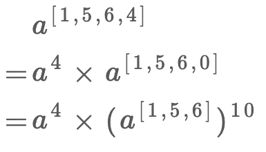
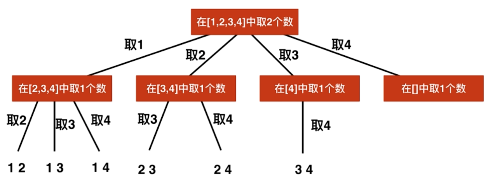

关于递归、回溯法算法题的总结

<!---more-->

## 1.基本问题

### 1.电话号码的字母组合(17)

~~~JS
var letterCombinations = function(digits) {
    const res=[],
          map={
              '2':"abc",
              '3':"def",
              '4':"ghi",
              '5':"jkl",
              '6':"mno",
              '7':"prqs",
              '8':"tuv",
              '9':"wxyz"
          }
    backtrack('',digits);
    return res;
    function backtrack(temp,digits) {
        if(!digits) {
            if(!temp) return;
            return res.push(temp);
        }
        for(let i=0,len=map[digits[0]].length;i<len;i++) {
            backtrack(temp+map[digits[0]][i],digits.slice(1));
        }
    }
};
~~~

### 2.复原IP地址(93)

```
Input: "25525511135"
Output: ["255.255.11.135", "255.255.111.35"]
```

~~~JS
var restoreIpAddresses = function(s) {
    const res=[];
    backtrack(0,[],s);
    return res;
    function backtrack(count,tempArr,s) {
        if(!s||count===4) {
            if(count===4&&!s) return res.push(tempArr.join('.'));
            return;
        }
        for(let i=0,len=s.length;i<len;i++) {
            if(isValid(s.slice(0,i+1))) {
                tempArr.push(s.slice(0,i+1));
                backtrack(count+1,tempArr,s.slice(i+1));
                tempArr.pop();
            }
        }
    }
};

function isValid(s) {
    if(s.length>3||(s.length===3&&parseInt(s)>255)||(s.length>1&&s[0]==='0')) return false;
    return true;
}
~~~

### 3.分割回文串(131)

~~~
Input: "aab"
Output:
[
  ["aa","b"],
  ["a","a","b"]
]
~~~

~~~JS
var partition = function(s) {
    const res=[];
    backtrack([],s);
    return res;
    function backtrack(tempArr,s) {
        if(!s) return res.push([...tempArr]);
        for(let i=0,len=s.length;i<len;i++) {
            if(isPalindrome(s.slice(0,i+1))) {
                tempArr.push(s.slice(0,i+1));
                backtrack(tempArr,s.slice(i+1));
                tempArr.pop();
            }
        }
    }
};

function isPalindrome(s) {
    let l=0,
        r=s.length-1;
    while(l<r) {
        if(s[l]!==s[r]) return false;
        l++;
        r--;
    }
    return true;
}
~~~

### 4.超级次方(372)

~~~
Your task is to calculate ab mod 1337 where a is a positive integer and b is an extremely large positive integer given in the form of an array.
Input: a = 2, b = [1,0]
Output: 1024
~~~

> 1.处理用数组表示的指数
>
> 可以用递归，从下图可以看出
>
> 
>
> 2.处理mod运算
>
> 对乘法的结果求模，等价于先对每个因子都求模，然后对因子相乘的结果再求模
>
> `(a * b) % k = (a % k)(b % k) % k`
>
> 3.高效幂运算

~~~JS
//对乘法的结果求模，等价于先对每个因子都求模，然后对因子相乘的结果再求模
let base=1337;

var superPow = function(a, b) {
    if(!b.length) return 1;
    let last=b.pop(),
        part1=Pow(superPow(a,b),10),
        part2=Pow(a,last);
    return (part1*part2)%base;
};

function Pow(a,b) {
    if(b===0) return 1;
    a%=base;
    return (b&1)===0?(Pow(a*a,b>>>1))%base:(a%base)*(Pow(a*a,(b-1)>>>1)%base);
}
~~~

### 5.括号生成(22)

数字 *n* 代表生成括号的对数，请你设计一个函数，用于能够生成所有可能的并且 **有效的** 括号组合。

~~~
输入：n = 3
输出：[
       "((()))",
       "(()())",
       "(())()",
       "()(())",
       "()()()"
     ]
~~~

> 回溯，过程中一定要满足左边括号数大于等于右边括号数

~~~JS
var generateParenthesis = function(n) {
    const res=[];
    generate(n,n,'');
    return res;
    function generate(l,r,s) {
        if(l>r) return;
        if(!l&&!r) return res.push(s);
        if(l) generate(l-1,r,s+'(');
        if(r) generate(l,r-1,s+')');
    }
};
~~~


## 2.全排列系列问题

### 1.全排列(46)

~~~
Input: [1,2,3]
Output:
[
  [1,2,3],
  [1,3,2],
  [2,1,3],
  [2,3,1],
  [3,1,2],
  [3,2,1]
]
~~~

~~~JS
var permute = function(nums) {
    const res=[];
    backtrack([],nums);
    return res;
    function backtrack(tempArr,nums) {
        if(tempArr.length===nums.length) res.push([...tempArr]);
        for(let i=0,len=nums.length;i<len;i++) {
            if(tempArr.includes(nums[i])) continue;
            tempArr.push(nums[i]);
            backtrack(tempArr,nums)
            tempArr.pop();
        }
    }
};
~~~


### 2.全排列2(47)

~~~
Input: [1,1,2]
Output:
[
  [1,1,2],
  [1,2,1],
  [2,1,1]
]
~~~

> 因为有重复的元素，所以需要先排序，这样可以处理相邻重复的元素，并且由于有重复的元素，上题中用到的includes也不能用，改用visited数组来标记是否访问过。
>
> if(i>0&&nums[i]===nums[i-1]&&!visited[i-1]) continue;
>
> 意思是，如果和前一个元素相同，并且没有访问过，说明当前面这个元素访问的时候，已经把当前元素算进去了，所以当访问当前元素的时候，前面一个没访问过，则就要跳过，防止重复

~~~JS
var permuteUnique = function(nums) {
    const res=[];
    nums.sort((a,b)=>a-b);
    backtrack([],[]);
    return res;
    function backtrack(temp,visited) {
        if(temp.length===nums.length) return res.push([...temp]);
        for(let i=0,len=nums.length;i<len;i++) {
            if(visited[i]) continue;
            if(i>0&&nums[i]===nums[i-1]&&!visited[i-1]) continue;
            visited[i]=true;
            temp.push(nums[i]);
            backtrack(temp,visited);
            temp.pop(nums[i]);
            visited[i]=false;
        }
    }
};
~~~


## 3.组合系列问题

### 1.组合(77)

~~~
Input: n = 4, k = 2
Output:
[
  [2,4],
  [3,4],
  [2,3],
  [1,2],
  [1,3],
  [1,4],
]
~~~



> 当我们选取一个数字的时候后，那么之后可以选取的起始位置一定在这之后
>
> 这里用到了剪枝

~~~JS
var combine = function(n, k) {
    const res=[];
    backtrack(1,[]);
    return res;
    function backtrack(start,temp) {
        if(temp.length===k) return res.push([...temp]);
        //此时后面必须有（k-temp.length）个空位才有进行的必要
        //即[i...n]至少要有（k-temp.length）个空位
        for(let i=start;i<=n-(k-temp.length)+1;i++) {
            temp.push(i);
            backtrack(i+1,temp);
            temp.pop();
        }
    }
};
~~~

### 2.组合总和(39)

> 给出的集合无重复的，可以多次选取

```
Given a set of candidate numbers (candidates) (without duplicates) and a target number (target), find all unique combinations in candidates where the candidate numbers sums to target.

The same repeated number may be chosen from candidates unlimited number of times.
Input: candidates = [2,3,6,7], target = 7,
A solution set is:
[
  [7],
  [2,2,3]
]
```

~~~JS
var combinationSum = function(candidates, target) {
    const res=[];
    candidates.sort((a,b)=>a-b);
    backtrack(0,[],0);
    return res;
    function backtrack(sum,temp,start) {
        if(sum>target) return;
        if(sum===target) return res.push([...temp]);
        for(let i=start,len=candidates.length;i<len;i++) {
            temp.push(candidates[i]);
            backtrack(sum+candidates[i],temp,i);
            temp.pop();
        }
    }
};
~~~


### 3.组合总和2(40)

> 给出的集合有重复的，但每个只能取一次

~~~
Given a collection of candidate numbers (candidates) and a target number (target), find all unique combinations in candidates where the candidate numbers sums to target.

Each number in candidates may only be used once in the combination.
Input: candidates = [10,1,2,7,6,1,5], target = 8,
A solution set is:
[
  [1, 7],
  [1, 2, 5],
  [2, 6],
  [1, 1, 6]
]
~~~

~~~JS
var combinationSum2 = function(candidates, target) {
    const res=[];
    arr=[].slice.call(candidates).sort((a,b)=>a-b);
    backtrack(0,[],0);
    return res;
    function backtrack(num,temp,start) {
        if(num>target) return;
        if(num===target) return res.push([...temp]);
        for(let i=start,len=arr.length;i<len;i++) {
            if(i>start&&arr[i]===arr[i-1]) continue;
            temp.push(arr[i]);
            backtrack(num+arr[i],temp,i+1);
            temp.pop();
        }
    }
};
~~~

### 4.组合总和3(216)

> 1-9 每个数字只能选一次，最多只能有k个数字，总和为n

~~~
Find all possible combinations of k numbers that add up to a number n, given that only numbers from 1 to 9 can be used and each combination should be a unique set of numbers.
Input: k = 3, n = 7
Output: [[1,2,4]]
~~~

~~~JS
var combinationSum3 = function(k, n) {
    const res=[];
    backtrack(0,[],1);
    return res;
    function backtrack(num,temp,start) {
        if(temp.length===k&&num===n) return res.push([...temp]);
        if(temp.length>=k||num>=n) return;
        for(let i=start;i<=9;i++) {
            temp.push(i);
            backtrack(num+i,temp,i+1);
            temp.pop();
        }
    }
};
~~~


### 5.组合总和4(377)

> 给定的集合无重复，可以选择多次，一样的组合顺序不一样算不一样的组合

~~~
Given an integer array with all positive numbers and no duplicates, find the number of possible combinations that add up to a positive integer target.
nums = [1, 2, 3]
target = 4

The possible combination ways are:
(1, 1, 1, 1)
(1, 1, 2)
(1, 2, 1)
(1, 3)
(2, 1, 1)
(2, 2)
(3, 1)

Note that different sequences are counted as different combinations.

Therefore the output is 7.
~~~


### 6.零钱兑换2(518)

~~~
Input: amount = 5, coins = [1, 2, 5]
Output: 4
Explanation: there are four ways to make up the amount:
5=5
5=2+2+1
5=2+1+1+1
5=1+1+1+1+1
~~~

~~~JS

~~~


### 7.子集(78)

~~~
Input: nums = [1,2,3]
Output:
[
  [3],
  [1],
  [2],
  [1,2,3],
  [1,3],
  [2,3],
  [1,2],
  []
]
~~~

~~~JS
var subsets = function(nums) {
    const res=[];
    backtrack([],0);
    return res;
    function backtrack(temp,start) {
        res.push([...temp]);
        for(let i=start;i<nums.length;i++) {
            temp.push(nums[i]);
            backtrack(temp,i+1);
            temp.pop();
        }
    }
};
~~~


### 8.子集2(90)

~~~
Input: [1,2,2]
Output:
[
  [2],
  [1],
  [1,2,2],
  [2,2],
  [1,2],
  []
]
~~~

~~~JS
var subsetsWithDup = function(nums) {
    nums.sort((a,b)=>a-b);
    const res=[];
    backtrack([],0);
    return res;
    function backtrack(temp,start) {
        res.push([...temp]);
        for(let i=start;i<nums.length;i++) {
            if(i>start&&nums[i]===nums[i-1]) continue;
            temp.push(nums[i]);
            backtrack(temp,i+1);
            temp.pop();
        }
    }
};
~~~


## 4.二维平面上的回溯系列问题

### 1.单词搜索(79)

~~~
board =
[
  ['A','B','C','E'],
  ['S','F','C','S'],
  ['A','D','E','E']
]

Given word = "ABCCED", return true.
Given word = "SEE", return true.
Given word = "ABCB", return false.
~~~

~~~JS
var exist = function(board, word) {
    if(word.length===0) return true;
    if(board.length===0) return false;
    let m=board.length,
        n=board[0].length;
    const visited=Array(m).fill().map(arr=>Array(n).fill(false));
    for(let i=0;i<m;i++) {
        for(let j=0;j<n;j++) {
            if(searchWord(i,j,board,word,0,visited)) return true;
        }
    }
    return false;
};
function inArea(x,y,m,n) {
    return x>=0&&x<m&&y>=0&&y<n;
}
//从board[i][j]开始，寻找word[cur...word.length)
function searchWord(i,j,board,word,cur,visited) {
    const d=[[-1,0],[1,0],[0,-1],[0,1]],
          m=board.length,
          n=board[0].length;
    if(cur===word.length-1) return board[i][j]===word[cur];
    if(board[i][j]===word[cur]) {
        visited[i][j]=true;
        for(let index=0;index<4;index++) {
            let newX=i+d[index][0],
                newY=j+d[index][1];
            if(inArea(newX,newY,m,n)&&!visited[newX][newY]&&searchWord(newX,newY,board,word,cur+1,visited)) return true;
        }
        visited[i][j]=false;
    }
    return false;
}
~~~

### 2.单词搜索2(212)

~~~
Input: 
board = [
  ['o','a','a','n'],
  ['e','t','a','e'],
  ['i','h','k','r'],
  ['i','f','l','v']
]
words = ["oath","pea","eat","rain"]

Output: ["eat","oath"]
~~~

~~~JS
var findWords = function(board, words) {
    if(!words||!words.length||!board||!board.length) return words;
    let res=[],
        m=board.length,
        n=board[0].length;
    words.forEach(word=>{
        const visited=Array(m).fill().map(arr=>Array(n).fill(false));
        for(let i=0;i<m;i++) {
            for(let j=0;j<n;j++) {
                if(backtrack(i,j,word,0,visited)) res.push(word);
            }
        }
    })
    return Array.from(new Set([...res]));;
    function backtrack(i,j,word,cur,visited) {
        if(i<0||i>=m||j<0||j>=n||visited[i][j]) return false;
        if(word[cur]!=board[i][j]) return false;
        if(cur+1===word.length) return true;
        else {
            visited[i][j]=true;
            if(backtrack(i+1,j,word,cur+1,visited)||backtrack(i,j+1,word,cur+1,visited)||backtrack(i-1,j,word,cur+1,visited)||backtrack(i,j-1,word,cur+1,visited)) return true;
            visited[i][j]=false;
        }
    }
};
~~~


### 3.岛屿的个数(200)

~~~
Input:
11110
11010
11000
00000

Output: 1
~~~

~~~JS
var numIslands = function(grid) {
    if(!grid||!grid.length) return 0;
    let res=0,
        m=grid.length,
        n=grid[0].length;
    for(let i=0;i<m;i++) {
        for(let j=0;j<n;j++) {
            if(grid[i][j]==='1') {
                backtrack(i,j,grid);
                res++;
            }
        }
    }
    return res;
    function backtrack(i,j,grid) {
        if(i<0||i>=m||j<0||j>=n||grid[i][j]==='0') return;
        grid[i][j]='0';
        backtrack(i+1,j,grid);
        backtrack(i-1,j,grid);
        backtrack(i,j+1,grid);
        backtrack(i,j-1,grid);
        return;
    }
};
~~~

### 4.岛屿的最大面积(695)

~~~JS
var maxAreaOfIsland = function(grid) {
    if(!grid||!grid.length) return 0;
    let res=0,
        m=grid.length,
        n=grid[0].length;
    for(let i=0;i<m;i++) {
        for(let j=0;j<n;j++) {
            if(grid[i][j]===1) {
                res=Math.max(res,backtrack(i,j,m,n));
            }
        }
    }
    return res;
    function backtrack(i,j,m,n) {
        if(i<0||i>=m||j<0||j>=n||grid[i][j]===0) return 0;
        grid[i][j]=0;
        return backtrack(i-1,j,m,n)+backtrack(i+1,j,m,n)+backtrack(i,j-1,m,n)+backtrack(i,j+1,m,n)+1;
    }
};
~~~


### 5.被围绕的区域(130)

~~~
input
X X X X
X O O X
X X O X
X O X X

output
X X X X
X X X X
X X X X
X O X X
~~~

> 从边界处往里面渗透，将相邻的O标记，其他都是X

~~~JS
var solve = function(board) {
    if(!board||!board.length) return;
    let m=board.length,
        n=board[0].length;
    for(let i=0;i<m;i++) {
        backtrack(i,0);
        backtrack(i,n-1);
    }
    for(let i=0;i<n;i++) {
        backtrack(0,i);
        backtrack(m-1,i);
    }
    for(let i=0;i<m;i++) {
        for(let j=0;j<n;j++) {
            if(board[i][j]==='A') board[i][j]='O';
            else board[i][j]='X';
        }
    }
    
    function backtrack(i,j) {
        if(i<0||i>=m||j<0||j>=n||board[i][j]!=='O') return;
        board[i][j]='A';
        backtrack(i+1,j);
        backtrack(i-1,j);
        backtrack(i,j+1);
        backtrack(i,j-1);
    }
};
~~~

### 6.朋友圈(547)

~~~
Input: 
[[1,1,0],
 [1,1,0],
 [0,0,1]]
Output: 2
Explanation:The 0th and 1st students are direct friends, so they are in a friend circle. 
The 2nd student himself is in a friend circle. So return 2.
~~~

> 对于每一个未被访问过的，都会dfs所有与之有关联的，即`M[i][j]=1`

~~~JS
var findCircleNum = function(M) {
    if(!M||!M.length) return 0;
    let m=M.length,
        count=0,
        visited=Array(m).fill(false);
    for(let i=0;i<m;i++) {
        if(!visited[i]) {
            dfs(i);
            count++;
        }
    }
    return count;
    function dfs(k) {
        visited[k]=true;
        for(let i=0;i<m;i++) {
            if(M[k][i]&&!visited[i]) dfs(i);
        }
    }
};
~~~